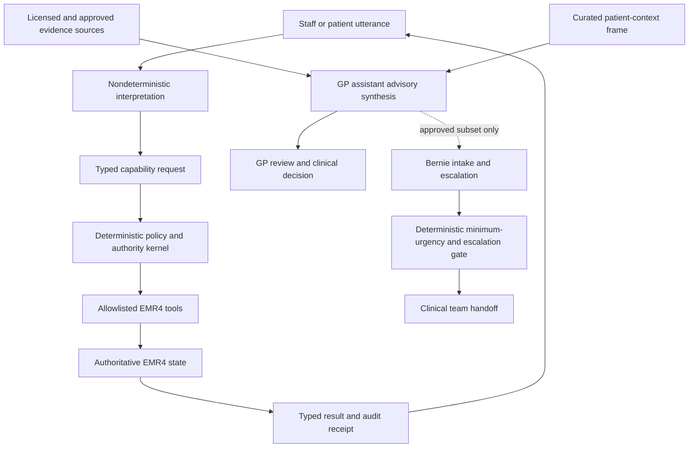

# Bernie, GP Assistant, and Triage Implementation Roadmap

Status: approved strategic implementation plan; individual authority-changing
gates remain closed until their named decision boundary is approved.

Date: 2026-07-13

## Purpose

This roadmap turns three related goals into an ordered development path:

1. make deterministic Bernie diary behaviour reproducible at scale;
2. develop a clinician-facing GP assistant with cited, reviewable advice; and
3. only then expose a smaller, protocol-bound clinical intake and escalation
   capability to reception-facing Bernie.

It guides tranche selection. It is not a fixed sprint calendar. Ariadne assigns
global sprint numbers when a tranche is dispatched and may adapt later tranches
from evidence, but must preserve the dependencies and authority boundaries here.

## Strategic Decision

Develop the GP-assistant consultation capability before making Bernie
triage-capable. Do not first attempt an autonomous AI doctor.

The GP assistant is a clinician-facing advisory system. It is the safer place to
develop evidence retrieval, citations, patient-context framing, uncertainty,
clinical evaluation, and incident governance because a qualified clinician can
challenge every output. Reception-facing Bernie may later consume only an
explicitly approved subset of that capability.

Success in clinician-facing decision support does not itself validate reception
triage. Triage has a separate safety case, scenario corpus, escalation policy,
and supervised pilot because under-triage and confident reassurance create
different risks.

## Non-Negotiable Architecture

The model may interpret, retrieve, summarize, ask, and propose. Code-owned
contracts decide what is true, what is allowed, and what is written. Clinical
decisions remain with an appropriately qualified clinician. Reception-facing
Bernie must never inherit the full authority of either the signed-in user or the
consultant model.

## Current Baseline

EMR4 already has:

- a YAML, fake-provider, route-level Bernie scenario replay harness supporting
  ordered `interpret`, `normalize`, `search`, `select`, and `confirm` turns;
- appointment and audit-row delta assertions plus provider-call guards;
- deterministic exact-duplicate classification and an
  `existing_booking_found` supervised-booking result;
- proposal-first, signed, idempotent confirmation routes;
- an authoritative `appointment.confirmation_receipt.v1` and accessible diary
  announcement/rendering;
- an Access AI capability registry containing `clinical.knowledge.query`;
- a provider-neutral knowledge-base adapter foundation; and
- an API-spine `consultant` principal whose advice requires doctor review.

The immediate gap is not another guard document. The replay harness cannot yet
concisely declare arbitrary starting diary state, call the supervised-booking
consumer as a first-class turn, assert side effects per turn, or emit one
portable evidence record across route and browser runs.

Planning verification on 2026-07-13 also found three existing replay failures
that T1 should triage rather than normalize away:

- `harness-demo-happy-path` no longer reaches a safe selection/confirmed write;
- `interpret_default_duration_no_type` has a same-day expected-time mismatch
  consistent with a clock-sensitive fixture; and
- `interpret_full_request_names` now requests clarification where its fixture
  expects a complete interpretation.

T1 must make clock, reference date, schedule, and seeded state deterministic,
then classify each remaining difference as a product defect or an explicitly
reviewed fixture-contract change.

## Evidence Ladder

Each capability moves upward only as far as its risk and current evidence allow.

| Level | Evidence | Purpose |
|---|---|---|
| E0 | Pure contracts and unit tests | Schemas, classifiers, invariants, policy |
| E1 | DB-backed route replay with fake provider | Real API and persistence behaviour |
| E2 | Non-intercepted local backend scenario | Transport, auth, serialization, transaction behaviour |
| E3 | Playwright against controlled backend | UI copy, controls, focus, live regions, accessibility tree |
| E4 | Live-model shadow evaluation, writes disabled | Model interpretation and tool-selection quality |
| E5 | Supervised internal pilot | Human workflow, incident and override evidence |
| E6 | Bounded production capability | Only after clinical, privacy, security, and regulatory gates |

Route-intercepted browser tests remain useful E3 UI contract evidence but must
not be labelled as E2 live-backend evidence. Model output never replaces E0-E3
deterministic acceptance.

## Tranche Map

### T1 - Stateful Diary Scenario Laboratory

Outcome: authored scenarios can establish diary state, perform several booking
turns, and prove exact responses and side effects without manual repetition.

Suggested sprint outcomes:

1. Extend the scenario schema with allowlisted setup fixtures, a first-class
   supervised-booking turn, per-turn appointment/audit delta expectations, and a
   redacted machine-readable replay record. Setup must use test factories, not
   arbitrary executable fixture code.
2. Add a golden corpus headed by Yuri's observed sequence: create and confirm a
   Margaret Thompson appointment, ask for that same booking again, receive
   `existing_booking_found`, perform no second write, and offer a change of time
   or day. Add exact duplicate, overlap, same-day-distinct, terminal-status,
   stale-state, concurrent-change, bounded-window, and idempotent-replay cases.
3. Run selected golden cases through Playwright against the controlled backend,
   capturing visible copy, control state, focus order, live-region output,
   accessibility-tree assertions, console errors, requests, and final receipt.

Exit evidence:

- the golden duplicate sequence passes E1 and E3;
- every turn records expected and actual row deltas;
- no duplicate confirmation affordance or second write is possible;
- evidence records contain no unnecessary PHI and distinguish fake provider,
  route interception, local backend, and live model accurately; and
- ordinary corpus execution remains a single repeatable command.

### T2 - Deterministic Bernie Behaviour Matrix

Outcome: deterministic diary policy is exercised broadly enough that manual
testing becomes exploratory rather than the primary regression mechanism.

Candidate slices:

- generated boundary cases for interval overlap, duration, day boundaries,
  roster changes, breaks, locations, practitioners, and stale proposals;
- model-based state transitions for create, move, resize, cancel, status,
  waiting-area, and patient-link workflows as those verbs are promoted;
- property tests for invariants such as no write before confirmation, no second
  write on replay, practice isolation, and no candidate outside normalized
  bounds; and
- a small manually authored golden corpus retained independently of generated
  expectations so tests do not merely reproduce implementation logic.

Exit evidence: every implemented diary action has E0-E3 coverage proportionate
to risk, including keyboard and assistive-technology semantics for authoritative
results.

### T3 - Nondeterministic Bernie Shadow Evaluation

Outcome: candidate models can be compared as interpreters and tool selectors
without gaining write authority.

Candidate slices:

- provider-neutral evaluation input/output schema and model-version ledger;
- replay of the T1/T2 semantic corpus through live models with all writes
  disabled and deterministic tools operating on synthetic state;
- repeat sampling for variance, with deterministic scoring of intent, entity,
  date/time, clarification, tool selection, unsafe claims, and attempted
  authority expansion; and
- promotion thresholds, regression quarantine, rollback, and cost/latency
  reporting separated from correctness.

Fine-tuning is not a prerequisite. Prompting, typed tools, retrieval, and evals
come first. Fine-tuning may later improve stable interaction patterns but must
not encode current patient facts, mutable practice rules, or write authority.

#### Language-Coverage Bridge Before Provider Replay

T2's deterministic policy coverage and T3's provider-neutral contracts do not
by themselves demonstrate adequate coverage of receptionist language. Before
T3 provider adapters or live shadow calls proceed, implement the language
coverage programme in
`docs/bernie-language-coverage-implementation-plan.md`.

The bridge preserves original utterances, introduces typed temporal relations
and source spans, measures a multidimensional coverage lattice, separates
Gold/Silver/Bronze evidence, uses models as generators or candidate interpreters
rather than outcome oracles, and composes language interpretation with the T2
deterministic diary replay. Stop-word removal, stemming, and lemmatization may
support offline clustering but must not remove semantic operators from the
authoritative path.

### T4 - Shared Clinical Safety Foundation

Outcome: EMR4 has a reviewable safety and governance basis before patient-specific
clinical advice is implemented.

Required slices:

- intended-use and explicit non-use statements for the GP assistant and for
  later reception intake/triage;
- named clinical safety owner, governance group, scope-of-practice rules,
  hazard log, safety case structure, incident and rollback process;
- preliminary TGA CDSS/software-medical-device classification assessment and
  regulatory advice decision;
- privacy impact and data-flow assessment covering patient context, provider
  regions, retention, training use, logs, and cross-border disclosure;
- evidence-source registry with licence, jurisdiction, currency, citation,
  caching, PHI, and provenance policy, recording Cochrane Library as the central
  general pillar while keeping complementary source classes explicit; and
- clinical evaluation protocol, adjudication method, protected test set,
  subgroup/accessibility review, and release criteria.

This tranche may build contract/test scaffolds, but it must not quietly activate
patient-specific live consultant output.

### T5 - GP Assistant Consult: Evidence and Contract

Outcome: a GP can ask a bounded clinical question and receive a structured,
cited advisory response that cannot diagnose, prescribe, or write the record.

Clinical direction:
[`consultant-safety-first-differential-diagnosis-doctrine.md`](consultant-safety-first-differential-diagnosis-doctrine.md).
The future contract must support a safety-weighted differential rather than a
single probability ranking: plausible must-not-miss conditions, most-supported
hypotheses, discriminating evidence, outstanding follow-up and safety-netting
remain separately visible and clinician controlled. A backend-owned
Diagnostic Thread must carry that reasoning and its unresolved obligations
across encounters without becoming provider-model memory.

Cochrane Library is the selected central general evidence-based pillar for this
future contract, continuing the original EMR practice of giving every GP direct
licensed access to it. The intended trial candidate is the licensed Wiley Agent
Knowledge Base: Cochrane Library through AWS Marketplace. It remains one adapter
behind the provider-neutral contract: Australian guidelines, regulatory and
drug sources, diagnostic-test evidence, local pathways, specialty and rare-
disease sources remain complementary, and lack of a Cochrane answer must be
reported as an evidence gap rather than converted into reassurance.

Candidate slices:

- `consultant` charter and least-authority Access AI capability;
- curated patient-context frame with provenance, omissions, freshness, and
  clinician-controlled inclusion;
- versioned hypothesis and evidence ledgers that keep patient report,
  clinician observation, results, specialist opinion, retrieved guidance and
  model inference distinct;
- a longitudinal Diagnostic Thread and typed FollowUp Obligations that bridge
  to reminders and recalls while keeping delivery, attendance, evidence review
  and clinical completion distinct;
- provider-neutral, source-type-aware evidence retrieval contract with a
  licensed Cochrane adapter as the central general pillar and separately
  governed complementary-source adapters;
- an AWS/Wiley trial-readiness gate binding exact product identity, licence and
  entitlement scope, excerpts/full-text/caching/embedding rights, cost, region,
  PHI/query logging, retention/training terms, citations/versioning, rate limits,
  failure semantics, privacy assessment and TGA/CDSS posture before any call;
- advisory schema containing question understood, source citations and dates,
  evidence summary, uncertainty, contradictions, missing information, suggested
  questions, red flags for clinician attention, candidate discriminators,
  outstanding follow-up, safety-netting and explicit limitations;
- injection-resistant separation of patient text, retrieved evidence, policy,
  and instructions; and
- immutable invocation metadata without routine raw-PHI logging.

Exit evidence: E0-E2 pass with synthetic clinical cases, citations remain
traceable to retrieved material, unsupported claims fail or are visibly
labelled, and no clinical-record or prescribing mutation is available.

### T6 - GP Assistant Consult: Clinician Experience and Shadow Pilot

Outcome: clinicians can review the assistant efficiently and EMR4 can measure
whether it helps without silently influencing care.

Candidate slices:

- clinician-facing interface separating source evidence, model synthesis,
  uncertainty, and GP-authored decisions;
- accessible provenance and correction controls;
- retrospective synthetic/de-identified evaluation followed by prospective
  shadow use under an approved protocol;
- clinician adjudication of material omission, unsupported assertion,
  dangerous reassurance, citation mismatch, and workflow burden; and
- model/prompt/source version monitoring, incident review, rollback, and
  revalidation after changes.

Exit evidence: the named clinical governance body accepts a bounded intended
use and the predefined safety/performance thresholds. Model agreement with a GP
is not sufficient by itself; clinically material errors must be measured.

### T7 - Bernie Clinical Intake, Not Triage

Outcome: Bernie can collect and relay patient-reported information without
diagnosing, reassuring, or deciding that care is unnecessary.

Candidate slices:

- transparent AI identification, consent/notice, identity and caller-context
  boundaries;
- clinician-authored question sets for bounded presenting-problem categories;
- faithful patient-language capture plus structured handoff, with inferences
  clearly separated from reported facts;
- accessibility, interpreter, communication-support, and carer pathways; and
- deterministic emergency/escalation triggers that stop ordinary intake and
  seek human clinical assistance.

Exit evidence: E0-E5 demonstrate reliable handoff, no diagnostic or treatment
claims, no suppression of patient requests for clinical review, and fail-upward
behaviour under ambiguity.

### T8 - Bounded Reception Triage Assistance

Outcome: Bernie may assist with urgency and routing only inside approved,
clinician-owned protocols and mandatory escalation paths.

Required preconditions:

- T4-T7 exits accepted;
- formal intended-purpose and TGA position reviewed;
- protocol owner, version, expiry, and clinical escalation roster are active;
- under-triage, atypical presentation, vague language, vulnerable-patient,
  communication, and emergency corpora meet predefined thresholds; and
- monitored supervised pilot, kill switch, incident pathway, and audit review
  are operational.

Bernie may ask approved questions, apply a code-owned minimum urgency, find an
appropriate appointment type, and warm-transfer to clinical staff. She may not
diagnose, prescribe, recommend medication changes, provide false reassurance,
override a red flag, deny clinical review, or convert model confidence into a
lower urgency than the deterministic protocol permits.

### T9 - Learning and Optimization

Outcome: evaluation evidence improves the system without turning production PHI
or mutable policy into opaque model memory.

Use retrieval for current clinical and practice knowledge. Consider supervised
fine-tuning only for stable communication and tool-use behaviours after a large,
clinician-adjudicated corpus exists, privacy and licence rights are explicit,
training and holdout sets are separated, and the tuned model still passes every
deterministic gate. Never train on the raw historical diary trove or ordinary
patient interactions by default.

## Tranche Selection Rule

At each tranche closeout, Ariadne selects the next tranche using this short
sequence:

1. Continue the current tranche if its outcome is incomplete and meaningful
   implementation work remains.
2. Otherwise choose the earliest dependency-satisfied tranche that produces a
   user- or clinician-observable capability or validates one at the next
   evidence level.
3. Prefer a consumer increment over another guard artifact once the necessary
   guard exists. A guard follow-up is justified only by a concrete finding,
   authority change, or failed acceptance check.
4. Keep at most one primary product tranche and one genuinely independent
   enabling/security stream active. Do not fragment one outcome across many
   coordination-only sprints.
5. Replan at tranche boundaries or when evidence falsifies an assumption, not
   merely because a sprint ended.

T1 and T2 are complete, T3.1-T3.4 have established the write-disabled
evaluation contract, source-safe projection, repeat runner, and live-replay
gate, and LC1-LC2 have established the semantic foundation plus pending corpus.
The default next tranche is **LC3 Composed T2/T3 Evaluator**, defined in
`docs/bernie-language-coverage-implementation-plan.md`. T3.5 provider adapters
are deferred until the language-coverage bridge has the composed evaluator and
credible candidate-aware coverage evidence. T4 may begin as a genuinely
independent governance stream, but T5 must not precede T4, T7 must not precede
a credible T5-T6 evidence base, and T8 must not precede all of T4-T7.

## User Decision Boundaries

Ariadne should continue across ordinary sprints and commit/push completed work
without asking for permission. Pause only when the next action would:

- change the intended clinical purpose or claimed level of autonomy;
- send identifiable or sensitive patient information to a new provider,
  region, model, or evidence service;
- accept a licence, material cost commitment, or new retention/training term;
- open a live-provider, clinical-record write, prescribing, or autonomous-write
  authority gate;
- start a clinician or patient-facing live pilot;
- approve a clinical protocol, safety threshold, or regulatory position; or
- release reception triage beyond supervised internal evaluation.

Defects, test failures, worker unavailability, and routine implementation
choices remain orchestrator responsibilities unless they force one of these
authority changes.

## Tranche Closeout Evidence

Every closeout records only what is needed to choose the next move:

- product outcome delivered;
- evidence level actually reached;
- tests and scenarios passed, including known failures;
- authority or data boundaries changed, if any;
- clinical/privacy/security findings that alter the path;
- next dependency-satisfied tranche; and
- whether a named user decision boundary is reached.

No estimated model-token budget, arbitrary worker timeout, or mandatory
conductor/verifier exchange is part of product acceptance.

## Initial Scenario Corpus Priorities

These priorities seed the language-coverage lattice; they are not a claim that
one historical scenario is uniquely canonical or that a raw number of scenarios
demonstrates linguistic completeness.

After the golden duplicate case, prioritize scenarios by harm and frequency:

1. stale proposal followed by another staff or Bernie change;
2. exact duplicate versus overlap versus same-day-distinct booking;
3. practitioner, date, and time correction across several turns;
4. no matching time versus no roster versus fully booked;
5. cancellation, move, resize, status, and waiting-area idempotency;
6. midnight, daylight-saving, elapsed-time, and locale boundaries;
7. practice, location, practitioner, and patient isolation;
8. keyboard-only and screen-reader completion and recovery; and
9. adversarial instructions attempting confirmation or policy bypass.

## External Governance Sources

- Australian Commission on Safety and Quality in Health Care, 2026 National
  Model for Clinical Governance:
  https://www.safetyandquality.gov.au/clinical-topics/clinical-governance/2026-national-model
- Therapeutic Goods Administration, clinical decision support software:
  https://www.tga.gov.au/resources/guidance/understanding-clinical-decision-support-system-software-regulation
- Therapeutic Goods Administration, software-based medical devices for health
  professionals:
  https://www.tga.gov.au/resources/health-professional-information-and-resources/software-based-medical-devices-health-professionals
- Office of the Australian Information Commissioner, privacy and commercially
  available AI products:
  https://www.oaic.gov.au/privacy/privacy-guidance-for-organisations-and-government-agencies/guidance-on-privacy-and-the-use-of-commercially-available-ai-products
- Office of the Australian Information Commissioner, Guide to Health Privacy:
  https://www.oaic.gov.au/privacy/privacy-guidance-for-organisations-and-government-agencies/health-service-providers/guide-to-health-privacy
- RACGP, Standards for general practices:
  https://www.racgp.org.au/running-a-practice/practice-standards/standards-5th-edition/standards-for-general-practices-5th-ed

These sources guide architecture and governance but do not replace formal legal,
regulatory, privacy, licensing, or clinical-safety advice for the intended EMR4
product.
