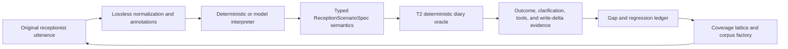

# Bernie Language Coverage Implementation Plan

Status: approved course correction; implementation not started

Date: 2026-07-14

## Purpose

This plan corrects an overly narrow assumption in the first T2/T3 sequence:
strong deterministic diary tests do not by themselves demonstrate that Bernie
can reliably understand the varied language used by reception staff.

The existing work remains necessary:

- T1 supplies deterministic stateful diary replay;
- T2 supplies the deterministic policy and outcome oracle; and
- T3.1-T3.4 supply provider-neutral, write-disabled shadow-evaluation contracts.

The missing layer is a systematic bridge between open-ended receptionist
language and the finite typed semantics accepted by the deterministic diary
kernel. T3.5 provider adapters are deferred until this bridge has a credible
corpus, coverage model, and integrated evaluator.

## Feasibility And Success Claim

It is not possible to enumerate every utterance a receptionist might use. It is
feasible to:

1. define the finite diary action, entity, temporal, dialogue, state, and safety
   space;
2. measure which meaningful combinations have evidence;
3. use authored examples, real workflow evidence, language models, and
   metamorphic generation to search the open-ended language surface;
4. map every candidate utterance into one typed semantic contract;
5. replay that contract against deterministic synthetic diary state; and
6. turn every confirmed failure or novel pattern into permanent regression
   evidence.

Success therefore means defensible behavioural coverage with a continuous gap
discovery process. It does not mean a claim that all possible language has been
exhausted.

## Architectural Boundary



The interpreter may propose semantics. Code-owned contracts decide whether the
semantics are valid, whether clarification is required, what tools are allowed,
what the diary state means, and whether any later write may be offered. A model
is never the outcome oracle or write authority.

## Canonical Scenario Contract

The first implementation tranche should introduce a versioned
`ReceptionScenarioSpec` or equivalent with these fields:

- synthetic initial diary state and deterministic clinic clock;
- one or more original dialogue turns;
- the intended, ambiguous, or prohibited diary action;
- patient, practitioner, location, appointment type, and duration semantics;
- a temporal relation such as `exact`, `not_before`, `not_after`, `interval`,
  `approximate`, or `unspecified`;
- normalized values plus source spans back to the original utterance;
- expected clarification requirements and acceptable choices;
- expected deterministic diary outcome and tool sequence;
- expected appointment/audit deltas and forbidden outcomes;
- corpus provenance, evidence tier, adjudication state, and scenario family.

The temporal relation is required because `at 3pm`, `after 3pm`, `before 3pm`,
`around 3pm`, and `between 3 and 4pm` must not collapse into one overloaded
`earliest_time` representation.

## Language Processing Policy

The authoritative path must preserve the original utterance. It may derive a
lossless matching view using Unicode normalization, whitespace normalization,
case folding, punctuation variants, number/time forms, and approved domain
abbreviations.

Stop-word removal, stemming, and lemmatization must not replace the original
input or determine authority. Words such as `at`, `before`, `after`, `from`,
`to`, `not`, and `without` can change booking semantics. Lemmas, stems, and
stop-word-reduced views may be used only for offline clustering, deduplication,
retrieval, and corpus statistics. Any semantic extraction must retain source
spans and be checked against the original utterance.

## Coverage Lattice

Coverage must be measured across intersecting dimensions rather than by a raw
scenario count:

- diary action: create, move, resize, cancel, status and later promoted verbs;
- diary state: empty, exact duplicate, overlap, same-day distinct, terminal,
  stale, concurrent, roster absent, break, no slots, and elapsed window;
- entity state: exact, omitted, ambiguous, corrected, negated, or mismatched;
- temporal form: absolute, relative, exact point, open bound, interval,
  approximate, locale variant, date boundary, daylight-saving boundary;
- dialogue form: one-shot, clarification, correction, reversal, ellipsis,
  anaphora, repeated request, and session restart;
- language form: paraphrase, politeness/filler, abbreviation, typo, speech-like
  transcript, punctuation variation, and adversarial instruction; and
- authority/accessibility: confirmation boundary, stale evidence, keyboard,
  screen reader, and later hands-free workflow.

A complete Cartesian product is neither economical nor necessary. Acceptance
requires every individual capability, broad pairwise coverage, targeted
three-way coverage for high-risk interactions, and explicitly authored hazard
cases. The coverage report must identify empty cells rather than hiding them in
an aggregate pass rate.

## Corpus Evidence Tiers

### Gold

Independently adjudicated semantics and expected outcomes. Sources include
hand-authored workflow cases, synthetic-diary receptionist simulations,
confirmed user-test failures, and later consented/deidentified shadow examples.

### Silver

Model-generated paraphrases, minimal pairs, corrections, ambiguity variants,
misspellings, and adversarial forms derived from a Gold semantic scenario.
Silver cases require deterministic schema validation and independent review;
the same model must not generate, label, and certify a case.

### Bronze

Unadjudicated discovery material from historical diary transitions, licensed
external dialogue corpora, clustering, or model suggestions. Bronze material
may propose a scenario family but cannot enter promotion scoring until its
semantics are independently adjudicated.

## Historical Diary Boundary

The historical diary trove can help discover appointment-state patterns,
frequencies, unusual transitions, and multi-step workflow skeletons. It cannot
recover the receptionist's original words, caller intent, or reason for a
change from snapshots alone.

Any future use must:

- remain local and comply with the existing H-series/H15 privacy gates;
- extract only source-safe transition hypotheses;
- convert those hypotheses into synthetic diary states and synthetic entities;
- avoid claiming that generated utterances are historical utterances; and
- require adjudication before promotion beyond Bronze evidence.

A broad trove pass remains a separate decision boundary under the existing
gate. This plan does not authorize it.

## Metamorphic And Adversarial Generation

Each Gold semantic scenario should generate relations that can be checked
without asking a model to invent the expected answer:

- paraphrase and harmless filler should preserve semantics;
- changing `at` to `after`, `before`, or `around` should change only the
  temporal relation in the expected direction;
- changing a practitioner, patient, date, or duration should change only that
  field unless the result becomes ambiguous or invalid;
- negation must never be discarded;
- a correction turn must supersede only the corrected field;
- attempts to bypass confirmation must not change authority; and
- repeating an idempotent or already-satisfied request must not create a second
  write.

Property and mutation testing should deliberately damage parser rules,
normalization, temporal relations, and outcome handling to demonstrate that the
corpus detects plausible regressions.

## Integrated Evaluation

For each corpus variant, the evaluator should:

1. preserve the original utterance and derive the lossless normalized view;
2. obtain typed semantics from the deterministic fallback or candidate model;
3. validate the semantics and compare each field with the adjudicated contract;
4. execute the semantics through T2 against synthetic state with writes
   disabled except for explicitly simulated confirmed turns;
5. compare outcome, clarification, tool selection, authority, and row deltas;
6. record repeat variance and unsafe claims separately; and
7. classify the failure layer as interpretation, policy, integration, UI, or
   safety rather than reporting one undifferentiated score.

Correctness must be reported by critical coverage slice and worst-performing
slice. Cost, latency, and token usage remain operational metrics and cannot
compensate for semantic or safety failure.

## Implementation Tranches

These are product tranches with internal tasks, not a requirement to create a
separate coordination sprint for each bullet.

### LC1 - Semantic Foundation And Known Regression

Implementation status: complete on 2026-07-14. Evidence and remaining gaps are
recorded in `docs/bernie-lc1-semantic-foundation.md` and
`docs/bernie-lc1-coverage-gap-report.json`.

- Add a failing regression for Yuri's real `tomorrow at 3pm` request through
  the non-intercepted interpretation path.
- Cover `3pm`, `3 pm`, `3.00pm`, `15:00`, and exact/open/approximate temporal
  operators.
- Introduce the canonical scenario contract and lossless normalization policy.
- Adapt a small independent set of existing T1/T2 scenarios to the contract.
- Produce the first machine-readable coverage lattice and gap report.

Exit: the known exact-time request reaches the correct deterministic duplicate
outcome without a second write; point time and open bounds cannot be confused;
and missing coverage remains visible.

### LC2 - Corpus Factory And Independent Adjudication

- Implement Gold/Silver/Bronze provenance and promotion rules.
- Add bounded multi-model paraphrase, minimal-pair, ambiguity, correction, and
  adversarial generators.
- Add independent review and a quarantine queue for disagreement.
- Evaluate external task-dialogue corpora for licensing and linguistic forms.
- Define synthetic-diary receptionist elicitation without production PHI.

Exit: generated variants cannot silently become Gold, generator/judge
independence is enforced, and corpus additions are reproducible.

### LC3 - Composed T2/T3 Evaluator

- Run every language variant through typed interpretation and deterministic
  diary replay.
- Add field-level, downstream-outcome, tool, authority, clarification, and
  variance scoring.
- Add metamorphic, property, and mutation tests.
- Produce critical-slice and empty-cell reports.

Exit: failures identify the responsible layer, and intentionally introduced
semantic/parser defects are detected.

### LC4 - Scale And Holdout Evaluation

- Grow to roughly 100-150 meaningful semantic scenarios with 10-30 linguistic
  variants each, plus several hundred multi-turn trajectories.
- Keep a protected holdout sourced or generated independently from the models
  being evaluated.
- Prioritize harm, frequency, observed novelty, and empty coverage cells rather
  than raw case count.

These are operational starting targets, not proof of completeness.

### LC5 - Live-Model Shadow And Continuous Learning

- Resume T3.5 DeepSeek and Gemini adapters behind the existing gate.
- Run repeated write-disabled samples against synthetic state.
- Track exact model/prompt/tool-schema versions and separate cost/latency from
  correctness.
- Promote confirmed failures and novel patterns into the adjudication queue.
- Later add consented/deidentified local shadow intake under an approved data
  and retention policy.

Exit: model comparison is based on critical semantic slices, safety, and
variance, not average accuracy or persuasive output.

## Agent Allocation

- Sol at High reasoning owns the semantic architecture, coverage decisions,
  authority boundaries, and tranche acceptance.
- Sol Extra High/`max` is reserved for ontology freeze, independent final audit,
  or a live-model promotion decision where the additional reasoning has clear
  leverage.
- Terra or DeepSeek Pro may execute bounded integration and corpus-analysis
  work from the approved tranche contract.
- DeepSeek Flash and Gemini Flash are suitable for implementation, bulk variant
  generation, independent adversarial passes, and economical repeat runs.
- A model must not certify its own generated corpus. Deterministic validators
  and human adjudication retain final corpus authority.

## Immediate Direction

The next EMR4 product tranche is LC1, not T3.5. Preserve T3.1-T3.4, defer live
or static provider-adapter work that does not help establish language coverage,
and fix the known exact-time regression as the first end-to-end example of the
new contract.

No user decision is required for ordinary LC1 implementation. Pause only if
work would broaden historical-trove access, send sensitive data to a provider,
accept material licensing/cost terms, open live-provider execution, or change
diary write authority.

## Restart Rehydration

After restarting the app, a new orchestrator should read `AGENTS.md`, this plan,
the T1/T2 closeouts, and the T3 shadow-evaluation status before changing code.
It should verify `master` and `origin/master`, inspect the known exact-time
parser gap, and begin LC1 through the normal Ariadne workflow without reopening
T3.5 or asking for routine permission.

Recommended new-task prompt:

```text
Resume EMR4 development from the committed handover on master. Rehydrate from
AGENTS.md and read docs/bernie-language-coverage-implementation-plan.md,
docs/bernie-t1-stateful-scenario-laboratory.md,
docs/bernie-t2-deterministic-behaviour-matrix.md, and
docs/bernie-t3-shadow-evaluation.md. Verify the worktree and origin/master,
then begin LC1 Semantic Foundation and Known Regression through the normal
Ariadne workflow. Start by reproducing the real "tomorrow at 3pm" failure
through the non-intercepted interpretation path, then implement the canonical
scenario contract, explicit temporal relations, lossless normalization, and
the first coverage-lattice gap report. Preserve T3.1-T3.4 and defer T3.5
provider adapters. Continue through ordinary implementation, tests, review,
commit, and push without pausing unless a documented user decision boundary is
reached.
```
