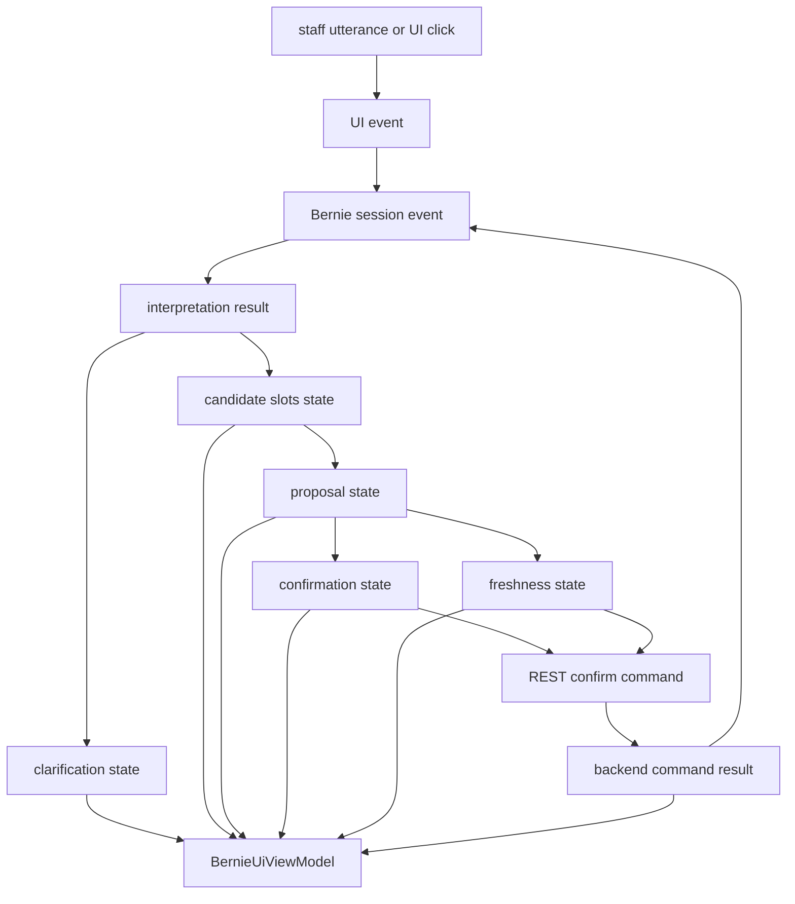
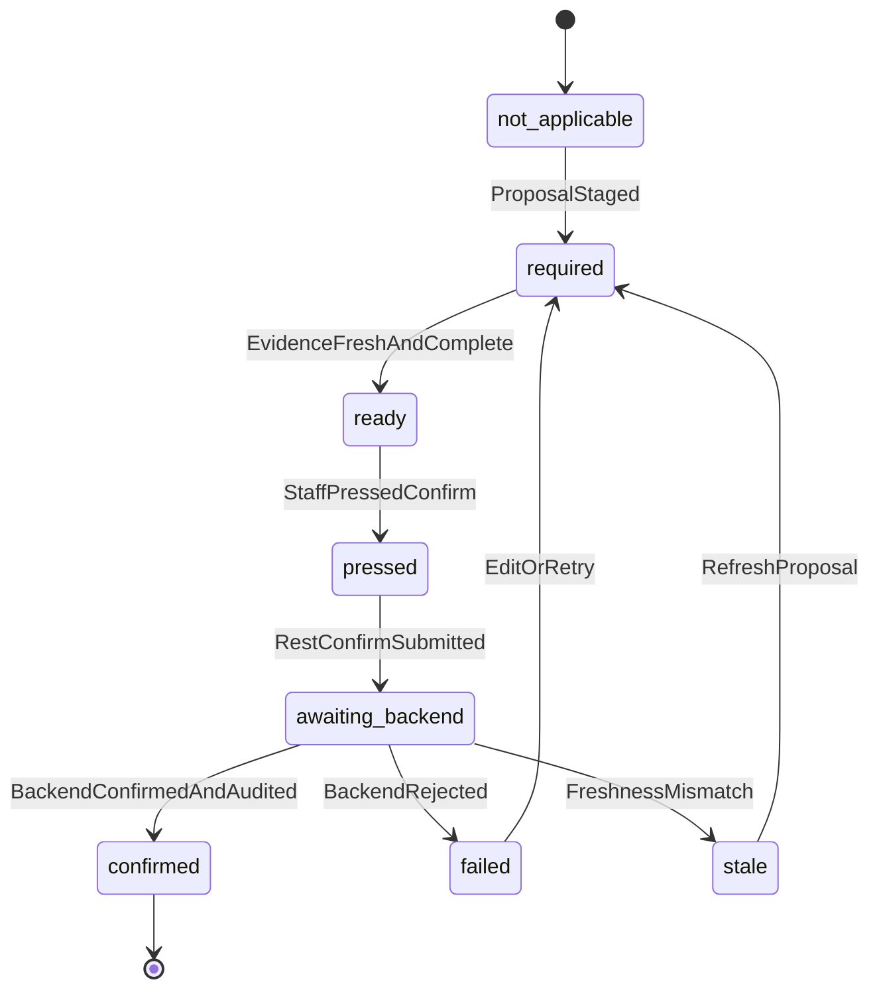

# Bernie UI Derived State DAG Plan

Date: 2026-07-08

Status: proposal only. This document does not approve runtime route wiring,
provider prompt wiring, provider dry-run wiring, memory/RAG/GraphRAG use,
H15/H-series runtime imports, historical diary material access, GraphQL
mutations, external patient clients, or model-to-database writes.

Sprint 236 D1/D2 amendment: Fable approved the direction only with the
constraints below. The first selector is anchored to
`app/schemas/appointments.py::BernieSessionSnapshotOut`, binds
`session_phase` to `app/services/bernie/session.py::BernieSessionState`, treats
`copy_mode` as a derived leaf, tags node values by source of truth, fails closed
on unknown enum values, and emits display-only state with no write payload,
write authority, provider, route, database, H15/H-series, historical diary, or
memory/RAG/GraphRAG wiring.

Proposal-surface guard citation:

```powershell
.venv\Scripts\python.exe scripts\bernie_interpretation_readiness_check.py
.venv\Scripts\python.exe scripts\bernie_provider_boundary_readiness_report.py
```

Expected current blocked values:

- `runtime_or_provider_wiring_ready=false`
- `raw_trove_access_ready=false`
- `runtime_gate_decision=blocked`
- `default_provider=disabled`
- `live_provider_enabled=false`
- `provider_calls_performed=false`
- `route_behavior_changed=false`
- `database_access_performed=false`
- `memory_or_rag_access_performed=false`
- `historical_diary_material_access_performed=false`

## Position

The Bernie UI should move toward a small, explicit derived-state graph for
reception-facing display. The goal is to reduce the current spread of local UI
switches for clarification prompts, candidate slots, proposal cards,
confirmation controls, stale warnings, and success/failure copy.

This is adjacent to causal DAG language, but the project should avoid the word
`confounder` in code because it has a specific statistical meaning. In EMR4 the
safer term is `conditioning node`, `derived state node`, or `view-model
dependency`.

The practical rule:

- session/event state records what happened;
- workflow statecharts define legal transitions over time;
- a derived-state DAG computes one current UI view model from the current
  session snapshot;
- REST commands remain the only authority for appointment writes.

## Why This Belongs Soon

This should be a near-term plan-only sprint candidate if Yuri does not approve a
runtime implementation sprint first. It should not be casually folded into an
unrelated implementation sprint because it changes the mental model for Bernie
UI behavior.

The correct first step is design and deterministic tests only:

1. define canonical Bernie UI state nodes;
2. define their dependency graph;
3. define the pure selector from `BernieSessionSnapshot` to `BernieUiViewModel`;
4. prove fixture snapshots render the expected visibility/copy/action flags;
5. request independent review before wiring into the live UI.

## Relationship To Existing Architecture

This plan extends, rather than replaces:

- `orchestration/event_driven_statechart_architecture.md`
- `orchestration/bernie_interaction_model.md`
- `orchestration/bernie_release_gates.md`
- the provider-free interpretation harness and readiness gates
- the API spine rule that GraphQL/read models expose context while REST commands
  own mutations

Statecharts model temporal legality. The DAG layer models current display
dependencies.

## Proposed State Flow



## Canonical Conditioning Nodes

Initial nodes should be small and typed:

| Node | Purpose |
|---|---|
| `session_phase` | Current workflow phase, such as instruction, clarification, candidate selection, proposal preview, confirmation pending, terminal success, or terminal failure. |
| `clarification_state` | Whether Bernie needs staff input, what field is missing/ambiguous, and whether prior facts are preserved. |
| `candidate_state` | Whether candidate slots exist, are empty, are stale, or have a selected candidate. |
| `proposal_state` | Whether a proposal is absent, staged, stale, blocked, or ready for confirmation. |
| `confirmation_state` | Whether confirmation is not applicable, required, ready, pressed, awaiting backend, confirmed, failed, stale, or blocked. |
| `freshness_state` | Whether the current proposal/candidate snapshot matches current backend context. |
| `identity_state` | Whether patient/practitioner identity is absent, ambiguous, recognized, staff-selected, or blocked. |
| `copy_mode` | Reception-safe copy mode: ask, offer, staged, not-booked-yet, success, stale, blocked, or technical-details-only. |

## Example Visibility Rules

The first selector can be deliberately boring and pure:

| UI element | Visible/enabled when |
|---|---|
| Clarification prompt | `session_phase == "clarification"` |
| Candidate slot list | `candidate_state == "available" and confirmation_state not in terminal states` |
| No-slot suggestions | `candidate_state == "empty_after_search"` |
| Pending proposal card | `proposal_state in ["staged", "ready"]` |
| Confirm button | `confirmation_state == "ready" and freshness_state == "fresh"` |
| Choose another time | `candidate_state == "available" and proposal_state in ["staged", "ready", "stale"]` |
| Identity verification panel | `identity_state in ["ambiguous", "staff_selected", "recognized"] and proposal_state != "confirmed"` |
| Success copy | `confirmation_state == "confirmed"` |
| Stale warning | `freshness_state == "stale" or confirmation_state == "stale"` |
| Old prompt/candidate history | hidden from primary panel when `confirmation_state in ["awaiting_backend", "confirmed"]`, available only in details/history if needed |

## Confirmation Example

`Confirm booking` should not directly mean `appointment_confirmed`.



Derived UI behavior then conditions many elements on one node:

- hide candidate list while `awaiting_backend`;
- disable confirm while `pressed` or `awaiting_backend`;
- show "not booked yet" copy for `required`, `ready`, `pressed`, and
  `awaiting_backend`;
- show success copy only after backend confirmation;
- expose retry/edit actions for `failed` and `stale`;
- collapse verification details after `confirmed`.

## Implementation Plan

### Sprint D1: Derived State DAG Design Packet

Goal: create a reviewed design surface only.

In scope:

- this plan;
- a small JSON or Markdown dependency matrix for Bernie UI state nodes;
- a Fable/Claude/DeepSeek review brief;
- explicit non-approval language for runtime/provider/route changes.

Out of scope:

- frontend component changes;
- route changes;
- provider changes;
- new GraphQL resolvers;
- database writes;
- appointment confirmation behavior changes.

### Sprint D2: Pure View-Model Selector

Goal: add a provider-free, route-free, DB-free selector that maps a synthetic
`BernieSessionSnapshotOut`-shaped snapshot to a view model.

Candidate artifact:

```text
app/services/bernie/ui_view_model.py
tests/test_bernie_ui_view_model.py
tests/fixtures/bernie_ui_view_model/*.json
```

The selector should be pure and deterministic. It should not import routers,
provider code, database models, H15 fixtures, H-series profiles, historical
diary builders, or local ignored outputs.

Fable-required D2 constraints:

- `session_phase` is exactly `BernieSessionState`, not a parallel phase enum;
- every canonical node records whether its value is server-snapshot-derived,
  client-transient, or derived;
- `copy_mode` is a leaf derived from the other nodes, not an independent input;
- unknown session or client-transient enum values fail closed with `ValueError`;
- `confirmed` and `success` can be produced only from backend-confirmed session
  state, never from client-transient button state;
- the view-model schema contains no `writes_authorized`, confirm payload,
  signed evidence, proposal freshness echo, appointment id, patient id, or
  practitioner id fields;
- the frontend consumption mechanism remains future backend-computed view model
  delivery, not shared frontend/backend code, because the current taskpane is
  plain JavaScript and must not drift through a reimplementation.

Acceptance:

- each fixture has one canonical session state and one expected view model;
- confirmation states drive multiple otherwise unrelated UI elements;
- success state is reachable only from backend-confirmed input;
- pressed/awaiting-backend states never claim the appointment is booked or
  confirmed;
- stale and failed states keep retry/edit paths visible;
- tests include the ordinary Margaret Thompson / Dr Shera release-gate flow as
  a fixture shape, with route/provider evidence clearly labelled as synthetic.

### Sprint D3: UI Integration Proposal

Goal: decide whether and where the selector should be consumed by the actual
Diary/Bernie taskpane UI.

In scope:

- inventory current UI switch points;
- map each switch to a canonical view-model field;
- identify which fields are already available from current route responses and
  which need read-model work later;
- produce a no-runtime-change migration plan.

Out of scope:

- broad visual redesign;
- live backend evidence claims;
- provider/runtime gate changes.

### Sprint D4: Narrow UI Consumer Slice

Goal: after review, wire one low-risk UI panel branch to the selector.

Suggested first branch:

- confirmation-state visibility/copy for candidate list, pending proposal card,
  confirm button, stale warning, and success copy.

Acceptance:

- route-intercepted Playwright evidence only unless a later sprint explicitly
  runs live backend checks;
- no provider calls;
- no appointment writes except through existing signed REST confirm command;
- ordinary staff copy never displays raw IDs, snake_case error codes, or
  "confirmed/booked" before backend success.

## Review Questions For Fable Or Substitute Reviewer

1. Does the split between event log, statechart, and derived-state DAG make the
   Bernie UI simpler, or does it add another abstraction too early?
2. Are the proposed canonical nodes the right level of granularity?
3. Which node is most likely to become a hidden write-authority leak?
4. Should the first selector live under `app/services/bernie/` as a backend
   contract, or in the frontend as a rendering concern?
5. What fixture cases must exist before any UI wiring sprint begins?
6. Does the plan preserve the API spine rule that reads and display hints are
   not write grants?

## Closed Gates

This plan keeps closed:

- live providers;
- provider dry-run wiring;
- runtime route wiring from the interpretation harness;
- memory/RAG/GraphRAG runtime wiring;
- H15/H-series runtime imports;
- historical diary material access;
- GraphQL mutations;
- new GraphQL resolvers;
- external patient clients;
- model-to-database writes;
- appointment writes outside existing REST command handlers.
