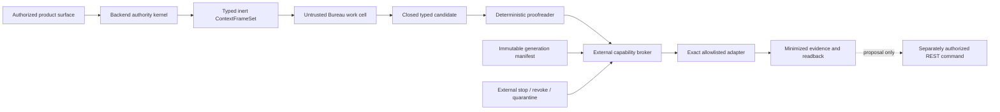

# Raisa AES-C0 architecture contract

Date: 2026-08-11

Status: `architecture_only_unmounted`

## Outcome

AES-C0 freezes the deterministic authority grammar that every later Agent
Execution Surface descendant must inherit. It defines what an occupied Bureau
generation could ask for, what a broker could grant, how that authority would
expire, and what evidence a future execution surface must retain. It implements
none of those runtime components.

The design treats model output, context, Memory Bank material and proofreader
input as untrusted data. Intelligence may propose closed typed arguments; it
cannot select an adapter, destination, method, credential, executable, SQL,
filesystem path, command route, cleanup target or policy amendment.

## Boundary classification

| Surface | AES-C0 classification | Authority consequence |
|---|---|---|
| Typed Context Fabric / Memory | inert, minimized, source-labelled input | never a capability or command grant |
| Occupied work cell | untrusted candidate generator | receives no lease or credential |
| Deterministic proofreader | candidate admission boundary | can reject or admit shape; cannot grant product authority |
| External capability broker | future deterministic authority kernel | resolves exact operation identity from current authority and immutable policy |
| GraphQL | read-only context plane | no mutation, provider invocation or command tunnel |
| Committed events | signal for a fresh authorized read | not current truth and not command evidence |
| REST/OpenAPI command | separate single-purpose command plane | requires current authorization, human/policy gate, idempotency, audit and readback |
| Audit evidence | minimized counts, reasons and digests | excludes raw prompts, reasoning, credentials and patient/product values |

## Closed capability vocabulary

The only leaseable classes are:

- `provider_inference`: one broker-owned billable inference operation with no
  provider-executed tools;
- `authoritative_read`: one exact fresh, authorized, read-only context
  operation; and
- `inert_tool_adapter`: an authored-synthetic adapter with no external effect.

`typed_proposal_egress` is not leaseable and is not executable. It may move
only to the deterministic proofreader. Generic network, filesystem, database/
SQL, shell/process, cloud metadata, repository/CI write, provider-executed
tools, runtime/deployment control, product commands and credential enumeration
are always denied.

## Six typed records

1. `GenerationManifest` binds one Bureau, work cell, principal/purpose digest,
   exact grants, cumulative budgets, stop conditions and pinned supply-chain
   identities to one immutable generation.
2. `CapabilityLease` is broker-side, audience-bound, expiring and revocable. It
   cannot be presented to the work cell or contain a reusable credential.
3. `BudgetState` carries independent cumulative reasoning, information,
   egress, action, denial and elapsed-time counters. A reached positive ceiling
   stops before the next operation; a zero ceiling means the capability is
   disabled, not that a fresh generation is already exhausted.
4. `BrokerDecision` records allow, deny or stop only after manifest/grant/lease,
   current-authority, proofreader and budget checks.
5. `RevocationRecord` invalidates all leases, aliases, tokens, writable caches
   and future calls for the generation. Clearing a conversation is not cleanup.
6. `AuditEvidenceEnvelope` records only closed reasons, cumulative counts and
   version-bound digests, with `contains_sensitive_values: false`.

Every record is a closed JSON Schema object. The authored-synthetic packet binds
all six records to the same generation, manifest, authority digest and exact
grant. It is evidence of contract coherence only, not a runtime simulation.

## Budgets and terminal behavior

Reasoning capacity and action authority are deliberately separate. Increasing
a model's thinking budget does not increase its information, egress, tool or
command budget. Encoded, compressed, chunked and exception-channel output
shares the same egress counters. Denials and boundary probes are cumulative.
Redirects, product mutations and command confirmations have a hard ceiling of
zero.

Provider failure is an explicit `intelligence_unavailable` state. Ordinary
manual product controls and preconfigured infrastructure safeguards may remain
available, but neither a different provider nor a deterministic imitation may
silently stand in for required model intelligence. An alternate provider would
require a new generation and separate acceptance.

## API Spine fit

AES-C0 adds no route or resolver. Its manifest is declarative input, not an
executable policy engine. In a future implementation, the backend--not the
model--would own authorization, freshness and audit. GraphQL remains Query-only;
events prompt fresh reads; Access AI invocation remains backend-brokered; and
any mutation remains on the existing explicit REST/OpenAPI command plane.

The broker may eventually prepare a typed proposal. It cannot confirm a
command for a human, use an event as authority, or issue a database connection
to the work cell.

## Deterministic evidence

The provider-free acceptance harness validates the closed schema, semantic
cross-bindings and the canonical authored-synthetic packet. It also mutates 37
independent boundaries covering runtime/provider opening, ambient authority,
operation-identity control, context execution, budget weakening, API command
confusion, fallback, revocation, supply-chain credentials, evidence leakage,
cross-generation replay and over-budget operation. All 37 mutations fail
closed.

No container, process broker, provider, credential, network, database, product
source, watcher, tool, command or deployment is exercised.

## Claim boundary and next descendant

AES-C0 proves that the selected containment doctrine can be expressed as a
closed, internally consistent and mechanically hostile-tested contract. It
does not prove operating-system, broker, adapter, provider or model security;
runtime enforcement; product-data safety; production readiness; or clinical
safety.

AES-C1 is the next safe descendant: a provider-free admission rehearsal over
authored-synthetic instances of this exact contract. It remains unmounted and
cannot add a real adapter, provider call, product read, tool or command.
