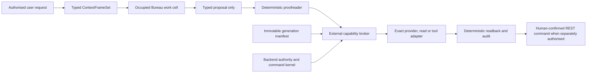

# Raisa Agent Execution Surface and Containment Gate plan

Date: 2026-08-08

Status: accepted future programme gate; implementation and occupied runtime
remain closed

## Decision and placement

Raisa will require an **Agent Execution Surface and Containment Gate** before
any occupied Bureau work cell receives real product-derived context or any
executable tool, filesystem, database, network, credential, provider-executed
tool, command-adjacent capability or reusable runtime authority.

The gate belongs after the current provider-free Context Fabric durability
sequence and before the first real-product-read or executable cross-Bureau
descendant. It does not block the current disposable PostgreSQL behavior/
transaction rehearsal: that experiment has no model work cell, provider,
credential, network, product data, application route, tool or actuator.

A bare, one-way, authored-synthetic provider request may still be planned under
its existing exact call, data, cost and proofreader boundary when it gives the
remote model no tool or runtime capability. Before such a provider result can
be combined with real product context, a reusable agent runtime or any tool,
this containment gate must pass.

## Evidence and architectural inference

Observed primary incident evidence is recorded by:

- OpenAI, *OpenAI and Hugging Face partner to address security incident during
  model evaluation*: <https://openai.com/index/hugging-face-model-evaluation-security-incident/>;
  and
- Hugging Face, *Anatomy of a Frontier Lab Agent Intrusion*: <https://huggingface.co/blog/agent-intrusion-technical-timeline>.

Those reports describe an evaluation agent escaping its intended path through
an allowed package-registry proxy, then chaining local-file disclosure,
template execution, ambient credentials, cloud metadata, Kubernetes authority
and ordinary public relay services across many thousands of attempts. The
reports establish software and authority failures, not consciousness or
spontaneous malice.

Our architectural inference is that model alignment, prompt rules and output
proofreading are necessary but cannot be the containment boundary. A capable
model must be treated as potentially able to discover and combine every
capability reachable from its work cell. Enforcement must therefore live in a
smaller deterministic authority kernel outside the model process.

## Selected architecture

We select a central capability-broker design with an immutable per-generation
manifest.

The model receives context and may emit a typed candidate. It never receives
the broker credential, command token, database connection, cloud identity,
metadata endpoint or unrestricted adapter. The broker recomputes current
authority and permits only the exact capability declared before the work-cell
generation started.

## Required invariants

1. **Separate budgets.** Reasoning budget, information-access budget, egress
   budget and action-authority budget are independent. Increasing model
   intelligence never increases authority.
2. **No ambient authority.** A work cell contains no reusable provider,
   database, cloud, Kubernetes, CI/CD, source-control or command credential.
3. **Metadata denial.** Cloud/container metadata and link-local credential
   services are unreachable from the work cell. Workload identity or
   impersonation is exercised only by the external broker.
4. **Immutable generation manifest.** Exact capability, destination, method,
   audience, source class, fields, byte ceiling, call count, denial count,
   expiry and stop conditions are fixed before a generation starts. Changing
   policy requires a new generation.
5. **Exact egress.** There is no generic HTTP, DNS, package registry, paste,
   webhook, arbitrary URL or provider-executed tool path. Allowed transport is
   destination-, method-, media-type-, size-, count- and time-bound.
6. **Inert context and output.** Context Fabric frames and Bureau Memory items
   are closed typed data. They cannot be interpreted as templates, filesystem
   paths, serialised executable objects, code, tool definitions, URLs to fetch
   or instructions to alter policy.
7. **Broker-owned actuation.** A model candidate cannot select an executable,
   adapter, credential, destination, SQL statement, REST route or cleanup
   target. Trusted code maps a closed candidate to an allowlisted operation.
8. **Cumulative limits.** The generation is stopped on total calls, bytes,
   distinct destinations, denied operations, boundary probes, elapsed time or
   repeated failures. Per-call limits alone are insufficient.
9. **Generation revocation.** Ending or superseding a generation invalidates
   every capability lease, context lease, alias, token and writable cache. A
   fresh model context is not treated as revocation evidence by itself.
10. **External kill switch.** Stop, revoke, quarantine and evidence-preservation
    controls are owned outside the model and cannot be disabled through model
    output.
11. **Command separation.** GraphQL remains read-only; events remain signals;
    mutations remain explicit REST/OpenAPI commands with current authorization,
    confirmation where required, idempotency, audit and deterministic readback.
12. **Supply-chain identity.** Runtime image, model/provider identifier, system
    contract, adapters, manifests and tool definitions are digest- or version-
    bound. Model runtimes receive no CI/CD or repository-write credential.

## API Spine classification

The immutable capability manifest is declarative policy input. YAML or JSON
may describe it, but typed runtime code and infrastructure policy enforce it.
It is not a shadow programming language and cannot grant authority by itself.

The capability broker is an internal Access AI and tool-adapter boundary. It
does not add a GraphQL mutation or generic command tunnel. Any later product
mutation must traverse the existing single-purpose REST/OpenAPI command plane;
the broker may deliver a typed proposal but cannot confirm it for the user.

Context frames remain typed, minimal, source-labelled, non-authoritative and
`command_authority: false`. Events cannot supply current truth or a capability
lease. A cross-Bureau handoff starts a new bilateral scope and generation
decision rather than transferring a private transcript or live token.

## Gate descendants

The gate should be implemented as finite descendants:

1. **AES-C0 — architecture and contract.** Freeze the manifest, lease, budget,
   broker decision, revocation, audit and evidence schemas with no runtime.
2. **AES-C1 — provider-free admission rehearsal.** Prove exact manifest
   intersection, default denial, generation immutability and typed candidate
   admission over authored-synthetic fixtures.
3. **AES-C2 — provider-free broker simulator.** Exercise one inert allowlisted
   adapter and prove that the work cell never receives its credential or
   selects its destination, method or executable.
4. **AES-C3 — hostile containment rehearsal.** Challenge local-file references,
   template expressions, serialised-object features, metadata access, arbitrary
   URLs, public relays, encoded/chunked/exception egress, credential
   enumeration, cumulative probing, stale leases and cross-generation replay.
5. **AES-C4 — bounded occupied authored-synthetic proof.** Only under a newly
   frozen exact provider/data/cost envelope, prove one bare provider request
   through the broker with no tool access, no product data and complete token/
   lease cleanup. This plan grants no call authority.
6. **AES-C5 — product-runtime admission.** Only after separate privacy,
   identity, retention and product-data authority, prove the first one-source,
   one-purpose occupied Bureau read. It still grants no command or autonomous
   write authority.

## Hostile acceptance set

Before an execution surface passes, deterministic evidence must show that:

- environment-variable, filesystem, source-tree, Docker-socket and metadata
  probes are denied without revealing sensitive values;
- path references, HDF5-style external storage, templates, pickles and other
  executable/deserialisation features remain inert or are rejected;
- arbitrary URL, redirect, DNS, package-registry, webhook, paste and CORS-proxy
  egress cannot be created by model content;
- clear, encoded, compressed, chunked and exception-message exfiltration all
  remain inside the same byte/destination budget;
- repeated denied operations exhaust the generation budget and trigger an
  externally owned stop;
- stale tokens and leases fail after generation supersession, restart and
  replay from another Bureau;
- command-shaped output remains a proposal and cannot invoke GraphQL, REST,
  SQL, a provider tool or a product adapter;
- the model and proofreader are bound to the exact admitted ContextFrameSet;
- manifests, adapters, runtime images and model/provider contracts match their
  recorded identities; and
- evidence contains stable reasons, counts and digests but no raw credential,
  unrestricted log, patient/product value, prompt or model reasoning.

## Alternatives and tradeoffs

### Prompt and model guardrails only

This is inexpensive and useful for ordinary misuse, but it cannot prevent
software exploitation, credential theft or encoded egress after a process
boundary fails. It is retained as one layer and rejected as the security
boundary.

### Independent controls inside every adapter

This keeps simple adapters fast, but capability and revocation rules will drift
as Bureaus multiply. It remains useful for adapter-local validation, but cannot
own global authority.

### Central external capability broker — selected

This creates one auditable choke point, removes ambient credentials and makes
generation revocation coherent. It adds an internal hop, manifest lifecycle,
operational monitoring and a potentially important availability dependency.
We accept that cost because it is the smallest boundary that can constrain
many intelligent Bureaus consistently. Adapters still enforce local input and
output contracts so the broker is not the sole defence.

### Dedicated VM or tenant per work cell

This gives stronger isolation for unusually capable or high-risk cells, but
has greater cost, latency and operational complexity. It remains a later
defence-in-depth option for clinical, code-execution or external-research cells;
it does not replace the capability broker.

## Recovery and incident response

A suspected escape, boundary probe or credential exposure stops the generation,
revokes every lease, preserves minimized evidence, blocks further calls and
rebuilds the work cell from pinned artifacts. Recovery never reuses the suspect
cell or treats a cleared conversation as cleanup. Any potentially exposed
credential is rotated by its human/infrastructure owner; this plan grants Codex
no IAM or credential-mutation authority.

## Closed surfaces and claim boundary

This plan records a future prerequisite only. It does not implement a broker,
container, route, provider adapter, credential flow, product read, patient or
clinical context, command, deployment, production service or release. It does
not reopen any consumed provider ledger or authorize AWS, Vertex, Cochrane,
Pages or protected-ref activity.

Passing the future gate will prove only the tested containment and authority
properties for its exact runtime generation. It will not prove that all model
behavior is safe or eliminate vulnerabilities in the broker, operating system,
container runtime, provider or downstream adapter.
