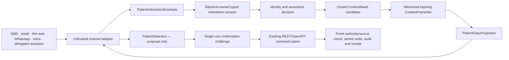

# Channel-neutral patient interaction foundation architecture

Date: 2026-08-13

Timestamp: 2026-08-13T14:37:36+10:00 (Australia/Brisbane)

Status: architecture-only, provider-free and unmounted

## Decision

Raisa will be capable of meeting a patient in software the patient already
uses without making any channel the system of record or command authority.
SMS, email, thin web, WhatsApp, voice and a future delegated assistant are
replaceable renderers around one backend-owned interaction protocol.

Authentication is **passkey-first, not passkey-only**. A passkey is the
preferred phishing-resistant returning authenticator after a patient has been
properly proofed and linked to one practice patient record. Multiple
authenticators, inclusive alternatives and explicit recovery are part of the
account lifecycle. EMR4 does not require a password vault or physical security
key, does not ingest the device biometric used to unlock a passkey, and does not
treat synced-passkey recovery as infallible.

This architecture freezes a policy and message grammar. It enables no patient
account, passkey, identity provider, channel or booking command.

## Boundary classification

This is a static security, identity and API-spine contract:

- future read projections remain backend-assembled, minimized, expiring and
  non-authoritative;
- future state changes remain single-purpose REST/OpenAPI commands;
- channel delivery and webhook events remain integration observations, not
  commands or receipts;
- policy artifacts describe default-deny posture but do not implement a runtime
  policy engine; and
- any future language model may interpret intent only after an AES-controlled
  admission and can neither identify a patient nor raise assurance.

The API Spine's external-patient-client gate therefore remains closed.

## The identity chain

The architecture preserves six distinct decisions:

1. **Record resolution** finds a unique practice patient record. An IHI can
   make record matching safer, but an IHI, Medicare number, date of birth,
   address, telephone number, email address or appointment detail is not a
   secret and cannot authenticate its subject.
2. **Identity proofing** establishes that a real person owns the asserted
   identity. The preferred initial path is an attended interaction with the
   patient's practice. Approved remote attended, accredited federated or
   document-verification methods remain future options.
3. **Identity binding** links an opaque identity subject to exactly one active
   practice/patient relationship and its proofing provenance.
4. **Authentication** establishes control of a currently bound authenticator.
   The preferred mechanism is a passkey, with multiple authenticators supported.
5. **Authorisation** decides whether that current subject, practice link,
   proxy scope, assurance level and purpose permit this exact read, proposal or
   command attempt.
6. **Recovery** temporarily restricts ordinary authority while independently
   established recovery evidence or repeated proofing permits new
   authenticators to be bound and old authority to be revoked.

Neither success at an earlier step nor a claim from a model, browser or channel
substitutes for a later decision.

## Principal model

An identity account and a clinical domain record remain separate objects.

| Object | Meaning | Never implies |
|---|---|---|
| `identity_subject` | An opaque proofed or unproofed digital subject | a patient record or practice grant |
| `practice_patient_link` | One active link from a subject to one practice patient record | cross-practice access |
| `channel_binding` | A recognised delivery/continuity route | identity proof or command authority |
| `authenticator_binding` | One approved authenticator attached under current assurance | patient/proxy scope |
| `proxy_grant` | Exact patient, practice, action, expiry and revocation scope for a parent, guardian or carer | credential sharing or general access |

This also prevents a future third-party assistant from being represented as the
patient. It is a separate client principal acting under a separate, narrow and
revocable delegation.

## Assurance ladder

`public` permits generic minimized availability only. It does not claim that a
patient has been recognised.

`recognized_channel` permits neutral continuity or notification. An inbound
message from a previously registered address can locate a possible interaction
session, but the response cannot reveal whether a patient record exists.

`verified_patient` means a proofed, active practice/patient link and a currently
accepted authenticator. It may later permit own-booking reads, proposals and
practice-policy-approved ordinary booking confirmation.

`stepped_up` is required for sensitive identity or delegation changes and any
future action that practice policy classifies as higher risk.

`recovery_restricted` is a safety state, not the top of the ladder. Ordinary
booking and patient-record authority are suspended until recovery completes.

Every action is default-deny. A channel or probabilistic component cannot raise
the observed level.

## Passkeys and accessibility

Passkeys are preferred because the authenticator signs for the genuine relying
party rather than asking the patient to type a reusable secret into whichever
screen looks convincing. Modern Apple, Android, Windows, macOS and ChromeOS
devices broadly support them, and synced passkeys reduce single-device loss.

They are not made exclusive because patients have different devices, abilities,
support networks and levels of technical confidence. The future service must:

- support more than one authenticator;
- encourage a second independent means during ordinary use rather than waiting
  for a crisis;
- provide an assisted, non-digital exception path;
- allow patient-chosen password managers or security keys without requiring
  them; and
- make an SMS/email fallback visibly lower assurance rather than silently
  treating it as equivalent.

Email is not an out-of-band authenticator. SMS, voice and encrypted messaging
possession are not phishing-resistant and cannot alone recover a high-assurance
account.

## Recovery

Recovery is intentionally rarer and more deliberate than everyday access. A
future recovery may use:

- a still-bound authenticator plus independent recovery evidence;
- two independent recovery methods;
- repeated approved identity proofing; or
- attended reproofing by the patient's practice.

Recovery starts a restricted state, sends notifications independently of the
initiating transaction, revokes prior sessions and compromised authenticators,
applies a bounded cooling-off period to sensitive changes and records an audit
event. Demographic or health knowledge cannot serve as proof. Recovery cannot
confirm a booking or manufacture a parent/guardian/carer grant.

The practice is the humane recovery institution of last resort: it already has
a legitimate relationship with the patient and can assist without forcing the
patient to become an identity-management specialist.

## Channel-neutral flow

The interaction envelope carries opaque transport and conversation references
and a content digest, not authority. Server-owned session state remembers the
last admitted projection and its expiry; provider or channel memory does not.

The Context Fabric remains behind the backend boundary. A channel may contribute
an untrusted intent candidate but cannot retrieve a ContextFrameSet directly.

## Projection and race semantics

A `PatientDiaryProjection` is a renderer-neutral view of a small candidate set.
It carries an expiry and authoritative source revision. Candidate references are
opaque. The projection says neither that a slot is current truth nor that it is
reserved.

A `PatientSelection` identifies one candidate from one expiring set and remains
proposal-only. If it is stale, Raisa reassembles the projection.

A `PatientConfirmationChallenge` binds the current identity subject,
practice/patient relationship, assurance, proposal evidence, source revision,
action and short expiry. It is single-use and not a reusable credential. The
server chooses the command family.

The existing command plane then independently rechecks current principal,
practice/proxy scope, assurance, proposal evidence and Diary truth inside the
authoritative mutation path. The winner receives the atomic command receipt;
the loser receives a truthful stale/blocked result and a refreshed projection.

## Transport versus command effects

A channel message ID or webhook delivery ID supports transport deduplication.
It is not a command idempotency key. A delivered/read/replied event is not a
booking receipt. Booking success exists only when the REST command's atomic
appointment, audit and idempotency receipt commits; replay returns the exact
stored command outcome.

This means a notification may be late or lost without changing Diary truth.

## Embedded email and thin web

Plain text is the universal representation. Dynamic email cards or messaging
buttons may later improve compatible clients, but they cannot be required for
correctness. An expiring thin-web handoff is the universal rich and accessible
escape hatch for stronger authentication, larger projections, consent and
transaction confirmation. It remains a renderer of the same protocol, not a
second booking application or command path.

## Future delegated assistants

Siri, Alexa or a general chatbot remains an explicitly preserved future gate.
Any such client must be registered, use an authorization-code flow with PKCE,
receive only minimum audience-restricted scopes, support revocation and satisfy
per-command confirmation policy. Sender-constrained tokens should be used where
supported. The patient never gives the assistant an EMR credential, and Raisa
never exposes a generic command tunnel.

## Audit, idempotency and security fields

The future implementation must retain opaque subject, practice, patient-link,
proxy, session, proposal, source-revision, correlation, command-idempotency,
audit and receipt references; assurance level and reason codes; binding and
recovery revision; issuance, expiry and revocation state; and non-enumerating
failure disposition.

Operational audit proves decisions without copying message bodies, patient
identifiers, contact addresses, credentials, recovery secrets, clinical reasons
or provider output.

## Standards and current Australian horizon

The posture is informed by:

- Australian Signals Directorate guidance that passkeys provide phishing-
  resistant MFA and are supported across modern consumer platforms:
  `https://www.cyber.gov.au/protect-yourself/secure-your-accounts/passkeys`;
- NIST SP 800-63B-4 authenticator binding and recovery guidance, including
  multiple authenticators, independent recovery methods and notifications:
  `https://pages.nist.gov/800-63-4/sp800-63b.html`;
- NIST SP 800-63A-4 separation of resolution, validation, verification and
  enrolment: `https://pages.nist.gov/800-63-4/sp800-63a.html`;
- OAuth 2.0 Security Best Current Practice for PKCE, minimum privilege,
  audience restriction and sender-constrained access tokens:
  `https://www.rfc-editor.org/rfc/rfc9700.html`; and
- Australian Government healthcare-identifier guidance, under which the IHI
  is a stable record-matching identifier rather than an authenticator:
  `https://www.health.gov.au/topics/health-technologies-and-digital-health/about/healthcare-identifiers`.

Australian Government Digital ID may later become a useful proofing/federation
option, but private-sector participation applications do not open until
December 2026. The architecture preserves that seam without depending on it.

## Deliberately unresolved choices

This slab does not decide:

- central Raisa identity versus deployment/practice-scoped identity topology;
- a remote proofing, federation, DVS or Australian Digital ID provider;
- which appointment types each practice permits patients to self-confirm;
- exact assurance levels for cancellation, rescheduling or sensitive details;
- recovery staffing, cooling-off duration or service level;
- which channel is implemented first; or
- production credential, retention, hosting or data-residency posture.

Those choices need evidence from a future dedicated external-patient-client
programme. They do not prevent Reception One's staff UI from proceeding against
the already accepted backend command contract.

## Claim boundary

The contract proves architecture only. It neither authenticates nor recognises
a real person and grants no permission to use patient data, call an identity or
message provider, mount a route, add a database table, register a passkey,
deliver a message, execute a booking, deploy or release.
