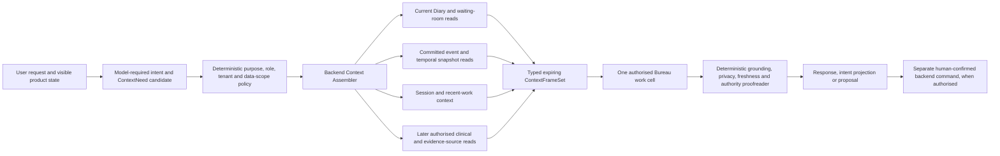

# Raisa Practice Context Fabric

Date: 2026-08-08

Status: accepted direction through the runtime-closed behavior/transaction
implementation candidate, with the future Agent Execution Surface and
Containment Gate position fixed

## Purpose

Raisa should become responsive to the working life of a general practice without
turning a provider model into the practice's memory or giving any Bureau a broad
database view. The accepted direction is a backend-owned **Practice Context
Fabric**: a temporal, permissioned substrate that assembles the smallest useful
set of typed context frames for a particular request, Bureau and moment.

The fabric metaphor is deliberate. Authoritative records and events are the
threads; deterministic policy and retrieval form the loom; the user's purpose
selects the pattern; and a response, projection or proposal is a temporary shape
made from those threads. Like clothing, shelter, carpet or a tapestry, the same
material can be composed into many useful forms without becoming an undifferentiated
cloud. Every released shape must retain its weave trace: provenance, scope,
freshness, redaction and expiry.

This is one way to knit Rayleen, Bernie, Davida, Consultant and future Bureaus
into a coherent Raisa intelligence while preserving their distinct roles and
authority ceilings.

## Architectural proposition

The Context Fabric is not a single prompt, vector store, global transcript or
agent memory. It is a deterministic backend service family that turns a scoped
`ContextNeed` into an expiring `ContextFrameSet` from authoritative sources.

The probabilistic layer may interpret the user's request and propose which
context is useful. It cannot decide what the principal may see, retrieve data
directly, extend retention, certify freshness or convert context into command
authority. Those remain deterministic backend decisions.

## Core objects

### `ContextNeed`

A closed, non-authoritative candidate describing the information required to
answer the current request. It should include:

- requesting Bureau, user intent and purpose code;
- tenant/practice and session bindings supplied by the backend, not the model;
- requested entity kinds and tentative identifiers or search features;
- temporal window, such as now, this morning, the last two hours or yesterday;
- source classes, precision requirements and maximum result cardinality;
- freshness requirement and whether historical state is necessary; and
- an explicit `command_authority: false` ceiling.

### `ContextScopeGrant`

A short-lived backend decision that intersects the need with the current
principal, role, practice, location, purpose, consent and source policy. It
records allowed frame types, fields, time windows, row/card limits, redactions,
expiry and reasons for every denied or reduced request. A provider-model output,
UI selection or prior grant cannot substitute for it.

### `ContextFrame`

One typed, source-labelled read projection. Existing EMR4 frame distinctions
remain controlling: live API fact, staff selected, caller signal, manifest
policy, model interpretation and fixture/intercepted evidence must not be
collapsed. Each frame should carry at least:

- frame type and schema version;
- opaque frame and source references;
- practice, purpose and authorised-reader bindings;
- `observed_at`, `assembled_at`, `expires_at` and source revision/event cursor;
- provenance and evidence mode;
- field-level redaction/minimisation disposition;
- content digest and supersession state; and
- `read_only: true` and `command_authority: false`.

### `ContextFrameSet`

The immutable, request-shaped bundle admitted to one Bureau turn. It binds the
need, grant, frames, exact source revisions, omissions, ambiguity state, expiry,
maximum disclosure and a digest. The model and deterministic proofreader must
see the same admitted bundle or an explicitly declared proofreader superset.
Responses and projections cite the frame ids and source revisions that ground
them. A stale or superseded set is reassembled, not patched in place.

### `ContextWeaveTrace`

A patient-safe audit record of how the bundle was produced: requester, purpose,
policy version, source classes queried, scope reductions, frame digests,
freshness, model/proofreader disposition and released output reference. Raw
provider reasoning is not required, and sensitive values should not be copied
into an operational audit merely to prove that they were read.

## Temporal practice memory

The Context Fabric needs several kinds of time-aware backend truth, kept
distinct:

1. **Current operational truth** — current Diary, appointments, waiting-room
   state, practitioner/location directories and other authorised read models.
2. **Committed event memory** — typed facts that a change occurred, used as a
   signal to perform a fresh authorised read. Events are not current truth or
   commands.
3. **Historical operational state** — bitemporal change records or periodic
   immutable snapshots sufficient to answer questions about what the waiting
   room or Diary looked like at a prior time. Retention and access must be
   purpose-specific.
4. **Recent collective work** — a bounded, practice-owned index of relevant
   recent user-visible events and completed actions, separated from private
   per-user conversation state and filtered by role and purpose.
5. **Session state** — the current user's selected entities, visible projection,
   unresolved ambiguity and proposal freshness. It is explicit state-machine
   memory, not a model transcript treated as truth.
6. **Durable domain threads** — later objects such as Consultant's
   `DiagnosticThread`. The domain object owns longitudinal reasoning and
   obligations; the Fabric may carry a scoped frame that references it.
7. **Knowledge-source evidence** — Cochrane and complementary evidence packets
   remain cited source frames with their own licence, version, retention and
   clinical-authority rules. They are not mixed invisibly with practice facts.

Where both "what was known then" and "what was later corrected" matter, the
source should support valid-time and transaction-time semantics rather than
overwriting history.

## Bureau Memory Bank

Recent collective work should be available through a named **Bureau Memory
Bank**, but only as another Context Fabric frame. It is not a new source of
truth, a second audit ledger, a provider-model memory, a global transcript or a
standalone search API.

The compliance audit and the Memory Bank serve different purposes:

- the audit is complete, immutable, compliance-oriented and independently
  retained;
- the Memory Bank is derived, lossy, minimal, purpose-filtered, expiring and
  rebuildable;
- a Bureau never queries or receives raw audit records;
- memory items are historical references, not evidence of current truth,
  identity, present authority or command success; and
- correction or supersession rebuilds or omits a projection rather than
  patching an already released frame.

The first contract should place `bureau_memory_item_set` under the existing
`recent_collective_work` source class. A closed `BureauMemorySelector` may name
originating Bureaus, allowlisted action families, the actor relation (`self`,
`same_practice_staff` or `system`), outcome codes, a temporal hint and a maximum
result count. It must not support free-text audit search, SQL-like predicates,
wildcard sources or model-selected identity scope.

Each released `BureauMemoryItem` should carry only a bounded request label,
action family, outcome code, initiator relation, target kind, policy-permitted
opaque target reference, start/completion times, source receipt/revision/digest,
supersession state, relevance reasons and an
`authority_ceiling: read_context_only`. Raw prompts and responses, before/after
payloads, secrets, IP addresses, user agents, database keys, unrestricted actor
identities and command material are forbidden.

The model may propose one named horizon: `current_turn`, `current_session`,
`current_practice_day`, `previous_practice_day`, `recent_operational`,
`explicit_interval` or `durable_thread_link`. Backend policy converts the hint
into an effective interval by intersecting it with practice timezone, role,
purpose, source availability and the authorised cap. It can only preserve or
narrow the request. Fixture durations used in the first descendant set no
production retention period.

## Example: “Who was that person called George?”

A request such as “Who was the person who came in this morning, probably
George, and was looked after by Priya?” should not cause a whole-day patient or
Diary dump.

The intent layer may propose a need for recent arrivals, a bounded morning time
window, approximate first-name evidence and a staff-attendance relation. The
deterministic scope layer decides whether the requester may perform that lookup
and which identifiers may be disclosed. The assembler queries current and, if
needed, historical waiting-room/event projections, then returns a small ranked
candidate frame with explicit match bases and ambiguity. Raisa can say that one
candidate fits or ask for another discriminator. She must not silently assert
identity, reveal unrelated patients or turn the match into a write.

This exact example requires later product/patient-data, identity, privacy,
retention and runtime authority. Its inclusion here specifies intended
behaviour; it grants none of those authorities.

## Bureau relationship

- **Bernie** receives prospective Diary, patient-booking, availability,
  visible-view, session and recent committed-event frames.
- **Rayleen** receives present and, when authorised, bounded historical
  arrival/waiting-room frames. Queue state and elapsed time remain backend
  calculations.
- **Davida** receives practice profile, directory, capability, policy, audit and
  dry-run frames, never unrestricted administration state.
- **Consultant** receives curated patient/encounter, Diagnostic Thread and cited
  evidence-source frames. The clinician remains the clinical authority.
- **Requests/referrals, prescribing/medicines and billing/claims Bureaus** will
  receive only the task-specific encounter, correspondence, medication,
  eligibility or financial frames independently authorised for their purpose.
  Each retains its own proofreader and command gate.
- **Proofreaders and command services** receive the exact grounding and
  authority bindings needed for their task, not a Bureau's private narrative.

Bureaus may share the Fabric but do not share private model memory or authority.
A cross-Bureau handoff is a new typed request with bilateral scope and provenance,
not an informal transcript transfer.

`RECEPTION ONE™` and the candidate `Clinician One` are user-facing workspace and
projection families, not authorisation domains. The Fabric may knit several
independently granted Bureaus into either experience, including capabilities
that legitimately cross reception and clinical work. The user's current
atomic capability grants determine which Bureaus and actions are present; the
brand, screen or occupational label grants nothing by itself.

## Implementation sequence

The direction should be implemented through narrow descendants rather than one
large “memory” feature:

1. **Fabric and Memory Bank contract** — **accepted** at exact independently
   reviewed source HEAD `cb1b0a712f8ee5340e73d8adde19103af0d9ed97`;
   provider-free authored-synthetic schemas for `ContextNeedCandidate`, backend
   `ContextAuthorityBinding`,
   `ContextNeed`, deterministic `ContextScopeGrant`, `BureauMemorySelector`,
   `BureauMemoryItem`, `ContextFrame`, `ContextFrameSet`, selector/weave trace
   and same-packet proofreader trace, aligned with the API Spine and existing
   Bureau frame contracts. The GraphQL surface remains documentation-only and
   unmounted.
2. **Current operational weave** — **accepted** at exact independently reviewed
   source HEAD `d8bc059212e65a6ed2d7ac8d57734096d14b9139`; four existing
   authorised Diary, waiting-room, directory and private-session read shapes
   compose into one typed expiring bundle without a new product route or data
   source.
3. **Patient-free temporal weave** — **accepted** at exact independently
   reviewed source HEAD `f32004a2f39ac769ba746afe2663813f7c422d8a`;
   immutable parent-bound frame sets are invalidated rather than patched,
   sealed watcher transitions preserve their committed checkpoint before any
   later read, continuity gaps fail closed, and purpose-scoped bitemporal
   snapshots remain historical context rather than current truth. This proves
   no live watcher, persistence or production retention.
4. **Intent-shaped retrieval rehearsal** — **accepted** at exact independently
   reviewed source HEAD `b24b56bda296f3713b5e2c0e52545c749e71540a`;
   five closed authored-synthetic intents deterministically select the minimum
   Current, recent-work and historical components, preserve the four-source
   Current coherence packet, require bilateral Memory sharing, return bounded
   opaque alternatives instead of guessed identity, reject invalidated Current
   state and recompute every upstream and same-packet proofreader.
5. **Occupied model-required intent shaping** — **accepted** at exact
   independently reviewed source HEAD
   `44f341481b55f99a18a47838da0f2b7e43a2f73e`; one primary Sydney Vertex
   `gemini-2.5-flash` call proposed the exact closed comparison intent, and the
   deterministic parent retrieval proofreader alone admitted it. One call and
   USD 0.25 were consumed, no correction or post-success call occurred, no raw
   provider/credential material was retained and owned cleanup completed. The
   controlling frozen plan is
   `docs/raisa-authored-synthetic-model-required-practice-context-fabric-intent-shaping-rehearsal-plan.md`.
6. **One-source provider-free adapter** — **accepted** at exact independently
   reviewed source HEAD `12fbab157551954018e781810e4b100f05698dfb`;
   the first descendant consumes only a completed authored-synthetic instance
   of Rayleen A4's `emr4.waiting_room_context_frame.v1`, validates and minimizes
   it behind the accepted binding/grant, applies a complete backend-authored
   opaque-reference manifest and emits one unmounted
   `current_waiting_room_projection` source envelope. It cannot invoke or
   refresh the source, watch changes, mount a route, call a provider or execute
   against real product data. Two vetoes found the nominal evidence-only result
   schema and then fully resealed provenance detachment. The accepted repair
   separates closed result/evidence schemas, recomputes the entire expected
   result from authoritative inputs at the deep-copy handoff and supports all
   independent waiting-field grant subsets before the unchanged parent
   projection. The controlling plan is
   `docs/raisa-provider-free-unmounted-rayleen-waiting-room-context-fabric-source-adapter-plan.md`.
7. **Provider-free invalidation/reassembly seam** — **accepted** at exact
   independently reviewed source HEAD
   `72b5f46146393c644ee8fbfa1bb9ee0869d8d994`; the accepted Rayleen adapter,
   immutable parent frame set and temporal protocol compose so that one typed
   payload-free authored-synthetic signal retires the old set and emits one
   inert fresh-reassembly requirement/instruction. It patches nothing, performs
   no fresh read and admits no replacement frame set.
8. **Provider-free fresh-generation rehearsal** — **accepted** at exact
   independently reviewed repaired source HEAD
   `9516b85542a4de1fcef305423ec15fd34f7731aa`; the inert requirement is
   reconstructed, both predecessor validity windows are sealed and enforced,
   one distinct no-wider request refreshes every affected dependency from
   independently authored synthetic completed-read-shaped input, and the new
   frame set, manifest and lease survive both older-result completion orders.
   This proves no live source, watcher, persistence, provider or command.
9. **Default-off live-source observation architecture** — **accepted** at exact
   independently reviewed repaired source HEAD
   `fdbda21b28371778f5e50b0bc2cbd870bbf40e42` under
   `docs/raisa-provider-free-default-off-live-source-observation-boundary-plan.md`.
   Integration-principal observation, payload-free temporal classification and
   application-principal fresh read are separate planes. Exact non-wildcard
   policy/binding, monotonic source position, baseline-before-frame binding,
   fail-closed gap/overflow/restart handling and coalesced pending requirements
   are mandatory. The observer is not truth, returns no data and has no read,
   provider, persistence or command authority. The first veto's impact,
   metadata-smuggling and activation findings are repaired and a fresh veto
   passed 67/67. Architecture acceptance precedes every database/feed/watcher
   implementation.
10. **Unmounted observation-to-signal rehearsal** — **accepted** at exact
   independently reviewed source HEAD
   `c0502c398df4a56c9558bc68eddedb2adf20d12d`. Pure typed policy, binding,
   backend impact floor, registered-alias, synthetic-only activation,
   admission, full-domain signal-mapping and proofreader contracts pass over
   authored-synthetic metadata. Two rejected vetoes are preserved as AER-0046
   and AER-0047; the final fresh veto found no P0-P2 issue with 227 checks.
   This proves no live source, persistence, product read, provider or command.
11. **Source-specific durability architecture** — **accepted** at exact
   independently reviewed repaired source HEAD
   `14e8d3257b9531601260bef094c73e08a9c7b92d`. It freezes distinct observer and
   coordinator principals, a rollback-safe per-practice transaction position,
   one atomic receipt/watermark/obligation/audit/checkpoint unit, durable frame
   freshness, source-head fencing, fail-closed gap/restart/retention semantics,
   dedicated key intervals and minimized audit for patient-free
   `diary.appointment_rescheduled.v1`. The first veto exposed generically
   bounded safety-critical arrays; the recovered exact tuples rejected all 28
   independent mutations and passed a fresh 160-check veto. No source, database
   or runtime is mounted.
12. **Pure durability state-machine rehearsal** — **accepted** at exact
   independently reviewed source HEAD
   `95a2ed5e960c58686262b5e82ce2e89354a3860a`. Thirty-three authored-synthetic
   cases prove immutable redelivery, atomic transitions, watermark/coalescing,
   gap/hold/rebase, restart, key rotation and complete-census retention. Three
   rejected candidates are preserved; the fourth fresh veto passed 29 attacks
   and 207 serial checks. This is deterministic integrity evidence, not a MAC,
   and mounts no source, database or runtime.
13. **Migration-and-transaction architecture** — **accepted** at exact
   independently reviewed source HEAD
   `c55d25d6c9704ae4612ef2d123158f71302ab411`; the future PostgreSQL schema,
   transaction, RLS/role, admission, anchor, key and retention boundaries are
   structurally closed without creating a migration or database object.
14. **Function-and-trigger-body architecture** — **accepted** at exact
   independently reviewed source HEAD
   `a93d07405ad35d7d6c0603065625c17ec14ab23e`; every function/trigger program,
   lock order and recovery-anchor fence is exact without execution.
15. **Inert PostgreSQL DDL and disposable parse/catalogue rehearsal** —
   **accepted** through runtime source
   `c3ca2515b9f2c4b20cb7230364de7417f48eab54`; one byte-stable PostgreSQL 16
   artifact installs and catalogues correctly in an isolated disposable
   container, proving no behavior or operational migration.
16. **Disposable behavior/transaction rehearsal** — **accepted** at exact
   independently reviewed source
   `f3383dc4099b4ee590014bea62dddb146f5d2a16`. All twenty frozen serial
   authored-synthetic entry-point, trigger, RLS, idempotency and rollback
   scenarios pass with exact container cleanup.
17. **CF-D1 disposable concurrency rehearsal** — **accepted** at runtime
   source `fed81847b4155d49cf997905e79cf31808ceb017` and exact independently
   reviewed functional source `43f168f3d5d1f71ec0f9071c40fadf14b6107621`.
   Six fixed two-session races prove bounded `PgSleep`/`Lock` overlap, exact
   winner/loser outcomes, native replay, outer rollback, zero retry and exact
   cleanup. Crash/restart and unknown-commit recovery remain unproved.
18. **CF-D2 restart and unknown-commit rehearsal** — **stopped without a pass,
   including its bounded recovery descendant**.
   Attempt 001 failed during fixture setup; its one plan-permitted mechanical
   recovery corrected successor-admission ordering. Attempt 002 passed all ten
   fixed preconditions but stopped before any `SIGKILL` with a minimized
   scenario failure. Both exact containers were removed and proven absent;
   provider, product and external-network counters remained zero. No restart or
   unknown-commit claim is released. Yuri selected one narrow recovery
   descendant: coordinate-specific evidence isolated the first no-crash
   failure to the anchor participant, but its only correction was insufficient
   and the second diagnostic failed at the same coordinate. Full attempt 003
   is ineligible. The next authorised work is an independent workflow-incident
   diagnosis and repository-only fluidity repair, not another database run.
19. **Agent Execution Surface and Containment Gate** — required after the
   provider-free durability sequence and before any real-product-read or
   executable occupied Bureau descendant. The selected external capability
   broker, immutable generation manifest, no-ambient-credential, exact-egress,
   cumulative-budget, revocation and kill-switch design is recorded in
   `docs/raisa-agent-execution-surface-containment-gate-plan.md`. It does not
   block the database-only rehearsal and grants no current runtime authority.
20. **Real product read descendants** — open one source and one role/purpose at
   a time only after the containment gate and their own privacy, identity,
   audit, retention and database acceptance.
21. **Cross-Bureau and clinical descendants** — introduce typed handoffs,
   Diagnostic Thread frames and licensed evidence frames only after their own
   containment, clinical, data and provider gates.

### Source-owned-truth reorientation (2026-08-12)

The first Context Fabric runtime no longer depends on durable watcher delivery
for record correctness. Authoritative domain services own current truth and
atomic conditional commands; the Fabric owns only minimal expiring evidence;
and events remain acceleration hints that trigger fresh authorised reads. A
missed cue may delay a projection refresh, but it cannot permit a stale command
to commit.

Every consequential appointment command is to converge on one backend-owned
conditional-command kernel. Freshness/precondition evidence, explicit human or
policy confirmation, idempotency and audit are distinct. Update, status and
delete recheck current authority and locked appointment state. Create also
requires database-owned serialization of the applicable schedule-conflict
domain because no appointment row exists to lock before insertion. The four
legacy compatibility writes remain unchanged until a separate migration proves
ordinary-client parity and moves them onto that same kernel.

The accepted durability work is preserved as evidence and a later **Durable
Event and Cue Delivery** extension. Its topology is one logical consumer per
database event partition, initially realizable as one physical watcher for the
database; any later active/standby replicas require external ownership fencing
and idempotent at-least-once delivery. CF-D1 remains positive concurrency
evidence. CF-D2 may return only under a fresh observability-first plan and is no
longer a prerequisite for the first Fabric runtime.

Each descendant must preserve GraphQL/query services as read-only, use REST or
OpenAPI command paths for mutations, revalidate fresh authority at execution,
and release no success based on a context frame alone.

The observability-first CF-D2 return now also passes its exact inert
seven-relation representation, byte-stable SQL lowering and disposable
PostgreSQL-16 parse/catalogue admission through source
`579e9e0e86bd92469d82eb1199e8b3120808844e`. The exact 12,022-byte artifact
catalogues as three domains, seven empty tables, fifty fields and the frozen
keys, row checks and references with no executable schema objects. This proves
empty structural representability only. Terminal admission, pending
coalescing, contiguous checkpoint advance, dispatch recording and
reconciliation remain separately unproved and form the next narrow disposable
behavior/transaction candidate. Runtime wiring, source access, persistence,
restart, unknown commit and operational delivery remain later gates.

## Permanent boundaries

- No global context dump, ambient unrestricted query or provider-held memory.
- No model-chosen tenancy, role, purpose, retention, source access or field
  disclosure.
- No vector similarity result treated as identity, current truth or clinical
  evidence without authoritative resolution.
- No event treated as current state; every consequential use requires a fresh
  authorised read.
- No stale frame, transcript, prior projection or Bureau output used as command
  evidence.
- No cross-user or cross-Bureau sharing without an explicit typed scope decision.
- No raw audit access, transcript replay, unrestricted actor lookup or standalone
  Memory Bank endpoint; memory is requested only through an ordinary scoped
  `ContextNeed`.
- No patient, product, provider, historical-PHI, clinical, production,
  deployment or release authority is created by this direction.

## Relationship to existing architecture

This direction extends, and does not replace, the API Spine's minimal context
frame rule, Bernie's patient-specific booking frame, Rayleen's freshness-bound
waiting-room projection, Davida's deterministic context desks, the Synaptic
Event Router's typed bilateral scope, the Bounded Cognitive Work Cell's context
admission and Consultant's backend-owned Diagnostic Thread. It supplies the
shared weaving architecture through which those distinct pieces can become one
coherent, responsive Raisa system.
