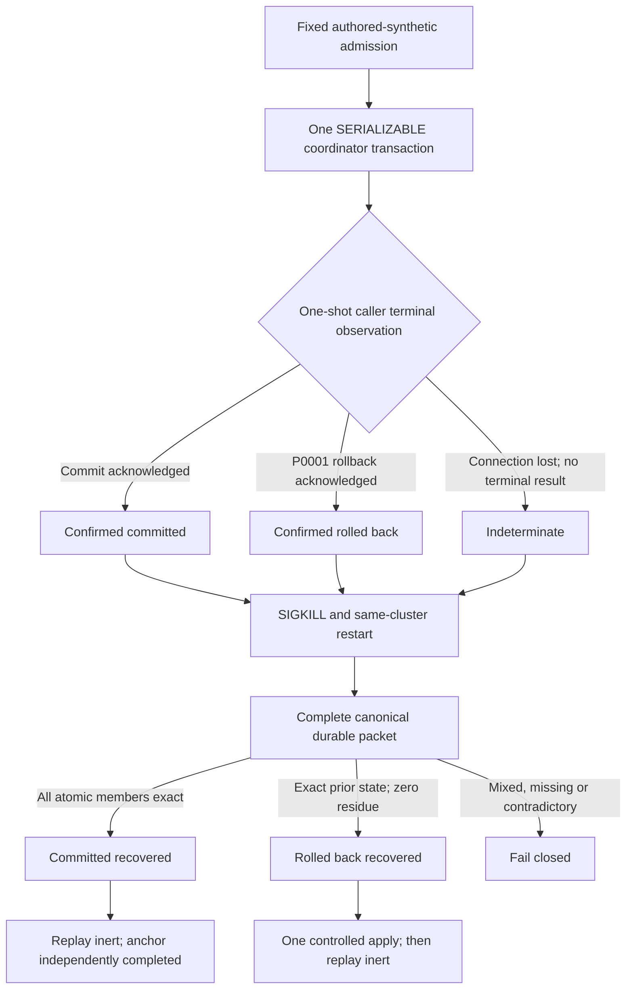

# CF-D2 restart and unknown-commit rehearsal design

Date: 2026-08-11

Status: `planning_design_runtime_closed`

## Design summary

CF-D2 treats recovery as a classification problem over complete durable facts,
not as a retry reflex. The caller may observe a terminal commit, a terminal
rollback or no terminal result. Only the first two observations carry an
outcome. After a lost result, the recovery controller reconnects to the same
PostgreSQL cluster and reads a closed canonical packet.

## Storage topology

The official image-declared data volume cannot be used because it would create
an anonymous volume and weaken exact cleanup. The harness overlays that unused
default path with tmpfs and sets the real `PGDATA` to one distinct fixed path
in the captured container writable layer. That layer survives `docker kill`
and `docker start` of the same ID but is destroyed by exact container removal.

The harness verifies from Docker metadata that there is no published port,
bind mount, named or anonymous volume, network join or restart policy. It also
binds the cluster by a server-authored system identifier digest, PostgreSQL
major version and exact durable settings before and after every restart.

## Scenario isolation

Four disjoint observer generations share the same accepted alpha binding and
payload-free source stream. Fixed positions one and two may be reused as
immutable source inputs while each generation has separate checkpoints,
receipts, lifecycle, anchors, frames, watermarks and obligations. This avoids
dropping or recreating the database between scenarios and makes every restart
exercise the same installed artifact and cluster.

The harness snapshots all accepted relations canonically. It compares counts
and SHA-256 row-set digests rather than retaining raw values. Per-scenario
expected relation deltas are closed in implementation constants and must agree
with the machine contract.

## Cutpoint protocol

The unknown-commit cases use one fixed one-shot `psql` batch whose terminal
result is defined at process completion. The harness does not accept or retain
partial output from a killed batch.

- In R03, `COMMIT` precedes a bounded `pg_sleep`. Observing that sleep proves
  only that the fixed post-commit cutpoint was reached.
- In R04, the sleep follows transition staging but precedes `COMMIT`.

A second owner-only control connection observes only the closed
`Timeout/PgSleep` wait class for the exact application label. It does not
retain PID, query or lock detail. After exact ownership reverification the
container receives `SIGKILL`, reaches stopped state and restarts from the same
cluster.

The classifier is a separate pure function whose inputs contain only the
post-restart canonical relation facts and exact expected coordinate. Its API
does not accept scenario id, cutpoint, elapsed timing, client output or an
expected branch. The test topology independently checks that R03 reaches
`COMMITTED_RECOVERED` and R04 reaches `ROLLED_BACK_RECOVERED`.

## Anchor recovery

A committed position advances checkpoint/lifecycle state atomically but its
new recovery anchor belongs to a separate lifecycle-authority transaction. A
lost terminal result can therefore restart with a complete committed effect
and a pending anchor. Exact receipt replay remains inert, but a subsequent
position must fail `CF303` until `append_recovery_anchor_v1` independently
reverifies the complete committed receipt, admission, lifecycle, audit,
checkpoint and controlling digests.

A rolled-back position leaves the prior anchor and every pre-transition digest
unchanged. The absence proof permits one controlled application of the stored
admission. The connection loss itself never permits that call.

## Failure envelope

No scenario passes on eventual equality, a subset of atomic members, caller
expectation or a server-log clue. The whole evidence document is written only
after all four scenarios, containment checks and cleanup pass. On failure a
distinct minimized failure artifact records the stage, stable reason, closed
container state and cleanup disposition without raw SQL/error/client output.

The result remains evidence about an isolated PostgreSQL process lifecycle,
not an operational migration, application recovery implementation or
availability promise.
