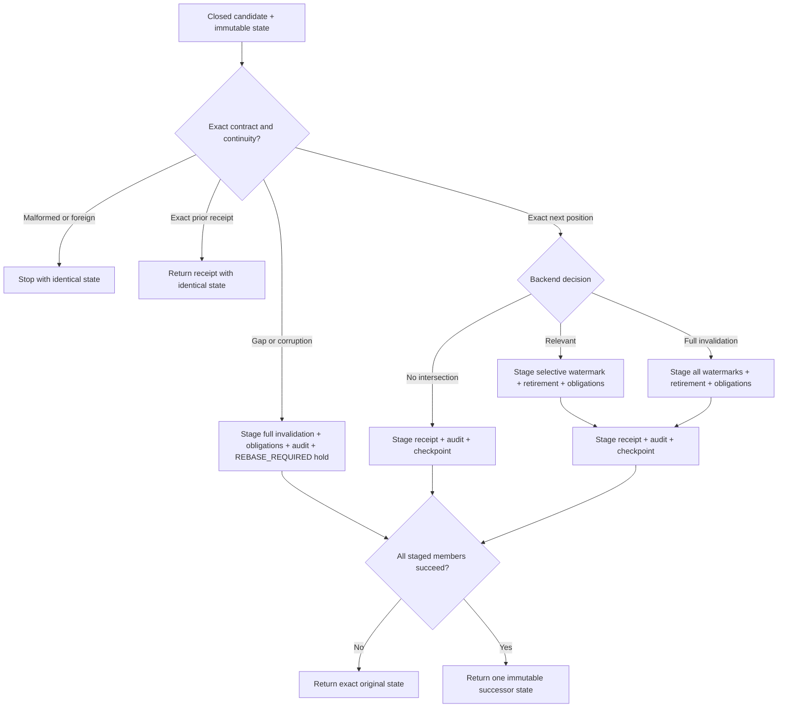

# Provider-free unmounted durability state-machine rehearsal design

Date: 2026-08-06

Status: frozen bounded implementation design

## Purpose

This design turns the accepted durability architecture into a pure state
transition algebra. It deliberately stops before PostgreSQL, source delivery,
credentials, product reads or runtime. The useful proof is that a candidate
position cannot advance a checkpoint unless every required stale-frame effect
is represented in the same immutable successor state.

## State boundary

`DurabilityState` is a frozen value containing checkpoint, frames, watermarks,
obligations, receipts, audits and metadata-only key intervals. Every collection
is canonicalized into a stable ordered tuple for hashing and evidence. Public
constructors reject unknown keys and values before transition logic runs.

The state integrity digest covers the complete canonical state except the
digest field itself. Restart reproduces it before trusting any checkpoint.
This is testable integrity evidence, not an operational MAC or database seal.

## Transition flow

The rehearsal's closed fault selector fails before each atomic member. It
exists only to prove the state-copy boundary and is not serialized into source,
checkpoint, receipt or audit contracts.

## Redelivery

The public transition derives redelivery from stored state. A caller cannot
label its own input a duplicate. Position and digest compare against the exact
stored receipt; the digest comparison is constant-time. Any difference is
corruption because a classified source position is immutable.

## Monotonic stale-state proof

Each frame records the exact source position through which its authoritative
read was assembled. A watermark greater than that coordinate is sufficient to
make the frame non-current. The state machine changes lifecycle only from
`CURRENT` to `RETIRED`; there is no reverse edge.

Pending obligations survive later causes. Coalescing changes only the latest
position, rolling digest and closed count bucket. It never creates a second
obligation, reopens a frame or stores event, aggregate or session identifiers.

## Rebase behavior

Coverage gaps and identity corruption are different from a known contiguous
full-invalidation decision. The latter may advance after every conservative
watermark/retirement effect is staged. A gap cannot claim the missing positions
were classified: it holds `last_classified_position`, moves checkpoint state to
`REBASE_REQUIRED`, raises conservative watermarks to the observed unsafe
position and retires every current frame.

Malformed, foreign or wrong-contract input is not allowed to create a receipt
or a suppress-and-continue marker. It returns a stop result and identical
state for operator handling outside this rehearsal.

## Restart

Restart validates the state integrity digest, every controlling digest, source
coordinates and exact key interval before returning `RESUME`. Failure uses the
same conservative rebase transition and keeps the last known contiguous
position. It never derives current truth from an event or audit record.

## Key schedule

Only key ids and position intervals are represented. An interval has inclusive
`start_position` and exclusive `end_position`, with `null` only for the final
open interval. Validation proves a single ordered, non-overlapping, gap-free
partition. Key bytes and credential operations are outside the model.

## Retention decision

The pure retention function receives one source-row position, eligible
generation checkpoints and explicit booleans for recovery/audit pin, key-
overlap completion and safety-grace completion. It returns an inert eligibility
decision and closed reasons. It neither reads a clock nor deletes anything.

## Deterministic evidence

The generator builds closed synthetic fixtures, runs every scenario, validates
the resulting packet and writes it only when the whole packet passes. Focused
tests independently recompute representative state transitions and mutate the
evidence/schema boundary. A committed evidence file is never its own oracle.

## Non-authority statement

The module is a development rehearsal. It creates no database object, event
read, checkpoint, credential, frame invalidation, source-head fence, product
read, provider call, command, runtime, deployment or production claim.
