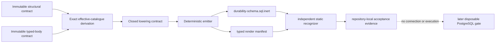

# Provider-free unmounted durability inert DDL rehearsal design

Date: 2026-08-07

Status: PostgreSQL-representability recovery active after rejected worker
implementation

Normative PostgreSQL-representability recovery:
`docs/raisa-provider-free-unmounted-durability-inert-ddl-rehearsal-postgresql-representability-recovery.md`

## Purpose

This design defines a one-way compiler from the accepted structural durability
catalogue plus accepted closed body IR into inert PostgreSQL-16 text. The
compiler has no database adapter, general SQL entry point or caller-selected
path. It produces evidence; it does not install anything.

## Trust boundary

The accepted JSON contracts are authority. Prose cannot supply a missing
operand or branch. The lowering contract may define syntax for an already typed
operation but cannot introduce a relation, column, helper, effect, privilege or
failure.

The renderer activation is an exact descendant delta. The structural parent's
omitted function/trigger-body surface and the body child's `renderer_present:
false`/`executable_ddl:false` evidence are not edited or reinterpreted. Only an
exact match of both immutable parents admits their already accepted catalogue
and all 22 programs into the fixed `.sql.inert` output. Every other input state
fails before emission.

## Components

The recovered implementation separates six pure components:

1. `load_and_bind_parents()` reads fixed paths and verifies canonical hashes;
2. `derive_effective_catalogue()` applies the exact closed recovery and
   reconciles every child summary;
3. `derive_effective_body()` applies only the closed PostgreSQL-16
   representability recovery while preserving and accounting for all 22
   immutable parent programs;
4. `lower_contract()` converts the exact effective catalogue and 23 effective
   body ASTs into a typed `RenderPlanV1` statement sequence;
5. `emit_inert_sql()` writes canonical UTF-8/LF text only to the fixed
   `.sql.inert` path and builds its typed manifest; and
6. `recognize_inert_sql()` independently tokenizes and checks the generated
   subset against that manifest.

The module imports only Python's standard library and the accepted pure body
validator/builder surfaces. It has no `subprocess`, `socket`, `os.system`,
database/ORM, HTTP, provider, browser or Alembic import. Output paths are module
constants resolved beneath the exact new continuity directory.

## RenderPlanV1

Before text exists, every statement is one closed typed render node. Each node
contains phase, ordinal, statement kind, authoritative contract pointer,
defined/referenced objects, required owner and privilege facts, and a closed
payload specific to that kind. The node family includes only role, schema,
domain, enum, composite, table, named constraint/index, RLS enable/force/policy,
support function, entry function, trigger function, trigger declaration,
revoke, grant and assertion-comment nodes.

No node contains caller-provided SQL. The text emitter is exhaustive over this
node union; an unknown node fails. The manifest stores the exact ordered node
inventory, SQL byte spans and SHA-256 so the static recognizer can compare text
to plan without trusting comments.

## Effective-parent reconciliation

Recovery is applied to a deep copy of the structural parent. The original
object and bytes are hash-checked again after rendering. The derived catalogue
must equal the body child's effective signatures, roles, trigger declarations,
relations/columns/types and privilege ceilings before any render node is built.

The renderer never creates, alters or transfers ownership of the four
referenced `public.*` application tables.
Those identifiers are allowed only in exact body reads/trigger declarations
and accepted owner `SELECT` grants. Any application `CREATE`, `ALTER`, DML,
ownership or broader grant is structurally impossible.

## Body lowering

PostgreSQL trigger row images are table-row records and do not expose system
columns such as `xmin`. For the three existing immediate guards that need
old-row provenance, the recovered effective body performs one exact keyed
pre-effect reselection of the physical row's `xmin`; the new appointment guard
does the same. An impossible missing or ambiguous row maps to
`F_CARDINALITY`/`CF004`. Deferred event and outbox delete fences record a
narrow dependency on their mandatory same-table immediate guards; they do not
pretend to recover a deleted row's old `xmin`. Appointment updates gain one
immediate guard so same-top-level-transaction second-update provenance is
checked before either row replacement. The deferred appointment fence retains
final-state temporal/non-temporal proof but no longer reads `OLD.xmin`.

Both appointment triggers first classify the exact producer scope. Zero
matching active producer bindings is inert, exactly one is applicable and
duplicate bindings fail closed. This preserves ordinary appointment writers
while keeping the durability obligation on the exact producer transaction.

Expressions are rendered recursively with a precedence-independent fully
parenthesized form. References use generated local aliases bound to typed
symbols; fields and trigger images are position-checked. Every literal carries
an explicit qualified cast. Complete row sets are ordered arrays, not
unordered query results.

Statements use exact templates:

- `SELECT_EXACT`, `SELECT_SET` and `LOCK_EXACT` preserve predicate, exact
  columns, cardinality, stable order and lock mode;
- `LET`, `ASSERT`, `IF`, `SWITCH_TG_OP` and `FOR_EACH` preserve the closed flow
  tree and terminal convergence;
- `INSERT`, `UPDATE` and `DELETE_SOURCE` emit only operand-derived columns and
  exact cardinality checks; every implicit `EXACTLY_ONE` failure maps to the
  value-free registered `F_CARDINALITY`/`CF004` outcome;
- `INSERT_OR_RELOAD_COMPARE` has one tightly scoped `unique_violation`
  translation. It derives one exact unique-constraint name from the effective
  catalogue, inspects `CONSTRAINT_NAME`, rethrows every non-matching violation,
  then reloads by conflict key plus `winner_predicate`; a missing or mismatching
  winner raises `F_CARDINALITY`/`CF004`;
- `CALL_SUPPORT` may name only `session_binding_allows_v1`;
- `RETURN_*` and `RAISE` are terminal and type/value closed; and
- the canonical unreachable retry marker is verified and erased, never turned
  into a retry or catch.

Locals are declared once in accepted symbol order. Input symbols bind exact
function parameters; trigger system symbols are never redeclared. Row symbols
use the exact qualified row type, set symbols use its array type and composites
use explicit typed `ROW(...)` construction.

The vocabulary reconciliation is exact: 22 instruction opcodes are declared,
21 occur in the immutable programs, and `DERIVE_BINDING` is the sole declared
but unobserved form. All 34 declared expression opcodes occur. The emitter has
no compatibility fallback for the unobserved instruction; seeing it means the
hash-bound input or population proof failed.

## Digest preimage

For each digest profile the lowering contract fixes one ordered typed tuple.
Each component becomes:

`type-byte-length:type-name:value-byte-length:value`

and the profile is encoded by the same rule as component zero. A null uses
`value-byte-length = -1` and no value bytes, which cannot collide with empty
text. Components are joined by a fixed ASCII unit separator after their lengths
are computed in UTF-8. The final PostgreSQL expression is fully qualified and
uses core SHA-256 only. The manifest retains every profile, operand type tuple
and a repository-authored edge-case vector so Python reference encoding and
rendered SQL construction can be compared statically without executing SQL.

## Security-definer and privileges

Every emitted body is `SECURITY DEFINER`, owned by its exact non-login owner and
uses only the exact fixed search path. No body changes role/configuration or
resolves an unqualified application/fabric identifier. The output revokes
`PUBLIC` schema/object/function rights before granting only the effective role
matrix. Runtime roles receive execute only on their exact entry points; trigger
functions remain owner-internal. The owner receives exact product-table
`SELECT`, never product DML. Admission receiver and every other principal stay
inside their exact closed internal grants.

The inert phase creates the schema with exact authorization, creates the
support helper after its referenced relations but before all policies, and
then transfers every fabric domain, enum, composite and all eighteen fabric
relations to `context_schema_owner`. Function ownership remains signature
specific, including the admission receiver exception. The manifest asserts
each final owner and asserts that no runtime or receiver role gains schema
`CREATE`; application-object ownership is never touched. These statements
describe the required final catalogue under a separately privileged future
migration executor and grant that executor no runtime role.

## Static recognizer

The recognizer does not call the emitter. It implements a small lexer for the
emitted subset, tracks normal/string/quoted-identifier/dollar-body states,
balances delimiters and identifies top-level statements. It then checks exact
phase and statement fingerprints, function headers, body boundaries, object
references, revokes and grants against the manifest.

Hostile tests mutate both the typed render plan and emitted bytes after
resealing evidence. Acceptance therefore does not depend on the canonical file
hash alone. The recognizer deliberately claims only the closed generated
subset; PostgreSQL's own parser and catalogues remain later evidence.

## Determinism and failure

All collections are explicitly ordered from the accepted contracts. JSON is
canonical UTF-8/LF with sorted object keys where order is not normative. SQL is
UTF-8/LF with fixed indentation and one terminal newline. No wall clock,
environment value, absolute path, random UUID or Git metadata enters the
artifact. Rendering twice in fresh temporary directories must produce the same
bytes.

Any parent mismatch, unknown node/type, unresolved identifier, effect/privilege
widening, unsupported canonicalization, manifest disagreement or recognizer
failure raises a value-free local exception and writes no admitted artifact.
Temporary candidate bytes are written only beneath a test-owned temporary
directory; the fixed canonical files are replaced only after complete local
validation.

## Non-authority statement

This design adds no migration, database connection, schema/object/role,
credential, source read, operational persistence, patient/product data, API,
command, provider product call, runtime, deployment, production, release,
Pages or protected-ref authority.
