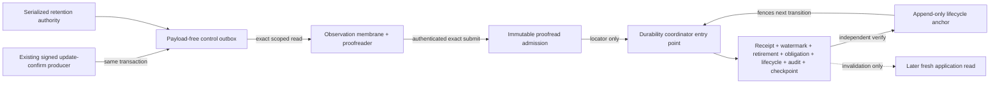

# Provider-free unmounted durability migration-and-transaction architecture design

Date: 2026-08-06

Status: second recovered design candidate pending fresh independent veto

## Purpose

Translate the accepted pure durability state machine into one exact future
PostgreSQL shape without creating or contacting PostgreSQL. The design makes
transactional position, tenant binding, coordinator atomicity, recovery and
retention mechanically expressible before inert DDL or a migration is allowed.

## Trust planes

The producer, observer, admission receiver, coordinator, lifecycle/anchor,
retention and later application-read principals are not aliases. None inherits
authority from an event, checkpoint, frame or another plane.

## Source transaction

The source head is an ordinary row keyed by practice and the exact reschedule
stream. The producer locks the existing idempotency and appointment rows, the
opaque alias row and then the stream head. Its `n -> n + 1` update and the
outbox append occur in the same existing command transaction as appointment
truth, appointment audit, committed event and idempotency completion.

This deliberately makes durability availability part of the enabled command's
atomic contract. A failed append or head lock fails the command; it cannot be
repaired after commit. Sequence, identity, timestamps, UUID ordering,
aggregate revision, transaction ids and WAL positions are rejected because
their rollback/ordering semantics cannot prove gap-free publication.

The outbox contains the accepted non-semantic raw event UUID and opaque alias,
but no product payload. The observer alone may read it. The raw event UUID is
domain-separated into the accepted observation digest and discarded before
the durability packet, receipt or audit.

## Tenant binding

Forced RLS is defense in depth, not the authority source. A custom practice GUC
is forgeable by a login that can execute arbitrary SQL. Every narrow entry
point therefore resolves the actual `session_user` through an owner-controlled
binding relation to exactly one active logical principal, practice, source
family and credential epoch. Duplicate or ambiguous active bindings fail
closed. Caller practice is only a locator to compare with that binding, and a
connection pool may not multiplex practices, capabilities or credential epochs
through one bound login.

Runtime roles own nothing, inherit nothing, cannot bypass RLS or set another
role and have no direct durability-table DML. Security-definer code, if later
selected, has a non-login owner, fixed empty/schema-qualified search path, no
dynamic SQL and no `PUBLIC` execute. Every tenant key includes `practice_id`.

## Authenticated proofread admission

The observer does not send a free-standing decision packet to the coordinator.
It may execute one receiver-owned admission function. That function rederives
the actual observer `session_user` and first locks and loads the complete
retained admission set and receipt for the exact locator. At most one immutable
`PRIMARY` plus one immutable `CONFLICT` sentinel may exist per position. An
exact duplicate returns the primary without source access. A different
authenticated attempted digest appends or returns the sole closed conflict
sentinel, including after source purge, and cannot overwrite the primary.

Only a first primary requires the receiver to reselect the exact payload-free
source row, validate coordinate/predecessor/aggregate revision and the
generation-local key interval, and bind the authenticated observer/binding,
source-membership digest and proofread packet into the primary digest.
Observation-digest reuse at another position similarly persists one conflict-
only sentinel after authenticated source validation. A sentinel contains only
the binding/source coordinate, attempted admission digest and closed reason;
raw UUID, alias and copied packet values cross neither the receiver boundary nor
the stored admission set.

The observer has no direct DML or durability-state privilege; the admission
receiver has no checkpoint/effect authority. The coordinator can identify an
admission set but cannot invent or replace one. Exact duplicate submission is
inert; the first mismatch or digest reuse becomes durable receiver-authored
corruption evidence and all later conflicts are storage-bounded by the same
sentinel. Primary and conflict rows are retained together with receipt/
checkpoint evidence. Operational database transport/channel and credential
proof remain later gates. Concurrent first-attempt uniqueness races reload the
winner: exact equality is inert, while inequality appends or returns the sole
conflict sentinel rather than disappearing behind `ON CONFLICT DO NOTHING`.

## Coordinator transaction

At `SERIALIZABLE`, the coordinator rederives binding, locks the generation
registry barrier and exact checkpoint, and verifies that the newest independent
anchor equals that checkpoint. It then loads the complete stored admission set
and retained receipt by locator before any new-position work. Any conflict
sentinel forces the atomic rebase path before redelivery can succeed. Otherwise
exact primary/receipt redelivery uses those retained rows and remains valid
after independent source purge. For a new transition it reloads the immutable
authenticated primary and generation-local key proof; it accepts no copied
decision values and never reads raw source UUID/alias.

Receipt, monotonic watermarks, one-way frame retirement, one coalesced
obligation, the `DECISION` lifecycle row, audit and checkpoint disposition
commit together.

The lifecycle journal orders both decision and key-rotation entries. Decision
audit is a one-to-one detail, so lifecycle revisions cannot be reassigned from
rotation to audit. Obligation buckets are derived from canonical admitted
history; no mutable exact cause counter or caller bucket becomes authority.

Exact redelivery is inert only when the retained set contains a matching primary
and no conflict. Any receiver-authored conflict sentinel, identity mismatch,
digest reuse, demonstrated admission gap, wrong predecessor/epoch, missing
required primary or unverifiable key holds the last contiguous checkpoint,
fully invalidates and atomically requires rebase. An event not yet admitted is
ordinary waiting.

## Restart and anchors

Lifecycle authority appends a distinct immutable recovery anchor for the
baseline and every committed decision/rotation checkpoint. A candidate
checkpoint is never its own authority, and coordinator consumption plus the
next decision or rotation lifecycle transition is blocked until the latest
anchor exactly matches it. Receiver-owned bounded primary/conflict admission
appends may continue while that anchor is pending. After a crash in the commit-
to-anchor window, lifecycle authority may complete the pending anchor only by
independently re-verifying the entire committed state; otherwise a new
generation is required. Resume requires exact agreement among the anchor,
verified durability state and next retained admission/source continuity.
Neither path reconstructs current truth or restores a retired frame.

## Generation-local key rotation

Each interval partition belongs to one exact observer generation. One
`SERIALIZABLE` routine rotation locks that generation's barrier, checkpoint,
current anchor and schedule; preserves history and predecessor overlap; appends
one `KEY_ROTATION` lifecycle row; and advances the schedule digest/checkpoint
lifecycle revision. It changes no other generation. A matching independent
anchor must exist before the next decision.

## Retention barrier

Generation registration/rebaseline and source purge share the same
practice/source registry barrier. A future retention transaction locks it at
`SERIALIZABLE`, derives every non-consumed generation inside the database and
uses the slowest checkpoint, independent pins, key overlap and safety grace.
The caller supplies none of that authority.

Source, receipt/checkpoint and audit retention are independent; no cascade
links them. Admissions and anchors remain in the receipt/checkpoint family for
as long as their receipt/restart/redelivery meaning is retained. Execution is
disabled by default. Production duration, capacity and key-store selection
remain later operational choices. Capacity pressure never legitimizes silent
loss.

## Expand and rollback

The later migration sequence is expand-first: closed schema/RLS/roles with no
runtime bindings; narrow entry points; database-backed synthetic acceptance;
separate credential binding; exact baseline; producer enablement; then
observer/coordinator enablement. Before any row, unused objects may later be
removed. After publication begins, rollback is forward-fix and data-preserving;
the appointment command must not continue without its required control row.

## Integrity claim

Relational constraints, append-only privileges and digest chains provide
integrity and tamper-evidence controls. They are not a cryptographic MAC and do
not make a database owner or compromised credential trustworthy. Operational
key storage, credentials, monitoring and incident response remain later gates.

## Non-authority statement

This design creates no SQL, migration, database object, role, credential,
source read, persistence, product or patient data, API, command, provider,
runtime, deployment, production, release, Pages or protected-ref authority.
