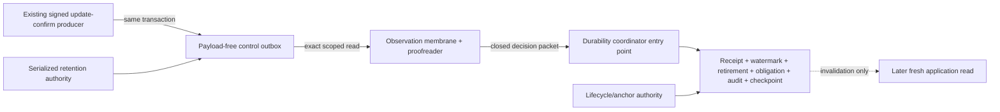

# Provider-free unmounted durability migration-and-transaction architecture design

Date: 2026-08-06

Status: design candidate bound to the frozen plan

## Purpose

Translate the accepted pure durability state machine into one exact future
PostgreSQL shape without creating or contacting PostgreSQL. The design makes
transactional position, tenant binding, coordinator atomicity, recovery and
retention mechanically expressible before inert DDL or a migration is allowed.

## Four trust planes

The producer, observer, coordinator, lifecycle/anchor, retention and later
application-read principals are not aliases. None inherits authority from an
event, checkpoint, frame or another plane.

## Source transaction

The source head is an ordinary row keyed by practice and the exact reschedule
stream. The producer locks the existing idempotency and appointment rows, the
opaque alias row and then the stream head. Its `n -> n + 1` update and the
outbox append occur in the same existing command transaction as appointment
truth, appointment audit, committed event and idempotency completion.

This deliberately makes durability availability part of the enabled command's
atomic contract. A failed append or head lock fails the command; it cannot be
repaired after commit. Sequence, identity, timestamps, UUID ordering,
aggregate revision, transaction ids and WAL positions are rejected because
their rollback/ordering semantics cannot prove gap-free publication.

The outbox contains the accepted non-semantic raw event UUID and opaque alias,
but no product payload. The observer alone may read it. The raw event UUID is
domain-separated into the accepted observation digest and discarded before
the durability packet, receipt or audit.

## Tenant binding

Forced RLS is defense in depth, not the authority source. A custom practice GUC
is forgeable by a login that can execute arbitrary SQL. Every narrow entry
point therefore resolves the actual `session_user` through an owner-controlled
binding relation to exactly one active logical principal, practice, source
family and credential epoch. Duplicate or ambiguous active bindings fail
closed. Caller practice is only a locator to compare with that binding, and a
connection pool may not multiplex practices, capabilities or credential epochs
through one bound login.

Runtime roles own nothing, inherit nothing, cannot bypass RLS or set another
role and have no direct durability-table DML. Security-definer code, if later
selected, has a non-login owner, fixed empty/schema-qualified search path, no
dynamic SQL and no `PUBLIC` execute. Every tenant key includes `practice_id`.

## Coordinator transaction

At `SERIALIZABLE`, the coordinator rederives binding, locks the generation
registry barrier and exact checkpoint, validates immutable source-row
membership without returning its raw UUID or alias, and consumes the already
proofread HMAC-normalized observation/key-interval proof. It then derives all
effects. Receipt, monotonic
watermarks, one-way frame retirement, one coalesced obligation, lifecycle/
audit and checkpoint disposition commit together.

The lifecycle journal orders both decision and key-rotation entries. Decision
audit is a one-to-one detail, so lifecycle revisions cannot be reassigned from
rotation to audit. Obligation buckets are derived from canonical admitted
history; no mutable exact cause counter or caller bucket becomes authority.

Exact redelivery is inert. Any identity mismatch, digest reuse, gap, wrong
predecessor/epoch, missing retained row or unverifiable key holds the last
contiguous checkpoint, fully invalidates and atomically requires rebase.

## Restart and anchors

Lifecycle authority creates immutable recovery anchors independently of the
coordinator. A candidate checkpoint is never its own authority. Resume requires
exact agreement among the anchor, verified durability state and next retained
source coordinate. Corrupt or missing state/anchor requires a new generation;
verified continuity loss requires rebase. Neither path reconstructs current
truth from an event or restores a retired frame.

## Retention barrier

Generation registration/rebaseline and source purge share the same
practice/source registry barrier. A future retention transaction locks it at
`SERIALIZABLE`, derives every non-consumed generation inside the database and
uses the slowest checkpoint, independent pins, key overlap and safety grace.
The caller supplies none of that authority.

Source, receipt/checkpoint and audit retention are independent; no cascade
links them. Execution is disabled by default. Production duration, capacity
and key-store selection remain later operational choices. Capacity pressure
never legitimizes silent loss.

## Expand and rollback

The later migration sequence is expand-first: closed schema/RLS/roles with no
runtime bindings; narrow entry points; database-backed synthetic acceptance;
separate credential binding; exact baseline; producer enablement; then
observer/coordinator enablement. Before any row, unused objects may later be
removed. After publication begins, rollback is forward-fix and data-preserving;
the appointment command must not continue without its required control row.

## Integrity claim

Relational constraints, append-only privileges and digest chains provide
integrity and tamper-evidence controls. They are not a cryptographic MAC and do
not make a database owner or compromised credential trustworthy. Operational
key storage, credentials, monitoring and incident response remain later gates.

## Non-authority statement

This design creates no SQL, migration, database object, role, credential,
source read, persistence, product or patient data, API, command, provider,
runtime, deployment, production, release, Pages or protected-ref authority.
