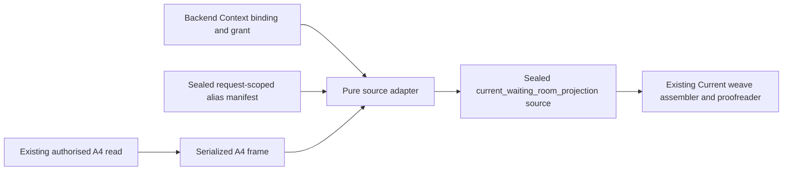

# Provider-free unmounted Rayleen waiting-room Context Fabric source-adapter design

Date: 2026-08-06

Status: revised provider-free authored-synthetic candidate after independent veto

## Placement

The adapter sits after Rayleen A4 has already produced an authorised immutable
`emr4.waiting_room_context_frame.v1` value and before the Context Fabric
assembler consumes a sealed Current source envelope.



The left-hand read is represented by an authored-synthetic fixture in this
descendant. No code here imports or invokes the A4 SQLAlchemy service.

## Trust split

- The A4 read service owns authentication, role/practice/location scoping,
  active queue selection and deterministic source facts/signals.
- The Context policy layer owns the current principal/session binding, purpose,
  admitted source/fields, freshness, cardinality and expiry cap.
- The alias manifest is backend-authored and binds source UUIDs to opaque
  request-scoped Fabric references. It conveys no authority.
- The adapter proves compatibility and minimization. It cannot obtain more
  source data or change either authority decision.
- The existing assembler and same-packet proofreader own atomic ContextFrameSet
  release.

## Closed contracts

`WaitingRoomReferenceAliasManifest` is sealed and contains only schema/id,
source frame/binding/grant/session digests, exact source practice/location,
Fabric practice/location references, complete appointment/practitioner alias
rows, issue/expiry coordinates and all-false authority.

`WaitingRoomSourceAdapterResult` contains one sealed source envelope, one
sealed trace and a terminal `RELEASE` or fail-closed exception. The envelope
uses the accepted Current weave source triple and evidence/data labels. Its
payload is:

```yaml
location_ref: opaque request-scoped reference
context_revision: positive source revision
entries:
  - appointment_ref: opaque request-scoped reference
    practitioner_ref: opaque request-scoped reference
    status: BOOKED | CONFIRMED | ARRIVED | IN_CONSULT
    elapsed_wait_minutes: optional non-negative integer
    threshold_code: optional closed threshold code
    flow_exception_code: optional closed exception code
    longest_wait_rank: optional positive integer
```

Optional derived values are included only when the source truth supports them.
The adapter never emits a sentinel elapsed time or treats absence as zero.
The accepted Current-weave implementation is not patched: deterministic scope
must omit an unavailable derived field before assembling that exceptional
shape, while a scope that requests it releases nothing.

The result has its own recursively closed JSON Schema, distinct from the
acceptance-evidence schema. A public validation function checks that schema,
all result/envelope/trace seals, internal cross-linked digests and identifiers,
counts, time/TTL relationships, unique appointment references and closed
wait/threshold/exception semantics. The only parent handoff function then
receives the authoritative frame, binding, grant and alias manifest,
deterministically recomputes the complete expected adapter result and requires
canonical equality. It returns a deep copy of the recomputed envelope, not the
caller-supplied nested dictionary. Direct nested dictionary access is not the
admitted adapter-to-assembler interface.

Entry construction intersects optional waiting fields with the effective
grant before sealing. The parent projection remains a second minimisation
layer, not the first place at which disallowed source fields disappear.
Elapsed and threshold remain independently requestable; when both exist their
relationship is checked, while an externally anchored elapsed-only or
threshold-only result remains valid.

## Validation order

1. Validate all outer shapes and seals without reading source payload content.
2. Admit exact Context binding/grant, Rayleen Bureau, purpose, role, frame,
   source class, source contract, location, current time and all-false
   authority.
3. Validate the complete A4 frame schema, exact lifetime and nested labels.
4. Canonically hash the frame and admit the exact alias manifest binding.
5. Recompute fact/signal relationships and deterministic signal values.
6. Build minimized entries through the complete alias map.
7. Scan the canonical output for every raw source UUID, patient display token
   and source label id; any occurrence blocks release.
8. Seal the source envelope, trace and result, validate their recursively
   closed schema and cross-links, and enforce cardinality/canonical-byte
   limits.
9. Revalidate, recompute from the authoritative inputs, require canonical
   equality and deep-copy only the recomputed envelope through the sole handoff
   extractor, then pass it to the unchanged assembler/proofreader.

No failure returns a partial entry or partially sealed envelope.

## Freshness and future watching

The adapter preserves `generated_at` as `observed_at` and uses the minimum of
source, binding, grant and alias-manifest expiry. It cannot renew the source.
The accepted temporal-weave protocol may later invalidate a parent frame set
when a relevant committed event is observed, but this adapter does not listen
for events or patch a frame set. A live database/event watcher and reassembly
worker require their own separately gated real-product descendant.

## API Spine consequence

The adapter is neither a query nor a command endpoint. It consumes a completed
read value and emits a read-context value. Future mounting belongs behind an
existing authorised query/context service; any action still returns through a
single-purpose REST/OpenAPI command with fresh authorization, human
confirmation where required, idempotency, audit and deterministic readback.
