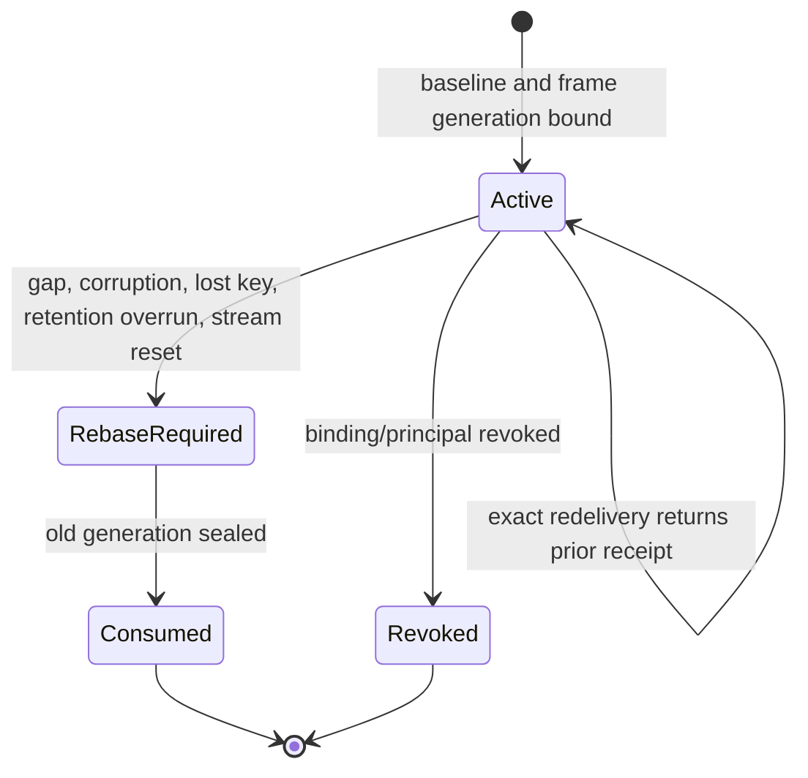

# Provider-free unmounted source-specific durability architecture design

Date: 2026-08-06

Status: frozen bounded architecture design

## Boundary classification

This design freezes durability semantics for one future async observation
source. It does not build the source. The existing appointment update-confirm
command continues to own mutation, audit and idempotency. The future control
outbox says only that a committed reschedule may make Context Fabric frames
stale; it carries no replacement truth and grants no fresh read.

## Why the existing feed is insufficient

`diary_committed_events` and its bounded Reception One polling route were built
for a different purpose. The row has a patient-free but product-bearing JSON
payload, and the route orders by `(occurred_at, event_id)` with a 24-hour
delivery expiry. That is useful UI delivery but cannot distinguish an absent
event from a late/backdated event, a retention loss or a restart gap.

The durability design therefore introduces a future *control projection*, not
a relabelled cursor. It is append-only, payload-free and written atomically with
the existing transaction. No product data is read in this tranche.

## Authority graph

The exact observation integration principal may select only the future
payload-free projection within one practice and one event stream. It can
authenticate, normalize and submit a candidate observation, but cannot persist
anything and may not reuse the staff JWT accepted by the existing HTTP feed.

The separate temporal durability coordinator receives only a proofread admitted
packet and may perform one narrow transaction over durability state. It cannot
query Diary payload or current practice truth. The application principal is a
third boundary and must later obtain a fresh no-wider grant before any source
adapter runs.

There is no authority edge from source position to data access, from durability
receipt to command evidence or from observer audit to Bureau Memory.

## Rollback-safe source position

One transactional stream-head row per practice and exact event family owns the
next position. The event producer locks it, calculates `n + 1`, appends the
control row with predecessor `n`, and updates the head in the same transaction
as appointment truth, audit, idempotency and the existing committed event.

An ordinary PostgreSQL sequence or identity cannot satisfy the invariant:
sequence values are not rolled back and legitimate allocation gaps would be
indistinguishable from lost events. Wall-clock timestamps, UUID ordering,
transaction identifiers and WAL positions have different ordering or lifecycle
semantics and are also rejected. The transactional counter deliberately
serializes only reschedules for one practice; it does not create a global hot
counter.

The source head is not a PostgreSQL `SEQUENCE`; rollback must preserve a
contiguous committed position domain.

The source coordinate proves order and detectable continuity, not current
truth. Aggregate revision adds a per-appointment freshness/anomaly signal but
cannot replace the stream position. Because the current producer counts all
appointment audit rows, a revision jump is not evidence of a missing reschedule
and is never used as the transport checkpoint.

## Payload-free control projection

The source transaction must mint the aggregate alias from a backend registry;
the observer never receives `appointment_id`, `practitioner_id`, `location_id`,
appointment times or the existing JSON payload. The raw event UUID remains a
non-semantic source coordinate only long enough for trusted HMAC normalization.

Column hiding is not enough when the same principal can query the base table.
The later runtime gate must prove deny-by-default table privileges, exact
projection access and practice isolation. The observer should not be able to
infer active sessions or which Bureaus will be invalidated.

## Checkpoint and classified receipt

The durable checkpoint means *classified through position n*, not merely
fetched through n. It binds observer generation, stream epoch, baseline,
policy/binding/registry/impact/key-schedule digests and the last immutable
classified receipt.

The classified receipt is uniquely keyed by practice, stream, generation and
position. It binds the observation digest, decision and checkpoint disposition.
It makes redelivery idempotent without retaining a raw event identifier in
audit or context.

## Transaction state machine

For a contiguous relevant event, frame retirement, obligation coalescing,
decision receipt, audit and checkpoint advancement are one commit. For a
contiguous event with uncertain impact, all potentially affected current frames
must be retired before the checkpoint can advance. For a coverage gap, the last
contiguous checkpoint is held while full invalidation and `REBASE_REQUIRED`
state commit. This distinction prevents the runtime from claiming it processed
events it never received.

The durable invalidation effect is a monotonic watermark per source epoch,
observer generation and conservative frame type. Each dependent frame
generation cites `assembled_through_position`; a later watermark makes it
non-current without relying on an in-memory mutation. Exactly one obligation
exists per retired generation. Later causes only add a bounded digest/count
under the same obligation, and no state transition can return a retired frame
to `CURRENT`.

## Crash, concurrency and replay

Reading the source row is not a checkpoint. A crash after read but before the
durability transaction causes safe redelivery. A crash after commit is detected
by the unique classified receipt and returns that receipt without another
invalidation.

Concurrent coordinators serialize on the checkpoint row. The second coordinator
must evaluate the newly committed checkpoint before doing work. A same-position
digest mismatch or repeated digest at a different position is corruption, not
normal at-least-once delivery.

## Restart and rebaseline

Restart may resume only when the durable checkpoint, policy/binding, stream
epoch, key schedule and exact next retained source row form one contiguous
chain. No current frame is adopted unless it was assembled after, and cites,
the exact baseline and observer generation.

When continuity is unavailable, the system does not replay the product payload
to recreate truth. It retires the relevant frames, consumes the generation and
requires a new baseline followed by newly authorised reads and frame assembly.

A new generation is releasable only if the authoritative truth read and source
head are fenced in one consistent PostgreSQL snapshot, or an exact before/after
head check proves no intervening event. A raced or unverifiable read is discarded.

## Retention

Retention follows the slowest eligible checkpoint, not the newest event time or
fastest consumer. A control row remains until every generation that may need it
has moved beyond it, investigation/recovery pins are clear, its HMAC key overlap
has ended and the configured safety grace has elapsed.

The architecture intentionally does not choose a production duration. That
choice depends on deployment capacity, outage objective, privacy assessment and
operational monitoring. It does freeze the non-negotiable rule: deleting a row
needed by any eligible checkpoint causes full invalidation and rebaseline,
never silent continuation.

## Key rotation

The key schedule maps position intervals to opaque key ids. A routine rotation
starts at one future stream position and retains the predecessor key until all
dependent rows and checkpoints have drained. Reprocessing a retained position
uses its original schedule interval, so rotation cannot change its observation
digest.

The key ring is dedicated and never reuses `settings.secret_key`, the
integration-authentication credential or a provider credential. Routine
rotation preserves the generation only when its exact future position fence and
overlap validate; an emergency or unverifiable rotation consumes the generation.

If a required key is missing or a schedule is changed retroactively, continuity
is no longer provable. The generation is invalidated and rebaselined. Emergency
revocation prioritizes safety over seamless continuity.

## Audit minimization

Audit records prove which policy, principal, stream coordinate, decision,
closed invalidation-count buckets and checkpoint disposition were committed. They do not copy
the source payload, aggregate alias, session ids, frame content, human actor,
appointment details or provider material. A digest-chained audit can show
tampering without becoming a parallel source of truth.

## Later implementation boundary

A later live-runtime plan must separately freeze the migration, table/RLS and
role definitions, transaction isolation, producer failure behavior, connection
ownership, credential lifecycle, process concurrency, cleanup/rollback,
monitoring, retention capacity and database-backed acceptance. This design
grants none of them.

## Non-authority statement

This design creates no database object, credential, event read, checkpoint,
frame invalidation, provider call, product command, runtime, deployment or
production claim. Its contracts are authored-synthetic architecture evidence
only.
