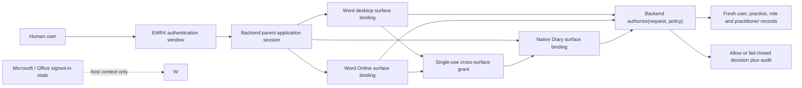

# Raisa shared application-authentication and clinician-role boundary

Status: `repository_local_architecture_candidate`

## Decision

Desktop Word, Word Online and the native Diary use one EMR4 backend-owned
authorization decision. They do not authenticate or authorize one another.
They only present backend-minted, audience-bound session evidence to the same
backend.



The dotted Office relationship is deliberately non-authoritative. A signed-in
personal Word Online session proves only that Word can host the add-in.

## Existing foundation reused

| Existing element | Reused invariant | Not carried forward as authority |
|---|---|---|
| `verify_token` | signature, algorithm and expiry verification | role claim as a final decision |
| `get_current_user` | active-user reload and token/user practice match | stateless token as a revocable session |
| `require_role` | backend role enforcement | client-decoded role or hidden button |
| GraphQL context | authenticated backend user and database scope | a generic client-selected authorization query |
| PostgreSQL request practice setting | same-practice data boundary | client-supplied practice scope |
| Office host profile | capability classification | identity, entitlement or role |

## Identity establishment

1. The human enters an EMR4-controlled authentication ceremony.
2. The backend validates the configured EMR4 authenticator.
3. If a future external identity provider is used, its assertion is only an
   authentication input. The backend maps it to exactly one active EMR4 user
   and practice membership.
4. The backend creates an opaque parent application session and records its
   authentication method, assurance, issue/idle/absolute expiry and revocation
   generation.
5. The browser receives only an HttpOnly session cookie scoped to an EMR4
   application origin or BFF. JavaScript receives a redacted session-status
   projection, never the secret.

Microsoft account, tenant, document, Office host and manifest state do not
identify the EMR4 principal. A future Microsoft federation still ends at step
3; it does not bypass the EMR4 user/practice/role mapping.

## Session model

### Parent application session

Server-owned fields:

- opaque `session_id`;
- `user_id` and `practice_id`;
- `authenticated_at`, `last_activity_at`, `idle_expires_at` and `expires_at`;
- `authentication_method` and assurance label;
- `revocation_generation`, `status` and optional revocation reason; and
- last reauthentication time for future high-risk commands.

### Surface binding

Each surface receives a separate binding containing:

- opaque `surface_session_id` and parent `session_id`;
- closed surface enum: `word_desktop`, `word_online`, `native_diary`;
- exact application origin and backend audience;
- parent revocation generation;
- issue, idle and absolute expiry; and
- correlation-safe host class, without Microsoft account or document identity.

A surface binding cannot outlive or broaden the parent session. Logging out a
surface revokes that binding; logging out everywhere or changing the user role,
practice, practitioner link or active state advances the parent generation and
invalidates every surface binding.

## Cross-surface trust

Word launches the native Diary with a single-use backend exchange, not a
bearer token:

1. Source surface generates `state`, `nonce` and a PKCE verifier/challenge.
2. Source asks the backend for a grant naming exact source surface, target
   surface, target origin, backend audience and challenge.
3. Backend evaluates the active parent/surface session and stores an opaque
   grant for at most 60 seconds.
4. Office dialog messaging transports only the opaque code and state. Exact
   source/target origins are enforced.
5. Native Diary redeems the code with the verifier, state and nonce.
6. Backend atomically consumes it, rechecks parent generation and creates the
   native-Diary surface binding.

The code is useless after first redemption or on another origin, audience,
surface, PKCE verifier, session generation or time window. It contains no
product data or Office identity.

## Clinician-role policy

The first protected Clinician One read uses the server policy
`clinician_workspace.read.v1`:

```text
active EMR4 application session
AND active surface binding for the request surface/origin/audience
AND active current backend user
AND user.practice_id == session.practice_id == resource.practice_id
AND current backend role == GP
AND user.practitioner_id exists
AND linked practitioner is active and belongs to the same practice
AND required audit record can be committed before release
```

The client does not send the role to be trusted. Endpoint/field code selects
the server policy and resource class. Practice owners and administrators do not
inherit clinical-note read access merely because they administer a practice.
Nurse expansion is intentionally outside this first policy.

## One backend authorization decision

All three surfaces invoke the same internal decision function. It receives
only server-resolved identity/session state plus a server-owned endpoint policy
and resource practice. Its result includes:

- opaque decision and correlation IDs;
- surface, action, resource type and policy version;
- allow/deny/error disposition and closed reason codes;
- current backend role and practice scope;
- evaluation time and single-request-only validity; and
- required-audit disposition.

The function runs before any protected query. GraphQL resolvers and REST
handlers consume it internally; no generic client API accepts arbitrary
role/action/resource triples. A prior allow result is not a capability token
and cannot authorize another surface or a later command.

## Expiry, refresh and revocation

- Parent absolute lifetime: maximum eight hours in the development contract.
- Surface idle lifetime: maximum 30 minutes and never beyond parent expiry.
- Cross-surface grant: maximum 60 seconds, single-use.
- Authorization decision: current request only.
- Refresh: rotates the surface secret and preserves the parent maximum; it
  cannot extend a revoked or changed principal.
- Revocation: checked centrally on every protected request. User deactivation,
  role/practice/practitioner change, explicit logout-all or operator revocation
  invalidates all bindings immediately through generation mismatch.

Clock uncertainty, unavailable session state or missing policy data denies.
There is no offline clinical-data mode in this boundary.

## Audit contract

The backend records typed events for:

- login success/failure;
- parent/surface session creation, refresh, expiry and revocation;
- exchange issue, redemption, replay and rejection;
- clinician authorization allow and deny; and
- audit-sink failure before protected release.

Minimum fields are event type, timestamp, correlation ID, opaque/hash-safe
session references, backend user/practice/role, surface, action/resource type,
policy version, decision and reason codes. Passwords, tokens, cookies, exchange
codes, PKCE verifiers, Office account/tenant/document identifiers, request
content and patient/clinical data are forbidden.

For the first clinician product read, durable audit admission is a precondition
to releasing data. A later outbox implementation may make that atomic, but an
unavailable required audit path must not degrade to an unaudited read.

## Failure semantics

| Failure | Backend result | Surface behavior |
|---|---|---|
| Missing, invalid, expired or revoked session | 401 | clear redacted state and require EMR4 sign-in |
| Active session but role/practice/practitioner denied | 403 | show generic insufficient-authority state |
| Exchange mismatch, expiry or replay | 401 | discard exchange and start a new backend ceremony |
| Required audit unavailable | 503 | release no protected data; retry only after service recovery |
| Unknown surface/policy or backend state | deny | never fall back to Office identity, cached role or local token |

Client reason copy is allowlisted. Detailed security causes remain in the
backend audit; no patient or session secret enters browser logs.

## Implementation sequence requiring fresh authority

1. Add server-side session and revocation storage plus append-only auth audit.
2. Add same-origin/BFF cookie transport and CSRF controls.
3. Implement the single-use PKCE exchange and exact-origin Office dialog flow.
4. Replace taskpane/Diary localStorage tokens, token relay and client-decoded
   authorization on the protected path.
5. Bind REST/GraphQL reads to the single backend decision.
6. Run live local authored-synthetic browser/backend/database acceptance.
7. Separately authorize organisational federation, deployment and any
   product-derived or real-data exercise.

None of those runtime steps is authorized by this design tranche.
