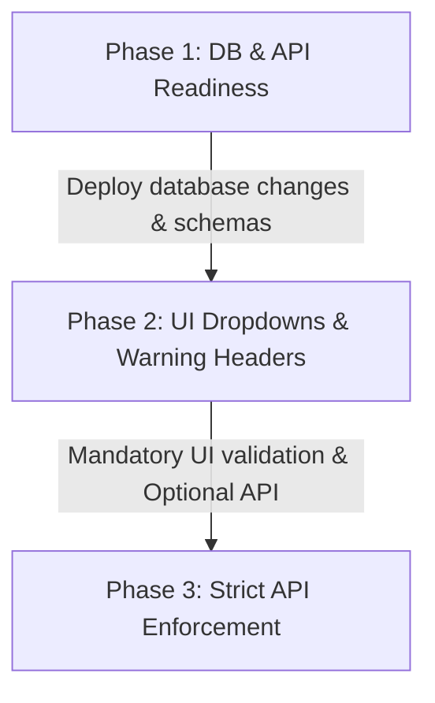

# Sprint R11 — Receptionist-Domain Reason-Code Taxonomy & UX Review

Sprint R11 provides a comprehensive UX, privacy, and copy critique of the Sprint R10 proposed reason-code substrate. This document serves as the design governance gate and implementation blueprint for integrating optional reason codes without altering the core temporal slot-write guards.

---

## 1. Objectives & Boundary Principles

The introduction of reason codes aims to improve clinic operations, compliance audit trails, and cancellation analytics. However, receptionists operate in a high-pressure, fast-paced environment. To prevent administrative friction and data quality degradation, we must balance compliance requirements with simple, error-resistant UX design.

> [!IMPORTANT]
> **Core Non-Negotiable Principle:** Cancellation and status reasons are **administrative metadata**, not clinical records. They must remain separate from the clinical dossier, protected from accidental disclosure, and completely free of clinical detail.

---

## 2. Taxonomy Critique & Refinements

The Sprint R10 taxonomy has been reviewed from receptionist cognitive load, clinical privacy, and reporting utility perspectives:

| R10 Code | R10 Staff Label | Critique & Privacy Risk | Recommended R11 Refinement |
|---|---|---|---|
| `PATIENT_CANCELLED` | Patient requested cancellation | Clear and standard. Low risk. | Keep. Default choice for patient-initiated cancellations. |
| `PATIENT_RESCHEDULED` | Patient requested reschedule | Reschedules are usually handled as a single atomic operation in the UI. | Keep. The UI should auto-select this code when moving an appointment. |
| `PATIENT_UNWELL` | Patient unwell | **HIGH PRIVACY RISK.** Encourages receptionists to ask for and record clinical symptoms (e.g., "Flu", "Covid", "Gastro"). | **Remove/Merge.** Merge into `PATIENT_CANCELLED` or rename to `PATIENT_PERSONAL_REASONS` to discourage the capture of specific medical conditions. |
| `PATIENT_TRANSPORT` | Transport or access issue | Useful operational indicator (especially for elderly/disability transit coordination). | Keep. Helps clinic managers identify accessibility or parking challenges. |
| `PRACTITIONER_UNAVAILABLE` | Practitioner unavailable | Critical clinic metric. Needs to be clear that this is clinic-initiated. | Keep. Ensure this code does not leak doctor health/personal leave details in public logs. |
| `CLINIC_OPERATIONAL` | Clinic operational issue | Overlaps slightly with practitioner unavailability (e.g. doctor late). | Keep. Clarify in training that this is for system/hardware/building issues (e.g., power outage, IT failure). |
| `CLINIC_RESCHEDULED` | Clinic requested reschedule | Used for clinic-initiated movements (e.g., rebalancing schedules). | Keep. UI should auto-select when clinic staff drag-and-drop to reschedule without patient prompt. |
| `ADMIN_ERROR` | Administrative correction | Standard housekeeping. | Keep. Use for typos, double-bookings, or training entries. |
| `DUPLICATE_BOOKING` | Duplicate booking | Sub-case of administrative correction. | Keep. Useful to separate from generic admin errors to monitor booking channel quality (e.g. portal issues). |
| `DID_NOT_ATTEND` | Did not attend | Standard Australian GP terminology (DNA). | Keep. Essential for private fee-billing policy enforcement. |
| `LEFT_WITHOUT_SEEN` | Left before being seen | Vital wait-time performance metric. Indicates patient arrived but left before GP consultation. | Keep. Highly valuable for service-quality auditing. |
| `OTHER` | Other reason | Catch-all. Danger of becoming the "lazy default" or containing sensitive clinical text. | Keep, but **require free-text context** when selected, alongside a strict privacy warning. |
| `LEGACY_UNCLASSIFIED` | Legacy unclassified | Backend-only compatibility fallback. | Hide from UI dropdown. Use only for pre-migration data mapping. |

---

## 3. Required-vs-Optional UX Policy

Enforcing mandatory fields at the wrong time will lead to receptionists selecting whatever option is fastest to clear the prompt (the "first-option bias"). To preserve data integrity:

### Contextual Filtering of Dropdowns
The dropdown options presented to the receptionist must match the current state of the appointment and the action being taken:
* **Future Cancel/Delete:** Only show patient-initiated, clinic-initiated, and administrative correction codes. Hide `DID_NOT_ATTEND` and `LEFT_WITHOUT_SEEN` (since the appointment time has not yet arrived).
* **Past Housekeeping / Status Change:** Prioritise `DID_NOT_ATTEND`, `LEFT_WITHOUT_SEEN`, and `ADMIN_ERROR` at the top of the list.
* **Automatic UI Mapping:** If a receptionist performs an action that implies a code (e.g., dragging an appointment to a new slot), the UI should pre-select `PATIENT_RESCHEDULED` or `CLINIC_RESCHEDULED` based on who initiated the change, requiring only a single click to confirm.

### Default State
* **Never pre-select a code.** The dropdown must default to an empty state: `-- Select Reason --`.
* If a default is pre-selected (like `PATIENT_CANCELLED`), receptionists will press Enter without reading, resulting in inaccurate cancellation metrics.

---

## 4. Privacy & Free-Text Governance (APP Compliance)

Under the Australian Privacy Principles (APPs), sensitive health information must not be stored in non-clinical administrative areas. EMR4 appointment logs are visible to IT, billing, and administrative staff who do not have a clinical relationship with the patient.

> [!WARNING]
> Free-text notes like "Patient cancelled because they had a miscarriage" or "Cancelled due to mental health breakdown" represent significant compliance liabilities if exposed in admin logs or sent via SMS/email notifications.

### Free-Text Restrictions & UI Guards
1. **Character Cap:** Hard-limit the free-text `cancellation_reason` to **150 characters**. This prevents copying-pasting clinical letters or typing long paragraphs of personal narrative.
2. **Dynamic Clinical Keyword Warning:** Implement a client-side real-time warning. If the receptionist types words associated with clinical symptoms or diagnoses (e.g., *sick, unwell, pain, flu, covid, cancer, pregnant, bleeding, depression, anxiety*), display a gentle inline warning:
   > ⚠️ **Privacy Notice:** Please do not enter medical symptoms, diagnoses, or sensitive personal information here. Keep notes limited to administrative context (e.g., "Called to reschedule", "Transport delayed").
3. **Communication Isolation:** Ensure that under no circumstances is the free-text reason field merged into automated patient communications (SMS reminders, cancellation notifications, or portal emails). Patient alerts should use static, standardized, patient-friendly text based on the selected code.
4. **Audit Log Access:** Access to the raw free-text reason field in the `AppointmentAuditLog` should be restricted. Only clinic managers and audit officers should view free-text logs; general reception staff should only see the structured reason codes.

---

## 5. Copywriting Refinements

The staff-facing copy must be direct, clear, and professional. We must strip out overly legalistic language (such as "audit evidence" or "diary availability") and replace it with action-oriented instructions.

### Cancellation Confirmation Dialog
* **R10 Copy:** *"Confirm cancellation. Choose the main reason for this cancellation. This does not reopen or rewrite diary availability, but it will record a permanent audit entry."*
* **R11 Critique:** Too wordy. "Diary availability" is confusing in this context.
* **Propose R11 Copy:**
  > **Confirm Cancellation**
  >
  > Please select the reason for cancelling this appointment. This will cancel the booking and free the slot for other patients.
  >
  > **Reason:** `[ -- Select Reason -- ]`  *(Mandatory)*
  >
  > **Note:** `[ Optional administrative note (max 150 chars) ]`
  >
  > *Do not enter medical details or symptoms in the note field.*

### Retrospective Status Update Dialog
* **R10 Copy:** *"Retrospective status change. You are updating an appointment whose time has already passed. This is allowed for diary housekeeping, but the reason and audit evidence will be recorded."*
* **R11 Critique:** "Housekeeping" is too informal, and "audit evidence" sounds accusatory.
* **Propose R11 Copy:**
  > **Retrospective Status Change**
  >
  > You are updating an appointment in the past. This action will be logged in the compliance audit trail. Please specify the reason for this update.
  >
  > **Reason:** `[ -- Select Reason -- ]`  *(Mandatory)*
  >
  > **Note:** `[ Optional administrative note (max 150 chars) ]`

---

## 6. Migration & API Compatibility Risks

Transitioning from an unconstrained nullable free-text field to a structured reason-code system introduces several rollout risks.

### API Breakdown Risk
If the database schema or backend validation requires a non-null `status_reason_code` immediately, third-party integrations (e.g. online booking widgets, automated check-in kiosks) that call `DELETE /api/v1/appointments/{id}` or status endpoints will crash or be rejected.

### Rollout Strategy (Phase 1 to Phase 3)
To mitigate integration risks, we must follow a phased validation rollout:

* **Phase 1: Database & Schema Readiness (Current Sprint)**
  * Add `status_reason_code` as a nullable string column. Do not create a database-level enum or foreign key constraint yet.
  * Accept both `null` and valid codes in the request payload.
  * Return a validation warning header (e.g., `X-EMR4-Warning: Missing reason code`) instead of a `422 Unprocessable Entity` when external API integrations omit the code.
* **Phase 2: UI Enforcement & Staff Training**
  * Update the taskpane UI to make selecting a reason code mandatory for first-party users.
  * Train receptionists on the taxonomy and the importance of avoiding clinical data in free-text fields.
* **Phase 3: Strict API Enforcement**
  * After 30 days of monitoring logs, convert the API validation to return `422` for all requests lacking a valid reason code (except for historical legacy appointments).

### Historical Backfills
* Do not attempt to auto-classify legacy free-text reasons using regex heuristics. Language is too variable and risks mislabeling audit records.
* Keep legacy rows as `null` or set them to `LEGACY_UNCLASSIFIED` at the API boundary when querying historical data.

---

## 7. Acceptance Gates (Verification Checklist)

The future implementation of the reason-code substrate must pass the following acceptance gates before being merged into production:

### 1. Schema & Validation Checks
* [ ] The database column `status_reason_code` is defined as a nullable string (max 50 characters).
* [ ] A shared application-level allow-list helper rejects invalid codes with a `422 Unprocessable Entity` if a code is provided.
* [ ] Requests without a code are permitted (returns `200` or `204`) but return a warning header when initiated by legacy API paths.

### 2. UI & Copy Checks
* [ ] The cancellation dialog shows the updated R11 text warning against clinical entry.
* [ ] The dropdown defaults to an empty choice, blocking confirmation until a choice is selected.
* [ ] The free-text input field is capped at a hard limit of 150 characters.
* [ ] A validation message alerts the user if clinical keywords are typed.

### 3. Privacy & Audit Checks
* [ ] The chosen reason code and optional free text are successfully written to `AppointmentAuditLog`.
* [ ] Automated patient notification scripts (SMS/Email templates) do not reference or pull the free-text `cancellation_reason` field.
* [ ] General staff views redact or hide free-text cancellation reasons, showing only the structured code.
