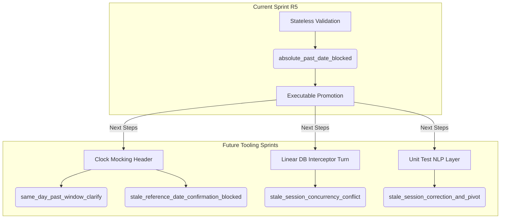

# Receptionist-Domain Acceptance Review: Sprint R5 Executable Scenario Promotion

This document provides the independent receptionist-domain, clinical safety, and test-design review for **Sprint R5: Executable Scenario Promotion**. It classifies the scenario fixtures from Sprint R3 and Sprint R4, critiques their readiness for automated executable replay under the current EMR4 Centaur test harness, and outlines the structural steps needed to resolve harness limitations.

---

## 1. Executive Summary & Verification Outcomes

Sprint R5 aims to promote the natural-language scenario corpus from EMR4 Sprint R3 (Stale-Session / Revision Hardening) and Sprint R4 (Backdated / Past-Date Safety) into executable replays. In EMR4 Centaur, scenario fixtures serve two distinct roles:
1. **Corpus Memory**: Descriptive natural-language dialogues with human-readable assertions, serving as design documentation and criteria for LLM verification.
2. **Executable Replays**: Programmatic, mock-based turn sequences executed against API routes with no LLM calls allowed, asserting deterministic outcomes (e.g., status codes, database writes, and exact payload fields).

As the Antigravity/Gemini domain reviewer, I have:
- **Analyzed all eight R3/R4 scenario fixtures** under `tests/fixtures/bernie_scenarios/` to determine their clinical safety/domain value and executable readiness.
- **Identified the precise technical blockers** preventing same-day fully-past window and stale-session cases from executing deterministically under the current `test_scenario_replay.py` harness.
- **Provided recommendations** for Sprint R5 scoping, confirming that promoting **`absolute_past_date_blocked`** is sufficient, and specified the next tooling priorities.

---

## 2. Review of R3/R4 Core Semantic Invariants

The promotion of receptionist-domain scenarios requires a strict understanding of EMR4's temporal and concurrency policies:

### A. Temporal Safety (Sprint R4)
* **Absolute Past Dates**: Validation must fail-closed *before* executing slot searches or displaying candidates when a requested date is strictly prior to the clinic session reference date (`date_from < reference_date`).
* **Same-Day Bounded Windows**: If the requested time has fully elapsed today, the system must switch to a clarification path ("That time has passed today. Would you like a later time or different day?") rather than a hard past-date block.
* **Clinic-Local Horizon**: Booking boundaries must evaluate against the clinic's local time zone to avoid timezone-drift errors (e.g., a Brisbane practice checking slots after midnight UTC).

### B. Session Freshness and Concurrency (Sprint R3)
* **Concurrency Protection**: The database enforces atomic revision checks. If a receptionist confirms a proposal with a mismatched `expected_revision`, the write is aborted, returning `409 Conflict` (`stale_session_revision`).
* **Stale Session Rollover**: Hibernated browser tabs waking up next morning or reloading on a stale date must block subsequent mutations, forcing a clean reload to sync the diary with clinic-local "today".
* **Context Reset**: Mid-conversation intent shifts (e.g., pivoting from booking to extending an appointment) must purge transient fields to prevent parameters from leaking across context boundaries.

---

## 3. Fixture Classification & Readiness Matrix

Below is the receptionist-domain priority ranking and executable readiness classification for the R3 and R4 fixtures.

| Fixture File | Category | Clinical Safety / Domain Value | Replay Harness Executable Readiness | Current Status & Recommended Path |
|---|---|---|---|---|
| `tests/fixtures/bernie_scenarios/absolute_past_date_blocked.yaml` | `session_state_guard` | **High**<br>Prevents invalid historical database entries, billing discrepancies, and audit log corruption. | **High**<br>State-free rule evaluation; compares `date_from` directly to `reference_date` in HTTP parameters. | **Executable.** Fully supported by the current API routes and replay harness. Promote for Sprint R5. |
| `tests/fixtures/bernie_scenarios/same_day_past_window_clarify.yaml` | `booking_clarification` | **Medium**<br>Guides the receptionist toward available slots, preventing workflow blocks, but has lower database corruption risk than past-date mutations. | **None**<br>Depends on the live system clock. The API uses `_clinic_local_now()` which cannot be mocked via the request payload. | **Memory-Only.** Blocked by lack of clock-mocking in the API routes. Keep as corpus documentation. |
| `tests/fixtures/bernie_scenarios/stale_reference_date_confirmation_blocked.yaml` | `stale_session` | **High**<br>Prevents confirming bookings across date-rollover boundaries, reducing scheduling errors. | **None**<br>Staleness checks rely on comparing the request reference date to the live clinic date (`_clinic_local_now().date()`). | **Memory-Only.** Stale reference checks are non-deterministic without system clock mocking. |
| `tests/fixtures/bernie_scenarios/stale_session_reload_blocking.yaml` | `session_state_guard` | **High**<br>Prevents browser tab wake-up from resurrecting outdated context and executing mutations. | **None**<br>Same clock dependency: session staleness logic compares reference date against live system time. | **Memory-Only.** Non-deterministic due to reliance on system datetime. |
| `tests/fixtures/bernie_scenarios/refresh_does_not_resurrect_stale_latest_message.yaml` | `session_state_guard` | **High**<br>Ensures reloads do not trigger mutations based on outdated user prompts. | **None**<br>Requires clock validation on session refresh. | **Memory-Only.** Non-deterministic due to clock-dependent staleness logic. |
| `tests/fixtures/bernie_scenarios/stale_session_concurrency_conflict.yaml` | `stale_session` | **High**<br>Prevents double-booking or overwriting modifications made by other receptionists concurrently. | **None**<br>The replay harness operates as a single-session runner and cannot perform out-of-band DB updates between turns. | **Memory-Only.** Requires concurrent multi-user execution or database intercept mocks. |
| `tests/fixtures/bernie_scenarios/stale_session_correction_and_pivot.yaml` | `appointment_extension` | **Medium**<br>Improves dialogue flow efficiency and ergonomics, preventing cognitive load on context switch. | **Low**<br>Requires natural language parsing and intent-shifting, which relies on the LLM (AI calls are forbidden in replay). | **Memory-Only.** Programmatic mocks cannot verify free-text context shifts without heavy hardcoding. |
| `tests/fixtures/bernie_scenarios/booking_to_extension_switch_during_clarification.yaml` | `appointment_extension` | **Medium**<br>Ensures intent changes cleanly discard old date/practitioner constraints. | **Low**<br>Same LLM dependency for detecting context shift in dialogue. | **Memory-Only.** Natural language context resets cannot be verified by stateless, mock-based HTTP replay. |

---

## 4. Why Same-Day Past Windows & Stale Sessions Remain Memory-Only

The current EMR4 deterministic replay harness (`test_scenario_replay.py`) is designed as a fast, state-free integration verification layer. It monkeypatches the AI service (`_install_forbidden_ai_provider_guard`) to prevent outgoing LLM calls, forcing tests to run offline. While this works beautifully for programmatic validation, it creates two major architectural boundaries:

### A. The System Clock Dependency (Same-Day & Stale Date Cases)
In the EMR4 API layer (`app/routers/appointments.py`), same-day window checking and session freshness checks rely directly on the system clock. For example, the appointment endpoints execute:

```python
practice_tz = _practice_zoneinfo(db, current_user.practice_id)
clinic_now = _clinic_local_now(practice_tz)
clinic_today = clinic_now.date()
```

And in the temporal helper (`app/services/bernie_slot_normalizer.py`), staleness is evaluated as:

```python
stale = request_reference_date != clinic_today
```

Because the FastAPI router fetches the live OS system time, running a replay scenario with a hardcoded reference date (e.g., `"2026-07-05"`) will result in non-deterministic failures on any day other than July 5, 2026. Since the replay harness has no way to inject a simulated clock time (such as through custom headers or middleware hooks), these scenarios cannot be safely promoted to executable tests.

### B. Single-Session Linear Replay Limits (Concurrency Cases)
The scenario replay engine executes a single list of sequential HTTP turns using the same database connection and test client context.
To test a concurrency conflict (`stale_session_concurrency_conflict.yaml`), the harness must:
1. Load a session state in Client A.
2. Mutate the session revision in the database via Client B (simulating another receptionist).
3. Attempt to commit with Client A, expecting a `409 Conflict` and `stale_session_revision`.

Because the YAML runner cannot execute out-of-band database queries or manage dual-client states within a single scenario turn, concurrency scenarios cannot be represented inside the current declarative replay structure.

### C. Conversational Intent Shifts (Correction & Pivot Cases)
Context pivots (`stale_session_correction_and_pivot.yaml`) verify that the natural language processor discards stale parameters when a user switches from "Book Margaret..." to "Actually, extend today's...". Because scenario replays operate offline by mocking the interpreter output, they bypass the NLP logic. Testing these in the replay harness would require manually specifying the expected parsed constraints for each step, which validates the mock normalizer itself rather than the LLM's actual ability to pivot intent.

---

## 5. Sprint R5 Decisions & Next Steps

### A. Is promoting `absolute_past_date_blocked` enough for Sprint R5?
**Yes.** Promoting `absolute_past_date_blocked.yaml` is the only viable candidate for EMR4 Sprint R5. 
- It evaluates the stateless invariant `date_from < reference_date`.
- It executes deterministically regardless of the system clock.
- It requires no out-of-band concurrency mocks or LLM interaction.
Promoting this fixture provides valuable regression coverage for past-date booking prevention, while keeping clock-mocking and concurrency test refactoring out of scope for the current sprint.

### B. What should come next? (Sprint R6+ Tooling Priorities)

To promote the remaining high-value clinical safety fixtures into executable replays, EMR4 should implement the following tooling enhancements in future sprints:



1. **Simulated Clock Header (Header-Based Time Mocking)**:
   Modify EMR4's API middleware to detect an optional HTTP header, such as `X-Clinic-Simulated-Now`. If present in dev environments, `_clinic_local_now()` should return the header-specified datetime instead of the system clock. This will immediately unlock `same_day_past_window_clarify.yaml` and reference-date staleness replays.
2. **Harness Database Mutation Actions**:
   Extend the YAML schema with a new utility action, such as `action: db_mutate`, allowing scenario turns to modify postgres rows (e.g. updating a session's revision number or appointment status) out-of-band. This will enable concurrency conflict validation.
3. **Conversational Unit Tests (LLM-Level Testing)**:
   For complex NLP intent pivots and corrections, rather than trying to fit them into the offline replay harness, maintain them as independent LLM-enabled integration tests that run against a sandbox Google Gemini instance. This separates fast integration replays from conversational validation.
