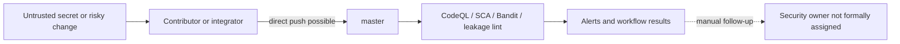
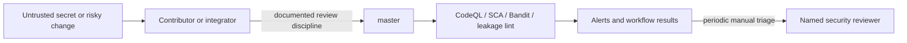
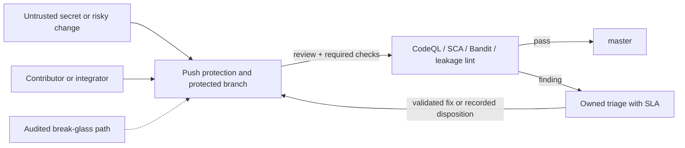

# Security Hardening Proposal: Enforce the delivery security boundary

## Decision

Choose whether EMR4 should keep security automation advisory at the GitHub
integration boundary or make reviewed integration, required checks, push
protection, and alert ownership technically enforceable.

## Executive Recommendation

There are two serious options. Option 1, **strengthened advisory controls**,
keeps direct integration possible but adds ownership and scheduled triage.
Option 2, **enforced protected integration**, makes selected checks and review
conditions mandatory and adds secret push protection. I recommend Option 2
after the current high-alert population is validated and a break-glass path is
rehearsed.

## Evidence

I inspected the repository workflows and queried GitHub's read-only API. The
evidence most influential to this diagnosis is the coexistence of useful
security automation with no technical protection on `master`.

| Evidence | Finding or document | What it establishes |
| --- | --- | --- |
| `E001` | Master branch protection | GitHub reports the default branch is not protected. |
| `E002` | Secret push protection | Secret scanning is enabled, while push protection is disabled. |
| `E003` | CodeQL alert population | Ten open candidates are classified high; none is treated here as validated. |
| `E004` | Dependabot alert 5 | A medium, dev-only `uuid` advisory remains open and upstream-blocked. |
| `E005` | Repository security workflows | CodeQL, Python/Node SCA, Bandit, leakage lint, Dependabot, and secret scanning already exist. |
| `E006` | API Spine and handover constraints | RLS, comprehensive audit, field encryption, and JWT storage hardening remain structural work. |

## Current Design And Failure Mode

The current design detects a broad set of problems after code reaches a GitHub
event, and the human Ariadne protocol requires careful protected integration.
The structural condition is that policy and enforcement live in different
places: AGENTS.md says protected refs are controlled, but GitHub permits a
direct push to `master`. A mistaken credential, bypassing change, or ignored
alert can therefore rely on human discipline at the final boundary.

The ten high CodeQL candidates sharpen this concern without proving ten
vulnerabilities. Several point at published Diary smoke/dev switches and DOM
or endpoint handling; two concern diagnostic output. We need reachability and
data-classification decisions before using the alert population as a hard
gate, otherwise we risk normalizing noisy red builds.

## Desired Invariants

- No ordinary change reaches `master` without the selected security checks.
- A pushed secret is blocked before it becomes repository history whenever
  GitHub can identify it.
- Every high security signal receives an owner, validity/reachability decision,
  remediation or disposition, and time-bound record.
- Emergency integration remains possible only through an audited, narrow
  break-glass path.
- Enforcement does not grant providers, LLMs, or workers integration authority.

## Constraints And Non-Goals

This proposal does not validate the CodeQL findings, implement RLS/encryption,
change product behavior, open provider or write gates, or constitute a
production security certification. It must preserve solo-maintainer recovery
and avoid making flaky or historical equality checks permanent blockers.

## Before Architecture

The before view shows detection downstream from an integration boundary that
GitHub does not protect.

The important edge is `Contributor -> master`: scanners can report after the
fact, but they do not currently own admission.

## Options

### Option 1: Strengthened advisory controls

This option keeps GitHub settings unchanged and strengthens the human process:
a named reviewer, weekly alert review, severity SLAs, and a mandatory security
delta in sprint acceptance. Its strongest case is low operational friction for
a solo-maintainer project; it also avoids blocking on noisy CodeQL quality
results. Its weakness is unchanged bypassability—documentation still cannot
prevent a direct push or leaked secret.

| Change | Before | After | Security consequence | Cost |
| --- | --- | --- | --- | --- |
| Alert ownership | Informal | Named owner and SLA | Faster response | Recurring review time |
| Integration | Direct push possible | Direct push still possible | Bypass risk remains | No CI admission friction |
| Secrets | Detection after push | Same | Repository-history exposure remains possible | No settings change |

Rollout is documentary and reversible. If alert ownership is not sustained,
the option collapses back to the current condition without a technical signal.

### Option 2: Enforced protected integration

This option adds branch protection, required stable security checks, secret
push protection, and an audited break-glass procedure. Its attractive feature
is moving control ownership to the trust boundary: the same evidence already
generated by CI becomes admission evidence. What gives me pause is signal
quality and solo-maintainer availability, so the current high alerts must be
triaged and required checks must be shown stable before enforcement.

| Change | Before | After | Security consequence | Cost |
| --- | --- | --- | --- | --- |
| Integration | Direct push possible | Required review/check policy | Prevents ordinary bypass | Slower integration when CI is unavailable |
| Secrets | Scan after push | Push protection before acceptance | Narrows credential exposure | Occasional false-positive override workflow |
| Findings | Alert queue | Owner, SLA, recorded disposition | Reduces silent backlog | Triage and evidence burden |
| Recovery | Informal direct action | Narrow audited break-glass | Preserves emergency capability with accountability | Procedure and rehearsal |

Rollout should begin in report-only mode, then require only demonstrably stable
checks. Rollback removes required-check enforcement while retaining alert
ownership and the evidence explaining why.

## Comparison

| Dimension | Option 1: Advisory | Option 2: Enforced |
| --- | --- | --- |
| Security | Improves response; bypass remains | Prevents ordinary bypass and blocks recognized secrets |
| Performance | Runtime-neutral | Runtime-neutral; CI admission latency increases |
| Memory | Neutral | Neutral; GitHub stores ordinary check metadata |
| Reliability | No new merge dependency | CI outage can block integration; break-glass mitigates |
| Operability | Weekly manual discipline | Settings, check curation, triage SLA, and rehearsal |
| Migration | Immediate documentation | Staged alert triage, dry run, then enforcement |

Neither option changes EMR4 runtime performance or memory in a meaningful way;
their costs occur in delivery latency and operational attention.

## Recommendation

I recommend Option 2 under the current constraints because EMR4 handles health
information and already pays the cost of producing security evidence. The
incremental value comes from making that evidence consequential. Option 1 is
preferable temporarily if high-alert triage shows excessive false-positive
noise or if no reliable emergency approver can be defined.

## Evidence Coverage And Residual Risk

| Evidence | Option 1 | Option 2 | Residual risk |
| --- | --- | --- | --- |
| E001 — unprotected master | Mitigates procedurally | Addresses technically | Administrators may retain bypass authority |
| E002 — push protection off | Unaffected | Addresses recognized secret patterns | Unknown/custom secrets may evade detection |
| E003 — high CodeQL candidates | Adds ownership | Adds ownership and future gating | Findings require validation; static analysis is incomplete |
| E004 — dev `uuid` alert | Tracks SLA | Tracks SLA; production audit remains blocking | Upstream toolchain remains vulnerable in development scope |
| E005 — existing workflows | Uses current evidence | Makes stable evidence an admission control | Workflow compromise/supply-chain risk remains |
| E006 — runtime structural gaps | Unaffected | Unaffected | RLS, encryption, audit, and storage work still required |

## Migration And Rollout

First validate and disposition the ten high CodeQL candidates. Next observe
workflow stability over representative pushes, define required checks and a
break-glass record, enable push protection, and finally protect `master` in a
reversible staged change. Do not make immutable historical-report equality
tests required checks if their accepted contract is intentionally frozen.

## Validation Plan

- Attempt an ordinary direct push in a disposable rehearsal repository or
  temporary branch rule and verify rejection.
- Submit a synthetic recognized test secret through the documented safe test
  mechanism and verify push protection without committing a real credential.
- Verify required Python, Node, and CodeQL checks on a no-op change and on a
  deliberately failing fixture.
- Exercise the break-glass path, audit record, and subsequent review.
- Measure median and 95th-percentile check latency for ten representative
  changes; reconsider the required set if the stable 95th percentile exceeds
  the project's agreed integration budget.

## Implementation Work Packages

- Validate CodeQL high alerts and record reachability/data classification.
- Define severity SLAs, owner, disposition schema, and metrics.
- Curate stable required checks and action-version pinning plan.
- Configure secret push protection and protected `master` after approval.
- Document and rehearse emergency integration and rollback.

## Open Questions

- Which GitHub identity or role may approve/break glass when Yuri is the sole
  available maintainer?
- Which checks have sufficient stability to become required immediately?
- What remediation SLA is proportionate for validated critical, high, medium,
  and dev-only findings?
