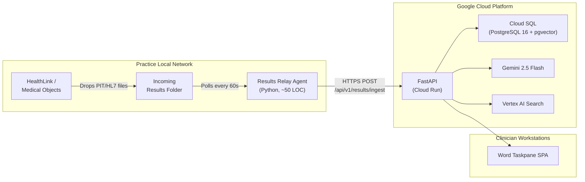
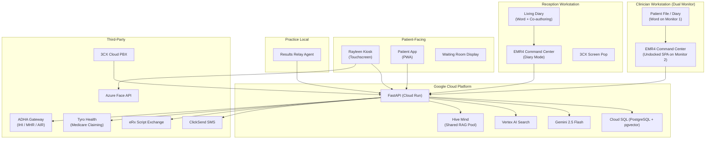
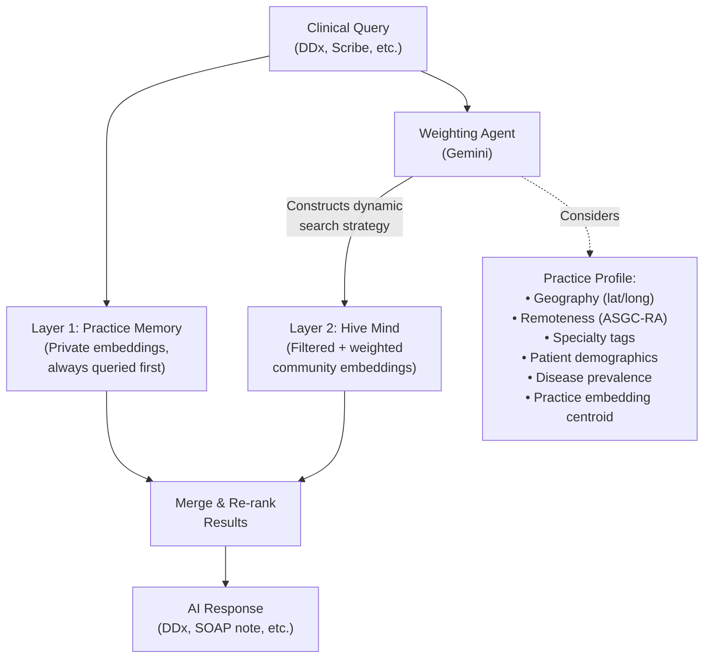
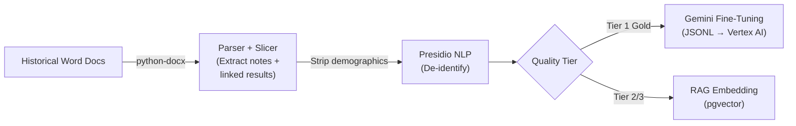
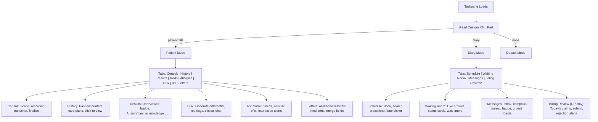

# EMR4 GP-AI Centaur — Master Implementation Plan v3.0
### *The Definitive Blueprint*

---

## 1. Vision

Build a **complete, AI-native, open-source, cloud-hosted, multi-practice General Practice management system** where Microsoft Word serves as the clinician and receptionist frontend, a FastAPI/PostgreSQL backend acts as the central nervous system, and Google Gemini AI is woven throughout every workflow.

The name **"Centaur"** reflects the design philosophy: the GP and AI work as one — the human provides judgment, empathy, and accountability; the AI provides speed, recall, and pattern recognition.

At maturity, the system becomes a **living clinical intelligence network** — every consultation across every participating practice feeds a shared, de-identified "Hive Mind" that makes the AI smarter for all. A new practice in Darwin gets the benefit of ten thousand tropical medicine encounters on day one. A First Nations health service inherits the collective wisdom of every Aboriginal health centre that opted in.

### 1.1 Business & Licensing Model

| Aspect | Decision |
|:---|:---|
| **Source Code** | Open-source on GitHub |
| **License** | **AGPL-3.0** (recommended) — anyone can self-host, modify, and contribute; but if they offer it as a hosted service, they must open-source their modifications. This protects the managed SaaS offering while keeping the core genuinely free. |
| **Revenue** | Managed cloud SaaS for practices that want a turnkey solution (hosting, backups, updates, support, Hive Mind access) |
| **Hive Mind** | Network-effect moat — the more practices on the managed platform, the smarter the shared AI becomes. Self-hosted instances can participate too if they opt in. |
| **IP** | No IP hoarding — the value is in the network, not the code |

> [!NOTE]
> Alternative license options: **Apache 2.0** (maximally permissive — anyone can fork and compete) or **BSL (Business Source License)** (prevents competing SaaS for a time window, then converts to open-source). AGPL-3.0 strikes the best balance for this project.

---

## 2. Architecture Pivots

Six pivots from [gemini-code-1781257559871.md](file:///c:/Users/YuriFrusin/Documents/EMR4/gemini-code-1781257559871.md) that supersede earlier assumptions:

### 2.1 The "Command Center" (Dual-Monitor SPA)
Abandon the narrow 300px sidebar. The GP undocks the Word taskpane and maximises it on their second monitor. The frontend is a **fully responsive SPA** using CSS Grid/Flexbox that transforms from a column into a multi-panel dashboard when expanded.

### 2.2 Minimalist Word Ribbon
A single custom tab with one button: **"Toggle EMR4 Copilot"**. All complex workflows live inside the web-based SPA taskpane.

### 2.3 SPA Tabbed Interface
Persistent navigation bar (e.g., `[ Consult ] [ History ] [ Results ] [ Meds ] [ DDx ] [ Rx ]`). Tab switching is instant DOM-swap via JS — no dialogs, no popups.

### 2.4 Document-Aware Routing
The taskpane reads a hidden `<emr4:document-type>` Custom XML Part from the active Word document:
- **Patient File → "Patient Mode"**: Consult, Scribe, DDx, Meds, Demographics, Results
- **Diary → "Diary/Admin Mode"**: Schedule, Waiting Room, Messages, Billing Review

> [!NOTE]
> Daily Billing Review is practice-wide and lives exclusively in Diary Mode, separate from individual patient workflows.

### 2.5 RBAC & Dynamic UI
The taskpane reads a JWT on login. Receptionist role → sensitive tabs (Billing Review) are omitted from the DOM entirely. Backend enforces `@require_role` route guards. GPs only see their own billing data (scoped by `practitioner_id` from JWT).

### 2.6 The "Living Diary" (Parse & Lock)
The daily `Diary_[Date].docx` is hosted on **SharePoint/OneDrive** with native co-authoring:
- **Parse & Lock** (`Ctrl+Shift+B`): Receptionist types `»09:00 Jane Doe` → add-in parses the chevron-prefixed line, registers the appointment in the database, converts it to a hyperlinked block **[09:00 - Jane Doe]**, and wraps it in a Content Control with `cannotEdit = true`, `cannotDelete = true`.
- **Unlock & Amend** (`Ctrl+Shift+U`): Removes locks for amendment or deletion.
- **Free-Text Spaces**: Lock only applies to the appointment paragraph. Blank lines between appointments remain unprotected for notes and messages.

---

## 3. Resolved Design Decisions

| Question | Decision |
|:---|:---|
| Multi-practice? | ✅ Yes, multi-tenant from day one |
| Hosting? | ✅ Cloud-first (GCP Cloud Run + Cloud SQL) with lightweight on-premise Results Relay Agent |
| VOIP? | ✅ 3CX Cloud PBX (not Asterisk — native CRM screen pop vs DIY middleware) |
| SMS? | ✅ ClickSend (Australian HQ, Perth; REST API; two-way) |
| Online booking? | ✅ Both standalone site + embeddable iframe |
| Patient app? | ✅ PWA (Progressive Web App) — booking + queue position + notifications |
| Medicare claiming? | ✅ Third-party gateway (Tyro Health / MediClear) — no direct PRODA B2B needed |
| IHI / MHR? | Direct PRODA B2B integration (no third-party option exists) |
| Letter writing? | ✅ Native Word — AI-drafted, merge fields, formatted per Dr Shera's original EMR templates |
| Open source? | ✅ AGPL-3.0 on GitHub |
| RAG pipeline? | ✅ Live dual-layer: Practice Memory (private) + Hive Mind (opt-in, de-identified) |

---

## 4. Cloud-First Hosting with On-Premise Results Relay



The Results Relay Agent is a stateless ~50-line Python script installed on the practice's local server. It polls the HealthLink/Medical Objects incoming folder, uploads new PIT/HL7 files to the cloud API, and archives processed files locally.

---

## 5. High-Level Architecture



---

## 6. Technology Stack

| Layer | Technology | Rationale |
|:---|:---|:---|
| **Frontend (Clinical)** | Word + Office.js → undocked SPA | Dual-monitor Command Center; CSS Grid/Flexbox; tabbed nav |
| **Frontend (Kiosk)** | Vite + vanilla JS | Full-screen touchscreen kiosk |
| **Frontend (Booking + Patient App)** | Vite + vanilla JS → PWA | Installable on home screen; works on both iOS/Android |
| **Frontend (Waiting Room)** | Vite + vanilla JS | Public display screen; auto-refresh |
| **Backend** | FastAPI (Python 3.11) | Async; AI orchestration; already in use |
| **Database** | Cloud SQL (PostgreSQL 16 + pgvector) | Managed; vector search; multi-tenant |
| **Migrations** | Alembic | Version-controlled schema evolution |
| **AI — Clinical** | Gemini 2.5 Flash (Vertex AI) | Multimodal; fast; already integrated |
| **AI — Search** | Vertex AI Discovery Engine | MBS rules RAG |
| **AI — De-ID** | Microsoft Presidio | PHI/PII scrubbing for Hive Mind |
| **AI — Face** | Azure Face API | 1:1 verification; liveness detection |
| **VOIP** | 3CX Cloud PBX | Native CRM screen pop; SIP trunking |
| **SMS** | ClickSend (Perth, AU) | REST API; two-way; ACMA compliant |
| **ePrescribing** | eRx Script Exchange | Australian standard; PBS integration |
| **Medicare** | Tyro Health / MediClear | Third-party claiming gateway |
| **ADHA** | Direct PRODA B2B | IHI, MHR, AIR (no third-party option) |
| **Results Relay** | Custom Python (~50 LOC) | Local folder polling → cloud upload |
| **Auth** | FastAPI + JWT | Role-based; practice-scoped |
| **Hosting** | GCP Cloud Run + Cloud SQL + Cloud Storage | Fully managed; `australia-southeast1` |
| **License** | AGPL-3.0 | Open-source; SaaS-protective |

---

## 7. Database Schema (30+ Tables)

### 7.1 Multi-Tenancy & Identity

| Table | Key Columns | Purpose |
|:---|:---|:---|
| **practices** | `id`, `name`, `abn`, `address_*`, `phone`, `email`, `logo_url`, `timezone`, `hive_mind_opt_in` (bool), `practice_embedding` (Vector(768)), `specialty_tags` (JSONB), `asgc_ra_code`, `latitude`, `longitude`, `proda_device_cert_path`, `proda_cert_expiry`, `created_at` | Top-level tenant; Hive Mind participation flag; geolocation for intelligent weighting |
| **practice_locations** | `id`, `practice_id` (FK), `name`, `address_*`, `phone`, `waiting_rooms` (JSONB), `is_active` | Physical sites |
| **users** | `id`, `practice_id` (FK), `email`, `password_hash`, `role` (enum: GP, Receptionist, Nurse, Admin, PracticeOwner), `practitioner_id` (FK, nullable), `is_active`, `created_at` | Login accounts |
| **practitioners** | `id`, `practice_id` (FK), `first_name`, `last_name`, `provider_number`, `prescriber_number`, `ahpra_number`, `hpi_i`, `specialty`, `default_location_id` (FK), `is_active`, `created_at` | Doctors, nurses, allied health |
| **patients** | `id`, `practice_id` (FK), `first_name`, `last_name`, `date_of_birth`, `medicare_number`, `ihi_number`, `dva_number`, `sex`, `gender_identity`, `indigenous_status`, `preferred_language`, `email`, `phone_mobile`, `phone_home`, `address_*`, `emergency_contact_*`, `concession_type`, `consent_facial_recognition` (bool), `face_embedding_id`, `sms_consent` (bool), `sms_consent_date`, `created_at`, `updated_at` | Full demographics; SMS consent; face consent |

### 7.2 Clinical

| Table | Key Columns | Purpose |
|:---|:---|:---|
| **encounters** | `id`, `practice_id`, `patient_id` (FK), `practitioner_id` (FK), `appointment_id` (FK, nullable), `status` (enum: Draft, InProgress, Finalized, Amended), `template_type` (enum: SOAP, Procedure, MentalHealth, CDM, GPCCMP, HealthAssessment, Antenatal, WoundCare), `raw_document_text`, `document_embedding` (Vector(768)), `is_shared_to_hive` (bool), `consultation_type`, `consultation_date`, `created_at`, `updated_at` | Core clinical record; embedding for RAG |
| **clinical_diagnoses** | `id`, `practice_id`, `patient_id` (FK), `encounter_id` (FK), `term`, `snomed_ct_au_code`, `is_active`, `onset_date`, `resolved_date`, `severity` | Active problem list |
| **prescriptions** | `id`, `practice_id`, `patient_id` (FK), `encounter_id` (FK), `drug_name`, `dosage_text`, `pbs_code`, `repeats`, `quantity`, `route`, `frequency`, `start_date`, `end_date`, `prescribed_by` (FK), `erx_token`, `is_active`, `created_at` | Full Rx metadata; eRx integration ready |
| **allergies** | `id`, `practice_id`, `patient_id` (FK), `substance`, `reaction`, `severity`, `snomed_code`, `recorded_date` | Drug/food/environmental |
| **immunisations** | `id`, `practice_id`, `patient_id` (FK), `vaccine_name`, `dose_number`, `date_given`, `batch_number`, `site`, `route`, `air_notification_sent` | AIR ready |
| **patient_history** | `id`, `practice_id`, `patient_id` (FK), `category` (enum: Medical, Surgical, Family, Social), `description`, `date_recorded` | Structured history |
| **consent_forms** | `id`, `practice_id`, `patient_id` (FK), `encounter_id` (FK, nullable), `form_type`, `signed_at`, `signature_data` (Text), `document_path` | Digital consent capture |
| **clinical_images** | `id`, `practice_id`, `patient_id` (FK), `encounter_id` (FK), `image_url`, `caption`, `body_site`, `captured_at` | Wound photos, skin lesions, etc. |

### 7.3 Care Plans & Structured Programs

| Table | Key Columns | Purpose |
|:---|:---|:---|
| **care_plans** | `id`, `practice_id`, `patient_id` (FK), `encounter_id` (FK), `plan_type` (enum: GPCCMP, MHTP, HealthAssessment45, HealthAssessment75, ATSI_HA, Antenatal), `mbs_item` (e.g., "965", "2715", "701"), `status` (enum: Draft, Active, Review_Due, Completed), `valid_until`, `review_date`, `plan_data` (JSONB), `created_at` | Tracks care plan lifecycle and review dates |

### 7.4 Appointments & Diary

| Table | Key Columns | Purpose |
|:---|:---|:---|
| **appointments** | `id`, `practice_id`, `location_id` (FK), `patient_id` (FK), `practitioner_id` (FK), `start_time`, `duration_minutes`, `appointment_type_id` (FK), `status` (enum: Booked, Confirmed, Arrived, InConsult, Completed, Cancelled, NoShow, DNA), `reason`, `notes`, `booked_by` (FK), `booked_via` (enum: Receptionist, Online, Phone, Kiosk, App), `waiting_room`, `queue_position`, `created_at` | Core appointment record |
| **appointment_types** | `id`, `practice_id`, `name`, `default_duration`, `color_hex`, `is_bookable_online` | Configurable types per practice |
| **practitioner_schedules** | `id`, `practitioner_id`, `location_id`, `day_of_week`, `start_time`, `end_time`, `slot_duration_minutes` | Weekly template |
| **schedule_overrides** | `id`, `practitioner_id`, `date`, `is_unavailable`, `override_start`, `override_end`, `reason` | Leave, half-days |

### 7.5 Results & Referrals

| Table | Key Columns | Purpose |
|:---|:---|:---|
| **test_requests** | `id`, `practice_id`, `patient_id`, `practitioner_id`, `encounter_id`, `request_type` (enum), `request_text`, `urgency`, `status` (enum), `created_at` | Outgoing orders |
| **results** | `id`, `practice_id`, `patient_id`, `test_request_id` (FK, nullable), `result_source` (enum: PIT, HL7, Manual, Scan), `lab_name`, `specimen_date`, `report_date`, `received_at`, `status` (enum: New, Reviewed, ActionRequired, Filed), `reviewed_by` (FK), `reviewed_at`, `raw_message`, `parsed_data` (JSONB), `is_abnormal`, `ai_summary`, `display_pdf_url` | Incoming results with AI summary |
| **result_items** | `id`, `result_id` (FK), `test_name`, `value`, `units`, `reference_range`, `flag` (enum: Normal, Low, High, Critical), `loinc_code` | Individual analytes |
| **referrals** | `id`, `practice_id`, `patient_id`, `practitioner_id`, `encounter_id`, `referral_to`, `specialty`, `reason`, `urgency`, `status` (enum), `letter_document_path`, `created_at` | Outgoing referrals |
| **reminders** | `id`, `practice_id`, `patient_id`, `practitioner_id`, `reminder_type` (enum: ResultFollowUp, Recall, ReviewAppointment, CarePlanReview, Custom), `message`, `due_date`, `is_dismissed`, `triggered_by_result_id` (FK, nullable) | System + manual reminders |
| **scanned_documents** | `id`, `practice_id`, `patient_id`, `document_type` (enum: SpecialistLetter, Report, Correspondence, Other), `file_url`, `scanned_at`, `triaged_to` (FK→practitioners), `triage_status` (enum: Pending, Triaged, Reviewed), `notes` | Document management |

### 7.6 Billing

| Table | Key Columns | Purpose |
|:---|:---|:---|
| **mbs_claims** | `id`, `practice_id`, `patient_id`, `practitioner_id`, `encounter_id`, `item_number`, `description`, `claim_type` (enum: BulkBill, PatientClaim, DVA, WorkCover, TAC, ECLIPSE), `amount`, `gateway_claim_id`, `claim_status` (enum: Draft, Submitted, Accepted, Rejected, Paid), `submitted_at`, `response_data` (JSONB) | Full claiming lifecycle |
| **invoices** | `id`, `practice_id`, `patient_id`, `encounter_id`, `total_amount`, `paid_amount`, `status` (enum), `issued_at` | Private billing / gap payments |
| **mbs_directory** | `item_number` (PK), `description`, `fee` | *(existing)* MBS lookup |
| **snomed_directory** | `concept_id` (PK), `term` | *(existing)* SNOMED lookup |

### 7.7 Messaging & Communications

| Table | Key Columns | Purpose |
|:---|:---|:---|
| **internal_messages** | `id`, `practice_id`, `sender_id` (FK→users), `recipient_id` (FK, nullable), `recipient_role` (nullable), `patient_id` (FK, nullable), `appointment_id` (FK, nullable), `subject`, `body`, `priority` (enum: Normal, Urgent, Critical), `is_read`, `read_at`, `created_at` | Internal staff messaging |
| **sms_log** | `id`, `practice_id`, `patient_id` (FK), `direction` (enum: Outbound, Inbound), `phone_number`, `message_body`, `sms_type` (enum: AppointmentReminder, Confirmation, ResultNotification, Recall, Bulk, Custom), `status` (enum: Queued, Sent, Delivered, Failed, Replied), `clicksend_message_id`, `sent_at` | SMS audit trail |

### 7.8 Kiosk, VOIP & Patient App

| Table | Key Columns | Purpose |
|:---|:---|:---|
| **checkin_events** | `id`, `practice_id`, `patient_id`, `appointment_id`, `checkin_method` (enum: Details, QR, NFC, FacialRecognition), `checkin_time`, `waiting_room_assigned`, `kiosk_id` | Arrival audit log |
| **patient_qr_tokens** | `id`, `patient_id`, `token_hash`, `created_at`, `expires_at` | Rotating QR codes |
| **call_log** | `id`, `practice_id`, `caller_number`, `patient_id` (FK, nullable), `answered_by` (FK), `call_time`, `duration_seconds`, `call_type` (enum), `notes` | Phone audit trail |

### 7.9 RAG Pipeline & Hive Mind

| Table | Key Columns | Purpose |
|:---|:---|:---|
| **community_encounters** | `id`, `source_practice_id` (FK), `deidentified_text`, `encounter_embedding` (Vector(768)), `mbs_item`, `snomed_codes` (JSONB), `gp_tier` (enum: Tier1_Gold, Tier2, Tier3), `practice_specialty_tags` (JSONB), `practice_asgc_ra_code`, `practice_latitude`, `practice_longitude`, `created_at` | De-identified hive mind pool |
| **rag_feedback** | `id`, `practice_id`, `encounter_id`, `query_embedding` (Vector(768)), `retrieved_community_ids` (JSONB), `was_accepted` (bool), `created_at` | Implicit feedback for learned weighting |

### 7.10 ADHA

| Table | Key Columns | Purpose |
|:---|:---|:---|
| **ihi_records** | `id`, `patient_id`, `ihi_number`, `ihi_status`, `verified_at`, `source` (enum: Manual, HI_Service) | Cached IHI lookups |
| **mhr_uploads** | `id`, `patient_id`, `encounter_id`, `document_type` (enum), `upload_status`, `uploaded_at`, `mhr_document_id` | MHR upload log |

---

## 8. The Live RAG Pipeline — Practice Memory + Hive Mind

### 8.1 Layer 1: Practice Memory (Private, Always-On)

Every finalized encounter generates a Gemini embedding → stored in `encounters.document_embedding`, scoped by `practice_id`. The DDx engine and scribe query this private pool for similar historical cases. Over time, the AI absorbs the practice's patient population, disease patterns, and coding style.

### 8.2 Layer 2: Hive Mind (Opt-In, De-Identified)

If `practices.hive_mind_opt_in = true`, finalized encounters pass through:
1. **Presidio NLP** — scrub all PHI/PII (`<PERSON>`, `<LOCATION>`, `<DATE>`)
2. **Gemini embedding** of the de-identified text
3. **Insert** into `community_encounters` with practice metadata (specialty tags, geography, remoteness)

### 8.3 Intelligent Agentic Weighting (Three Tiers)



**Tier 1 — Heuristic (Early, <20 practices):** Simple metadata-filtered vector search. Geographic proximity decay + specialty tag matching + remoteness code alignment.

**Tier 2 — Learned (Growth, 20-100 practices):** A lightweight model trained on `rag_feedback` data — which hive mind results were accepted vs rejected by GPs. Learns patterns like *"For mental health, specialty matters more than geography"*.

**Tier 3 — Agentic (Maturity, 100+ practices):** A Gemini agent dynamically constructs the search strategy per query:

> *"This is a 45-year-old Aboriginal woman in Darwin with polyuria. I should weight towards: First Nations health practices (any geography) + Top End practices (any specialty) + endocrinology-focused practices. But for the drug interaction check, weight all practices equally."*

### 8.4 The Practice Embedding Centroid

Each practice accumulates an implicit profile — the centroid (mean) of all its encounter embeddings. This 768-dimensional vector captures *what this practice is like* in a way no metadata tag could express. Two practices serving similar populations will have similar centroids automatically, enabling similarity-based weighting without manual configuration.

---

## 9. Centaur Brain — Historical Data Pipeline

A batch pipeline for ingesting the legacy trove of historical Word documents (volume TBD — potentially decades of clinical notes from a medical centre).

### Pipeline



**Key design**: The parser preserves **internal document links** between clinical notes and results sections, bundling linked pathology/radiology into the same JSONL encounter object. This captures the complete diagnostic reasoning chain (presentation → investigation → result → management decision).

**Tiering**: Encounters authored by the most meticulous GPs (Tier 1 "Golden Dataset") are used exclusively for **fine-tuning** Gemini on Australian clinical coding style. Lower-tier data is embedded for **RAG** only.

---

## 10. Letter Writing — The Dr Shera Heritage

One of the founding motivations behind the original EMR (dating back to MS-DOS and Windows 95) was the ability to compose **beautifully formatted letters** to other medical practitioners. EMR4 honours this heritage.

### EMR4's Unique Advantage
Unlike every competitor (Best Practice, Medical Director, Genie, Zedmed) which generates letters in a proprietary internal editor and then *exports* to Word, EMR4's letters **are Word documents natively**. The GP drafts, edits, and sends the letter in Word itself — with full access to styles, headers, letterhead, tables, and typography.

### Implementation
- **AI-drafted**: Gemini generates the letter body from encounter notes + reason for referral + relevant results
- **Merge fields**: Auto-populate patient demographics, practitioner details, recipient address, practice letterhead
- **Template library**: Referral letter, specialist reply, medical certificate, WorkCover report, to-whom-it-may-concern, batch recall letter
- **Formatting**: Will follow the original EMR letter templates supplied by the user
- **Transmission**: Save to encounter record; transmit via HealthLink/Medical Objects secure messaging or print

---

## 11. Command Center — SPA Tab Architecture



---

## 12. Development Phases

### PHASE 0 — Foundation & Scaffolding
*Auth, migrations, config, multi-tenancy, SMS infrastructure, cleanup.*

| Item | Details |
|:---|:---|
| Project restructure | `app/` package with `routers/`, `services/`, `models/`, `schemas/`, `middleware/` |
| Auth | JWT login, `@require_role()`, password hashing (bcrypt), Office SSO stub |
| Config | Pydantic `Settings` from `.env`; delete `gcp-key.json` from repo |
| Alembic | Initialize; baseline migration; multi-tenancy migration |
| Models | All tables from Section 7; SQLAlchemy `relationship()` declarations; indexes |
| SMS infra | `sms_service.py` with ClickSend client; `sms_log` + `sms_consent` tables |
| Cleanup | `requirements.txt`; delete dead `commands.js` code; update `manifest.xml` provider |
| Dependencies | FastAPI `Depends(get_db)`; proper error middleware |

---

### PHASE 1 — Patient Management & Patient File
*Full patient CRUD, the Patient File Word template, SPA framework, care plans, letter writing.*

| Item | Details |
|:---|:---|
| Patient CRUD | Create, search (name/DOB/Medicare/phone), view, update |
| Patient File template | `.dotx` with Content Controls; Custom XML Part for document-type routing |
| SPA framework | Tab router, DOM-swap engine, document-type detection, responsive CSS Grid |
| Care plan templates | **GPCCMP** (items 965/967), **MHTP** (items 2715/2717), **Health Assessments** (701/705/715) |
| Clinical templates | SOAP, Procedure, Antenatal, Wound Care (each maps to relevant MBS items) |
| Letter writing | AI-drafted referral/reply/med cert; merge fields; Dr Shera formatting |
| Consent forms | Digital capture; signature data; stored per patient + encounter |
| Allergies & History | CRUD for allergies, immunisation history, medical/surgical/family/social history |

---

### PHASE 2 — Appointments & The Living Diary
*Parse & Lock diary, appointment booking, internal messaging, waiting room feed, SMS reminders.*

| Item | Details |
|:---|:---|
| Living Diary | SharePoint-hosted `.docx`; `Ctrl+Shift+B` Parse & Lock; `Ctrl+Shift+U` Unlock; chevron `»` parser |
| Appointment CRUD | Book, reschedule, cancel; status lifecycle; practitioner availability |
| Internal messaging | `[ Messages ]` tab in Diary Mode; inbox, compose, unread badge, urgent toasts |
| SMS reminders | Automated 24-48hr reminders; two-way confirmation (YES/NO replies via webhook) |
| Waiting room feed | Live arrival notifications; patient status cards; time-in-waiting counters |
| Nurse workflows | Pre-consult observations entry; nurse notes section in encounters |

#### Phase 2 diary UX / configurability backlog

- **Native grid, not Word diary**: the diary is now a native HTML/JS grid backed by
  Postgres appointments. The earlier SharePoint/Word Parse & Lock diary concept is
  retained as historical context only.
- **Flexible durations**: preserve arbitrary appointment lengths (`duration_minutes`),
  including 10-minute bookings, odd follow-up lengths, and drag-resize adjustments.
- **Per-column slot cadence**: support optional per-column diary intervals in addition
  to the practice default, e.g. GP columns at 15 minutes and nurse columns at 10 minutes.
- **Readable dense bookings**: appointment cards should support click-to-front /
  click-to-expand note inspection over overlapping bookings.
- **Notes model**: keep urgent booking reason text visible when space allows; later add
  a lower-priority bubble/private-note option to avoid visual overload.
- **Lifecycle affordance**: experiment with the appointment left accent bar as a status
  indicator for Confirmed/Arrived/InConsult/Completed while preserving appointment-type
  meaning if useful.
- **Now navigation**: add a header control and open-time auto-scroll to position the
  diary just before the current time.

---

### PHASE 3 — Online Booking Portal
*Public-facing web app + embeddable widget.*

| Item | Details |
|:---|:---|
| Standalone site | Vite SPA; browse practitioners; view slots; book/cancel |
| Embeddable | `<iframe>` with practice ID parameter for existing websites |
| Patient verification | Name + DOB + Medicare to confirm identity |
| SMS confirmation | Booking confirmation + reminder via ClickSend |
| Waitlist | Notify patient if earlier slot opens |

---

### PHASE 3B — Patient PWA App
*Progressive Web App for patients — booking + queue + notifications.*

| Item | Details |
|:---|:---|
| PWA | Installable to home screen; service worker for push notifications |
| Booking | Same API as web portal |
| Queue position | Real-time "You are #3, estimated wait 12 min" (from Rayleen data) |
| Appointment history | Past and upcoming appointments |
| Push notifications | Reminders, confirmations, recall notices (supplement/replace SMS) |

---

### PHASE 4 — Rayleen (Auto-Receptionist Kiosk)
*Touchscreen check-in + waiting room display.*

| Item | Details |
|:---|:---|
| Kiosk app | Vite SPA; full-screen; 4 identification methods (details, QR, NFC, face) |
| Azure Face API | 1:1 verification; liveness detection; explicit consent; PIA documentation |
| Waiting room display | Separate screen mode showing queue (first name + initial only); estimated wait |
| Arrival SMS | Post-check-in confirmation to patient |
| Push to taskpane | Internal message to GP + receptionist on patient arrival |

---

### PHASE 5 — AI Differential Diagnosis Engine
*Clinical decision support; drug interaction checking; red-flag scanning.*

| Item | Details |
|:---|:---|
| DDx tab | `[ DDx ]` tab in Patient Mode |
| Mode 1 — Passive | Always-on red-flag scanner (PE, meningitis, ectopic, etc.) → urgent banner |
| Mode 2 — Active | On-demand ranked differential with evidence + suggested investigations |
| Mode 3 — Interrogative | Clinical chat grounded in patient's full record |
| Drug interactions | Cross-reference new Rx against allergies + current meds + active diagnoses |

---

### PHASE 5B — Centaur Brain (Historical Data Pipeline)
*Batch ingest legacy Word documents; bootstrap RAG + fine-tuning.*

| Item | Details |
|:---|:---|
| Parser | `python-docx` extraction; internal link preservation |
| De-ID | Microsoft Presidio NLP scrubbing |
| Tiering | GP quality grading (Tier 1 Gold → fine-tuning; Tier 2/3 → RAG) |
| Embedding | Gemini embeddings → pgvector |
| Fine-tuning | Tier 1 JSONL → Vertex AI supervised fine-tuning |

---

### PHASE 5C — Live RAG Pipeline & Hive Mind
*Per-practice memory + opt-in de-identified shared pool + intelligent weighting.*

| Item | Details |
|:---|:---|
| Practice Memory | Auto-embed every finalized encounter → practice-scoped pgvector |
| Hive Mind | Opt-in Presidio de-ID → `community_encounters` table |
| Tier 1 weighting | Heuristic: geography + specialty + remoteness |
| Practice embedding | Auto-computed centroid of encounter embeddings |
| Feedback loop | `rag_feedback` table for future learned/agentic weighting (Tiers 2-3) |

---

### PHASE 6 — Test Results, Referrals & Document Management
*PIT/HL7 parsing, Results Relay Agent, AI summarisation, alerts, scanning/triage.*

| Item | Details |
|:---|:---|
| PIT parser | Custom Python; 3-digit record code switch; patient matching |
| HL7 v2 parser | `hl7apy` library; ORU^R01 messages; OBX extraction; display segment |
| Results Relay Agent | ~50 LOC Python; polls local folder; uploads to cloud API |
| AI summarisation | Gemini plain-English summary; trend analysis vs previous results |
| Alerts | Critical → immediate push; Abnormal → inbox queue; Overdue → reminder |
| SMS notifications | Administrative-only ("Results available, please call") |
| Recall engine | Auto-create reminders from result triggers (e.g., repeat HbA1c in 3 months) |
| Document management | Scan-to-patient-file; inbound correspondence triage; PDF attachment |
| Referral letters | AI-drafted from encounter context; transmitted via secure messaging |

---

### PHASE 7 — VOIP Integration (3CX)
*Caller ID lookup, screen pop, call logging, telehealth.*

| Item | Details |
|:---|:---|
| 3CX CRM template | Custom XML mapping FastAPI `GET /api/v1/voip/lookup?phone=[NUMBER]` |
| Screen pop | Patient name + today's appointment + last visit → receptionist's screen |
| Call logging | `call_log` table; link to patient record |
| Telehealth | 3CX built-in video; link to encounter workflow |

---

### PHASE 8 — ePrescribing (eRx Script Exchange)
*Third-party API integration for electronic prescriptions.*

| Item | Details |
|:---|:---|
| Rx creation | GP fills out in `[ Rx ]` tab → backend calls eRx API → script token |
| Token delivery | QR code in taskpane; optional SMS to patient |
| PBS checking | Real-time eligibility and authority checking |
| Repeat management | Track intervals; remind GP when patient due |
| MIMS integration | Drug database for autocomplete, dosage, interactions |

---

### PHASE 9 — Medicare & Billing (Third-Party Gateway)
*Tyro Health / MediClear integration for claiming; invoicing.*

| Item | Details |
|:---|:---|
| Bulk billing | Auto-generate claim from finalized encounter MBS items |
| Patient claims | Private billing receipts |
| DVA | Veterans' Affairs pathway |
| WorkCover / TAC | State-specific injury claim billing |
| ECLIPSE | Private health fund claiming |
| Practice nurse billing | Items 10997 etc.; nurse role in RBAC |
| Daily reconciliation | Billing Review tab in Diary Mode |
| Financial reporting | Revenue by practitioner; claim acceptance rates; outstanding invoices |
| Invoice generation | Private billing; gap payments |

---

### PHASE 10 — ADHA National Services (Direct PRODA B2B)
*IHI lookups, My Health Record, Australian Immunisation Register.*

| Item | Details |
|:---|:---|
| PRODA B2B | Device certificate management per practice; mTLS |
| IHI Service | Lookup/verify patient IHI by demographics |
| MHR uploads | Shared Health Summaries (CDA); Event Summaries |
| MHR viewing | Read patient's existing MHR documents in Command Center |
| AIR submissions | Submit immunisation records; query history |

---

### PHASE 11 — Enhanced Ambient Scribe
*Context-aware scribe with patient history injection.*

| Item | Details |
|:---|:---|
| Patient context | Inject demographics, allergies, meds, active problems, recent results into prompt |
| DDx integration | Auto-append diagnostic considerations to SOAP note |
| Drug checking | Validate mentioned medications against allergies + current meds |
| Follow-up actions | AI suggests: investigations, referrals, recall period |
| Template selection | SOAP, Procedure, Mental Health, CDM, GPCCMP, Health Assessment, Antenatal, Wound Care |

---

### PHASE 12 — Polish, Testing & Launch Prep

| Item | Details |
|:---|:---|
| Batch letter writer | Bulk mail merge for recalls, flu clinic invitations |
| Anatomical diagrams | Canvas-based annotation tool in Consult tab |
| Image/photo capture | Camera → attach to encounter; wound progression |
| PIP QI reporting | Quarterly de-identified JSON export to PHN (10 improvement measures) |
| Clinical audit tools | Query builder ("all diabetics with HbA1c > 8%") |
| RACGP accreditation | Standards compliance documentation |
| Security audit | Penetration testing; OWASP checklist |
| Accessibility | WCAG 2.1 AA (kiosk, booking portal, patient app) |
| Documentation | User guides, admin setup, API docs |
| Onboarding workflow | Create practice → add locations → add practitioners → import patients |
| ACMA Sender ID | Register practice Sender IDs before SMS go-live |
| Open-source prep | GitHub repo setup; AGPL-3.0 license; CONTRIBUTING.md; README |

---

## 13. Estimated Timeline

| Phase | Name | Est. Sessions |
|:---|:---|:---|
| **0** | Foundation | 2–3 |
| **1** | Patient File + SPA + Care Plans + Letters | 4–5 |
| **2** | Living Diary + Messaging + SMS Reminders | 3–4 |
| **3** | Online Booking Portal | 2–3 |
| **3B** | Patient PWA App | 1–2 |
| **4** | Rayleen Kiosk + Waiting Room Display | 3–4 |
| **5** | DDx Engine | 2–3 |
| **5B** | Centaur Brain (Historical Pipeline) | 2–3 |
| **5C** | Live RAG + Hive Mind | 2–3 |
| **6** | Results + Referrals + Document Management | 4–5 |
| **7** | VOIP (3CX) | 1–2 |
| **8** | ePrescribing (eRx) | 2–3 |
| **9** | Medicare Billing (Tyro/MediClear) | 2–3 |
| **10** | ADHA (IHI/MHR/AIR) | 2–3 |
| **11** | Enhanced Scribe | 1–2 |
| **12** | Polish & Launch | 3–4 |
| | **Total** | **~36–50 sessions** |

**"Session"** = one focused Antigravity conversation (~2–4 hours of real work).

---

## 14. Agent / Sub-Agent Strategy (Claude Code)

> **Reframed after building Phase 1.** This project is now developed in **Claude Code**,
> not Antigravity. The roles below are conceptual ownership areas, not always separate
> agents. The deployment guidance has been rewritten around a lesson learned in Phase 1.

### The core principle: parallelise the decoupled, single-thread the coupled

Phase 1 surfaced a recurring failure mode — **cross-file invariants silently breaking**
when related files drift apart (e.g. the section-heading text/tag mismatch between
`taskpane.js` and `create_patient_file.py`; see CLAUDE.md "Cross-File Invariants").
Parallel agents editing in isolation are exactly how those invariants break.

Therefore:
- **Tightly-coupled clinical core** (taskpane SPA + FastAPI backend + Word templates +
  `docs/` deploy) → **one coordinated thread.** These share invariants and a fiddly
  deploy loop (edit → `sync_taskpane.py` → bump `?v=N` → push → reopen Word). Splitting
  them across parallel agents costs more in reconciliation than it saves.
- **Genuinely decoupled standalone apps** (kiosk, booking portal, PWA, waiting-room
  display, results parser, VOIP template) → **good parallel sub-agent / worktree
  candidates.** Separate codebases, few shared invariants.
- **Bounded research/exploration** (API docs, regulatory lookups, locating code) →
  spawn a sub-agent anytime; it's cheap and doesn't touch shared state.
- **`security-engineer`** reviews every PHI-touching phase regardless of threading
  (see §15A).

### Ownership areas

| Agent | Workspace | Role |
|:---|:---|:---|
| `database-architect` | `branch` | Schema, migrations, seeds, indexes |
| `backend-api-dev` | `branch` | FastAPI routers, Pydantic models, business logic |
| `spa-framework-dev` | `branch` | Taskpane SPA, tab router, document-type detection, responsive CSS |
| `word-template-builder` | `branch` | Patient File + Diary templates (python-docx / Open XML) |
| `rayleen-kiosk-dev` | `branch` | Vite kiosk app, touchscreen UI, face recognition |
| `booking-portal-dev` | `branch` | Vite booking app + PWA + iframe widget |
| `results-parser-dev` | `branch` | PIT + HL7 parsers, Relay Agent, alert engine |
| `ai-clinical-dev` | `branch` | DDx prompts, drug interactions, red-flag scanner |
| `rag-pipeline-dev` | `branch` | Presidio pipeline, embeddings, Hive Mind, weighting |
| `voip-integrator` | `branch` | 3CX CRM template, caller ID lookup |
| `research` | `inherit` | Documentation, API research, regulatory guidance |
| `security-engineer` | `inherit` | Threat modelling, multi-tenant isolation (RLS) + cross-tenant tests, audit logging, secrets management, de-identification validation, pen-test prep. **Has review rights over every phase that touches PHI/PII** — no PHI-handling phase merges without its sign-off. |

### How to deploy agents per phase (Claude Code)

Parallel sub-agents (optionally with `isolation: worktree`) pay off when sub-tasks are
**independent and don't share invariants**. Phase 6 (results) is a good fit — the PIT
parser, HL7 parser, Relay Agent, and inbox API are largely separable:
```
Sub-agent A: PIT parser + test fixtures
Sub-agent B: HL7 v2 parser + test fixtures
Sub-agent C: Results Relay Agent (+ ingest auth — see §15A)
Sub-agent D: Results inbox API + alert engine
```
By contrast, do **not** fan out the taskpane/backend/template core this way — keep it a
single thread and lean on the Cross-File Invariants checklist. When in doubt: if two
sub-tasks would edit files that must agree with each other, they belong in one thread.

---

## 15. Regulatory & Compliance

| Area | Requirement | Implementation |
|:---|:---|:---|
| **Privacy Act 1988** | Lawful collection/storage/disclosure | Encryption at rest + transit; RBAC; audit logs; AU data residency |
| **Notifiable Data Breaches** | Assess + notify OAIC/affected within 30 days | Incident-response runbook; breach register; detection via audit log |
| **My Health Records Act** | Criminal penalties for unauthorised access | Access audit logging; least-privilege RBAC; MHR access gated + logged |
| **Facial Recognition** | Explicit consent; PIA | Opt-in; Azure 1:1 verify; liveness/anti-spoofing; encryption; deletion on revocation |
| **TGA / SaMD** | AI diagnostic tools may need ARTG | Frame as "decision support"; GP confirmation required; assess red-flag scanner separately |
| **SMS (Spam Act 2003)** | Consent; identification; opt-out | Explicit consent tracking; practice identified; "Reply STOP" |
| **ACMA Sender ID** | Register branded SMS IDs | Per-practice registration via ClickSend before go-live |
| **Data Sovereignty** | AU health data stays in AU | All GCP in `australia-southeast1`; verify Gemini/Vertex + any 3rd party stay in-region |
| **Data Retention** | 7 years min (or minor → 25) | Cloud SQL backups; 7-year retention; reconcile with deletion-on-revocation + un-poolable Hive Mind embeddings |
| **Hive Mind** | Practice-level opt-in; ironclad de-ID | Presidio NLP + quasi-identifier suppression + human-audited sampling gate; legal review of practice-vs-patient consent basis |
| **AGPL-3.0** | Cloud users must share modifications | License file in repo; contributor agreement; **no secrets in code (repo is public)** |

---

## 15A. Security Workstream (cross-cutting)

> Security is **not** a Phase 12 line item. It is a continuous workstream owned by the
> `security-engineer` sub-agent (§14), which has review rights over every PHI-touching
> phase. The Phase 12 "security audit / pen test" is *final validation*, not first discovery.

### Threat model (do first)
Maintain a living STRIDE threat model — at minimum one short entry per external trust
boundary: Results Relay ingest, eRx, Tyro, ADHA/PRODA, 3CX, Azure Face, ClickSend,
booking portal, PWA, kiosk, and the Hive Mind boundary. Update it as each phase lands.

### Foundational controls — land early, while the surface is small
| Control | Why now |
|:---|:---|
| **PostgreSQL Row-Level Security** keyed on `practice_id` (set per-request) | App-layer `practice_id` filters are per-query and fragile across 30+ tables built by different sub-agents. RLS makes cross-tenant leakage impossible even if a filter is forgotten. Add cross-tenant integration tests. |
| **`audit_log` table** (append-only: who accessed/changed which patient record, when) | Legally required (Privacy Act, My Health Records Act, RACGP accreditation). Currently absent from the schema. Must precede Phase 6 & 10. |
| **Secrets management** (GCP Secret Manager / KMS) | `secret_key` must fail-closed if default/unset; PRODA device certs and all 3rd-party keys out of the DB/filesystem and out of the public repo. |
| **AuthN hardening** | Lock CORS to known origins; short-lived tokens + revocation; review `localStorage` token exposure (XSS); force credential reset on onboarding. |
| **Field-level encryption** for national identifiers (Medicare, IHI, DVA, face refs) | A DB-read compromise should not yield cleartext national identifiers. |

### Per-phase security gates
| Phase | Gate — must be designed/reviewed before build |
|:---|:---|
| **3 / 3B / 4** (booking, PWA, kiosk) | Public unauthenticated surfaces. Strengthen identity proofing (name+DOB+Medicare is weak/enumerable); rate-limit + anti-enumeration; biometric PIA, liveness, encryption, deletion-on-revocation. |
| **5 / 11** (DDx, scribe) | Prompt-injection defence: treat all document-sourced text as hostile; output validation; no model output triggers action without GP confirmation. SaMD assessment of red-flag scanner. |
| **5B** (Centaur Brain) | Untrusted legacy-document ingest at scale; de-ID before fine-tuning; verify fine-tuned model can't regurgitate cross-practice training data. |
| **5C** (Hive Mind) | **Highest scrutiny.** Quasi-identifier suppression beyond Presidio; k-anonymity/sampling audit gate; embedding re-identification risk; legal basis for patient-data secondary use under practice-level opt-in. |
| **6** (Results) | Authenticate the Results Relay `/results/ingest` endpoint (per-practice mTLS / signed payloads) — an unauthenticated endpoint lets attackers inject fabricated results (integrity + clinical-safety attack). |
| **10** (ADHA/PRODA) | PRODA device certs in HSM/secret manager (not DB path); mTLS; MHR access fully logged. |

---

*This is the definitive plan. Ready to execute Phase 0 upon approval.*
