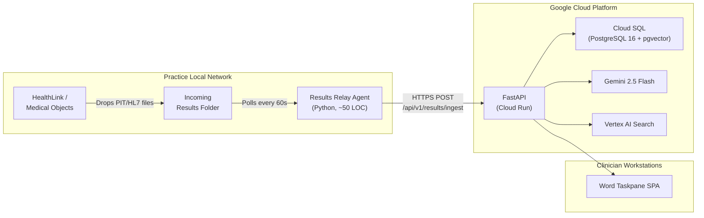
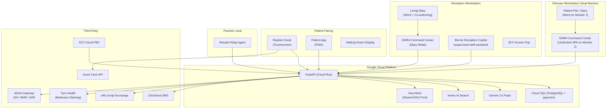
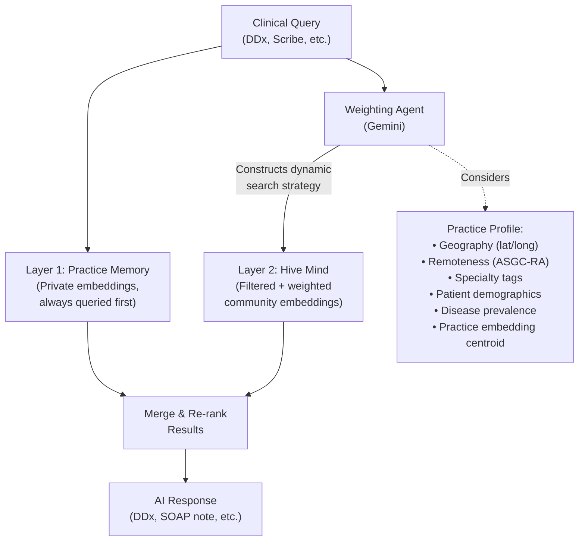
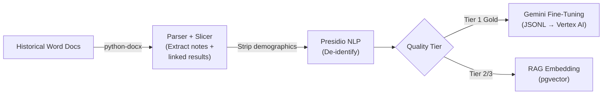
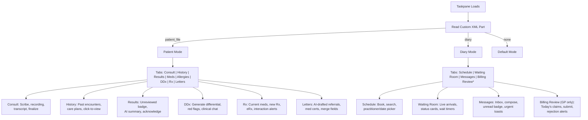

# EMR4 GP-AI Centaur — Master Implementation Plan v3.0
### *The Definitive Blueprint*

---

## 1. Vision

Build a **complete, AI-native, open-source, cloud-hosted, multi-practice General Practice management system** where Microsoft Word serves as the clinician and receptionist frontend, a FastAPI/PostgreSQL backend acts as the central nervous system, and Google Gemini AI is woven throughout every workflow.

The name **"Centaur"** reflects the design philosophy: the GP and AI work as one — the human provides judgment, empathy, and accountability; the AI provides speed, recall, and pattern recognition.

At maturity, the system becomes a **living clinical intelligence network** — every consultation across every participating practice feeds a shared, de-identified "Hive Mind" that makes the AI smarter for all. A new practice in Darwin gets the benefit of ten thousand tropical medicine encounters on day one. A First Nations health service inherits the collective wisdom of every Aboriginal health centre that opted in.

### Product north star — the conversational Diary twin

For receptionist scheduling, the controlling product direction is
[`docs/bernie-conversational-diary-north-star.md`](docs/bernie-conversational-diary-north-star.md).
The aim is to make routine Diary work possible without scanning a grid or
entering a form. *bernie* becomes the conversational interface to the living
Diary while FastAPI/PostgreSQL remains authoritative for identity,
availability, conflicts, confirmation, writes, audit, and receipts. The visual
Diary remains an optional spatial overview, verification, exception-handling,
and fallback surface.

The controlling interaction design is
[`docs/bernie-intent-projected-event-aware-diary-design.md`](docs/bernie-intent-projected-event-aware-diary-design.md).
The fixed grid becomes an intent-projected meta-grid that can refigure around a
patient, practitioner, date, time, location, availability question, or committed
change. From the outset, Bernie also reserves a carefully filtered nervous
system connected only to committed typed Diary events. Events trigger a fresh
authorised read and may update a projection or offer a proposal; they never
grant write authority or bypass staff confirmation.

All named EMR4 intelligences follow the model-required, deterministic-authority
Bureau architecture in
[`docs/emr4-model-required-deterministic-authority-bureau-architecture.md`](docs/emr4-model-required-deterministic-authority-bureau-architecture.md).
An approved provider model is mandatory for natural-language interpretation,
dialogue and candidate formation. Typed context, deterministic proofreading,
backend authorization, human gates, commands and post-action verification
remain independently mandatory. Provider-free tests prove components but do
not, by themselves, prove an intelligent product path end to end.

The first paired Rayleen A3 / Davida B3 occupied authored-synthetic rehearsal
now passes through the exact Sydney Vertex `gemini-2.5-flash` development lane.
Both lanes used explicit positive bounded reasoning, deterministic proofreading
and advisory-only release; this establishes neither product data access nor a
read, command, write, actuator, production or clinical authority.

Rayleen A4, paired A5.1/B4.1 and C4 now pass their bounded product-read,
command-boundary and provider-free actuator-simulator descendants. C5 also
passes one source-bound authored-synthetic live-development-recovery loop: one
Sydney Vertex `gemini-2.5-flash` diagnosis was deterministically admitted,
generation 2 passed fresh process-plus-HTTP readback, the ledger closed after
one call and cleanup proved zero reusable runtime capability. This does not
open a product service, database, patient-data path, general repair agent,
production, deployment or release action. The first provider-free Practice
Context Fabric and Bureau Memory Bank contract passes at exact independently
reviewed source HEAD `cb1b0a712f8ee5340e73d8adde19103af0d9ed97`.
The provider-free Current operational weave passes at exact independently
reviewed source HEAD `d8bc059212e65a6ed2d7ac8d57734096d14b9139`:
four existing authorised Diary, waiting-room, directory and private-session
read shapes compose into one typed, expiring and same-packet-proofread bundle
without a new product route or data source. Its provider-free patient-free
temporal descendant now also passes at exact independently reviewed source HEAD
`f32004a2f39ac769ba746afe2663813f7c422d8a`: relevant sealed event metadata
retires an immutable frame set and emits an inert reassembly requirement,
continuity gaps fail closed, and bitemporal snapshots remain historical context
rather than current truth. The provider-free patient-free unmounted intent-
shaped temporal retrieval rehearsal now also passes at exact independently
reviewed source HEAD `b24b56bda296f3713b5e2c0e52545c749e71540a`: five closed
intents select only minimum granted Current, recent-work and bitemporal
Historical components, private session remains same-Bureau, bilateral Memory
sharing is explicit, ambiguous opaque references are not resolved as identity,
invalidated Current state fails closed, and every upstream plus same-packet
proofreader is recomputed. The authored-synthetic model-required intent-shaping
rehearsal now also passes at exact independently reviewed source HEAD
`44f341481b55f99a18a47838da0f2b7e43a2f73e`: one Sydney Vertex
`gemini-2.5-flash` primary proposed the exact closed comparison intent, and
trusted code rebuilt and admitted the unchanged parent retrieval packet. The
controlling plan is
[`docs/raisa-authored-synthetic-model-required-practice-context-fabric-intent-shaping-rehearsal-plan.md`](docs/raisa-authored-synthetic-model-required-practice-context-fabric-intent-shaping-rehearsal-plan.md).
The first provider-free unmounted one-source adapter is accepted at exact
independently reviewed source HEAD
`12fbab157551954018e781810e4b100f05698dfb` around Rayleen A4's existing authorised
`emr4.waiting_room_context_frame.v1` shape. It consumes only a completed
authored-synthetic frame, validates and minimizes it, applies backend-issued
request-scoped aliases and emits one Current source envelope; it cannot invoke
or refresh the source, watch changes, mount a route, call a provider or execute
against real product data. Two useful vetoes exposed first a misnamed
evidence-only result schema and then fully resealed provenance detachment. The
accepted repair separates recursively closed result/evidence schemas,
recomputes the complete expected result from authoritative inputs at one
deep-copy handoff, and supports every independent waiting-field grant subset
before parent projection. The controlling plan is
[`docs/raisa-provider-free-unmounted-rayleen-waiting-room-context-fabric-source-adapter-plan.md`](docs/raisa-provider-free-unmounted-rayleen-waiting-room-context-fabric-source-adapter-plan.md).

The provider-free unmounted Rayleen invalidation/reassembly seam passes at exact
independently reviewed source HEAD
`72b5f46146393c644ee8fbfa1bb9ee0869d8d994`. Its provider-free fresh-generation
descendant now also passes at exact independently reviewed repaired source HEAD
`9516b85542a4de1fcef305423ec15fd34f7731aa`. It reconstructs the inert
obligations, seals and enforces their validity windows, derives one distinct
no-wider request/grant, refreshes every affected Diary and waiting dependency
from independently authored synthetic completed-read-shaped inputs, reruns the
accepted adapter/Current proofreader, admits one distinct new frame set with a
new manifest/lease and rejects an older result in both completion orders. It
performs no product read and mounts no observer, watcher, feed or persistence.
The architecture-only provider-free default-off live-source observation
boundary is accepted at exact independently reviewed repaired source HEAD
`fdbda21b28371778f5e50b0bc2cbd870bbf40e42`. Its provider-free unmounted
authored-synthetic observation-to-temporal-signal descendant is accepted at
exact independently reviewed source HEAD
`c0502c398df4a56c9558bc68eddedb2adf20d12d`. It proves exact scope-bound keyed
identity, closed prior continuity, backend-owned impact and alias mapping, the
full admitted raw-id/prior/two-sided-clock domain and proofreader-only public
signal egress. Its provider-free unmounted source-specific durability
architecture is now accepted at exact independently reviewed repaired source
HEAD `14e8d3257b9531601260bef094c73e08a9c7b92d`: distinct observer/coordinator
principals, rollback-safe transaction positions, atomic durability state,
durable invalidation watermarks, source-head fences and fail-closed lifecycle
contracts are exact. Its pure provider-free unmounted state-machine rehearsal
is accepted at exact independently reviewed source HEAD
`95a2ed5e960c58686262b5e82ce2e89354a3860a`: 33 cases prove atomic transitions,
restart anchoring, future-fenced rotation and complete-census retention after
three preserved rejections and a fresh 29-attack/207-check veto. None of these
acceptances gives the observer truth, returned-data, read, provider,
persistence or command authority. No migration, database/source or runtime is
opened. The first frozen migration-and-transaction plan
at `bea7d7193503c9176acea24395d3b7727f617454` was correctly rejected before
implementation because proofread admission was unauthenticated, redelivery
depended on independently purgeable source, evolving checkpoints lacked
representable independent anchors, lifecycle append was omitted from atomic
effects and key-schedule scope was ambiguous. The recovered plan adds an exact
receiver-owned immutable admission, source-independent redelivery, append-only
lifecycle-owned anchor fencing, atomic lifecycle append and generation-local
key rotation. The migration/transaction architecture and its exact function-
and-trigger-body descendant pass fresh exact-head acceptance. Their recovered
inert DDL lowering also passes at exact independently reviewed source HEAD
`46e16622471a192353cb82a33acf301dc2cfb7aa`: one byte-stable PostgreSQL-16
artifact statically closes the exact catalogue, trigger, owner and privilege
inventory without execution. The disposable local PostgreSQL-16 parse-and-
catalogue rehearsal passes, and the subsequent provider-free database-backed
behavior/transaction sequence is now closed successfully. Its frozen twenty
authored-synthetic scenarios cover selected entry-point, trigger, RLS,
idempotency and rollback behavior in one serial, networkless, mountless,
portless and tmpfs-backed disposable container. Attempts 001-047 remain
immutable fail-closed evidence of the bounded source, renderer, PostgreSQL-
representability, evidence, harness and fixture defects found and repaired
without weakening the scenario contract. Attempt 048 then passed all twenty
scenarios in exact order at independently reviewed evidence source
`f3383dc4099b4ee590014bea62dddb146f5d2a16`: six entry-point, four idempotency,
three RLS/privilege, four trigger and three rollback. It binds the 424-statement
inert artifact SHA-256
`dc475f71005a2b5a37de829e7f5e21be425dc970091e5b5567099cf2449142d7` and
immutable evidence SHA-256
`26c6dec802e46dec055c1c42aecc97df9942180014fc9fa410f96e1305798200`.
Cross-transaction replay is stable without volatile timestamp identity, and
the outer-rollback scenario proves fixed `P0001` plus complete coordinator
rollback readback. Exact container cleanup and absence passed. Fresh Gemini
3.6 Flash/high review passed 498/498 focused checks with no P0-P2 finding.
This proves the selected serial behavior slice only; concurrency, crash
restart, unknown-commit recovery, key rotation, retention execution, purge,
performance and operational availability remain unproved. Applied migration,
application behavior, operational database/source access and runtime remain
closed. CF-D1 subsequently proved the bounded two-session concurrency slice,
but CF-D2 restart/unknown-commit and its recovery descendant stopped before any
crash. The accepted workflow-incident diagnosis now separates hard safety
controls from adaptive flow and requires distinct observations for every viable
cause before another correction or retry. It does not prove CF-D2; key rotation
and retention/purge remain blocked and the next independent programme direction
requires Yuri's choice.

Yuri subsequently selected the independent source-owned-truth reorientation.
The first Context Fabric runtime is to depend on authoritative source services
and atomic conditional commands for correctness, while committed events remain
best-effort acceleration hints that request fresh authorised reads. A missed
cue may delay the interface but cannot validate a stale mutation. Appointment
freshness/precondition evidence, human or policy confirmation, idempotency and
audit remain separate; update/status/delete lock and recheck existing state,
while create must serialize the relevant schedule-conflict domain and retain a
final database invariant check. The four legacy compatibility writes are to
converge on the same backend kernel before deprecation, without treating an
implicit freshness check as human confirmation. Durable Event and Cue Delivery
remains a named later extension with one logical consumer per database event
partition, optional externally fenced active/standby replicas, retained CF-D1
evidence and any CF-D2 return gated by a fresh observability-first plan.

The provider-free legacy-route sequence now also passes through its source-
bound default-off runtime-instrumentation architecture and globally-disabled
typed application scaffold. Four exact raw appointment routes call a disabled-
first stage only after helper success and pass only one closed adapter constant;
the outer ASGI middleware delegates directly without a cell or send wrapper.
The only constructible generation is globally disabled with empty practice and
route allowlists and no digest key, context provider, observer or sink. Exact
authored-synthetic create/update/status/delete response, mutation, audit and
failure parity passes with zero context, projection, digest, cell or offer work
on the disabled path. The ordinary/fallback native Diary client descendant now
also passes. Its exact inventory binds seven raw appointment mutation call
sites and zero remain; create, update, drag/resize, status, waiting-area and
delete gestures use the existing proposal plus signed-confirm families with
client idempotency headers. Fresh blocks override prior warning review,
warning-code drift requires renewed review and missing confirmation evidence
has no raw fallback. Create/update follow-up status remains an explicit second
committed command and reports a partial outcome if that status step fails. All
four backend compatibility routes remain mounted and unchanged. The subsequent
provider-free compatibility-consumer and kernel-convergence admission review
also passes. It finds zero committed product/runtime/import/recovery/migration/
operational raw HTTP consumers, 126 conformance calls in 21 files, four direct
database fixtures and an unknown external-consumer population. It freezes
current response, audit, idempotency-gap and helper commit behavior and selects
status confirm-first without changing raw status. The subsequent test-only
temporal/idempotency readiness repair also passes: the same 311-test collection
moves from 266 pass / 45 classified harness failures to 311/311 through exactly
eight test files, with the application tree and status-code assertions
unchanged. The provider-free unmounted status transaction-kernel protocol now
passes at exact source `bd381de83bc0b5d4b6b43b4bbb4e1e70a68d7f62`, and
its pure status-confirm adapter descendant passes at exact source
`30a49015d23bfcf069be0af838df7091032a40be`. Fifteen adapter cases admit only
`update_appointment_status`; waiting-area input, missing authority/session,
invalid evidence, stale state, warning drift and terminal re-transition stop
without a request. Eight outcome mappings and thirty-seven hostile mutations
bind current-authority/freshness/evidence parity and canonical stored-receipt
delivery without another request after response loss. The exact-file,
provider-free read-only runtime-gap review now also passes at source
`426ccbbd26a2ab0bfb70c65d7adce113f0239f3a`, with the existing route
deliberately `not_admitted` unchanged. Seven blockers cover lock order,
in-transaction current authority/session, status-only discrimination, terminal
policy, exact warnings, durable audit/receipt correlation and authority-first
replay disclosure; session/source-version evidence and canonical initial/replay
receipt delivery are partial gaps. The unmounted convergence architecture over
this finite set now passes at exact source
`b9cc57b6e607e5896e822abc7b632442df2f907e`: nine closed decisions, twenty
scenarios and fifty-six hostile mutations bind status-only ingress,
server-owned session/current authority, ordered locks, a semantic monotonic
state version, exact warnings, terminal deferral, atomic audit/receipt
correlation and stored initial/replay delivery. The next bounded gate is a pure
provider-free unmounted in-memory rehearsal of that architecture. That
rehearsal now passes at exact source
`a1629f2441e2bdb350d00c6d6016e94123ff0d8d`: all twenty-four schedules
reproduce their frozen outcomes and counts, three staged failure points roll
back atomically, same/different-digest races produce one effect, revoked or
removed callers receive no stored-result disclosure, response loss preserves
one correlated write set plus exact retry, and all eighty-eight hostile
mutations fail closed. The next bounded gate is a provider-free read-only
physical representability review of the exact state-version, private receipt
and ordered-lock surfaces. That exact-file review now passes at source
`530a1d479a48242df6985886acdbb796550e9093`: all three domains are
`representable_with_additive_change`, but none is already represented end to
end. It confirms no admissible appointment state version, thirteen existing
receipt primitives plus four additive gaps, and one idempotency-row lock that
does not implement the accepted practice/appointment/idempotency order. The
provider-free unmounted physical-design architecture now also passes at exact
source `826aad11c29007b13eaa377e3f7ea494cc82ce70`. It selects a PostgreSQL-owned
positive `BIGINT` appointment revision, seven-phase cutover baseline, five-field
versioned private receipt, opaque 32-byte session HMAC, exact stored canonical
response bytes and one bounded `READ COMMITTED`
practice/appointment/idempotency transaction. Legacy receipts remain
non-replayable under the new contract and the public response is unchanged.
The provider-free unmounted physical schema-and-transaction scaffold now also
passes at exact source `b36b8a455b70d8bc3e99b5e5dd84a8237375ff3c` with
runtime authority false. Its additive mapping, inert seven-phase migration,
exact-byte/session-HMAC helpers and authority-first ordered transaction seam
are not imported by any route. The subsequent provider-free disposable
PostgreSQL 16 parse/catalogue rehearsal passes at exact source
`bccc64f87eb0c1ae755b642fb6c4eb082298051d`: the exact target head, six
columns, three constraints, trigger function, enabled trigger and version-one
cutover match, all nine rolled-back authored-synthetic invariant probes pass,
and captured-ID cleanup is verified. The disposable provider-free
status-confirm behavior/transaction rehearsal now also passes at exact source
`aed1bb076835e8cb6302f614869a285dba79983b`: all sixteen serial scenarios
prove the frozen current-authority and statement-lock order, one atomic
appointment/audit/v1-receipt effect, byte-stable stored replay, conflict and
integrity classification, revocation precedence and four complete rollback
boundaries. The fixed local relay stops and exact captured-ID container/network
cleanup is verified. The subsequent provider-free read-only route-mounting
admission review passes at exact source
`fb3772dea0c27a7572df00e1b9d5153f9165ccf3`: the status-confirm endpoint is
literally mounted and the physical foundation remains accepted, but seven
bounded composition gaps block the unchanged legacy handler from entering the
physical seam. One stale Sprint-138 test expectation is isolated for test-only
lifecycle repair. That repair now passes at exact source
`ec9aa1b1d2813b3e864b37f331ac6b587816610a`: update/delete confirmation tests
match their accepted idempotency headers and all 125 current status-confirm
lineage checks pass without application change. The subsequent unmounted
composition, route-readiness, product-adapter and disposable PostgreSQL
integration descendants now pass at their accepted source heads. The final
provider-free HTTP convergence passes at exact source
`b414eb256853c301099d9cf7797a69cd3ec077c5`: canonical
`POST /api/v1/appointments/proposals/status/confirm` and the hidden historical
alias share one product-adapter handler; proposals carry an opaque
database-generation binding; current authority and source truth are rechecked
in a fresh command session; mutation, audit and v1 receipt commit atomically;
and initial delivery plus replay return exact stored bytes. Waiting-area-only
input is blocked without a local fallback. All twelve disposable scenarios,
112 hostile mutations, 217 focused/current-lineage tests and the 193-test
canonical fast profile pass with exact cleanup.

The next product-direction gate is bounded visible native Diary status-confirm
wiring against this exact backend contract. CF-D2 is preserved but is not a
prerequisite: the command path already derives correctness from current
database truth, while the visible interaction boundary should define the
quiet cues and reconciliation signals for a later observability-first durable
event/cue delivery extension. Product data, providers, other command families,
restart/unknown-commit claims, deployment, production and release remain
separately closed.

The bounded read-only architectural-health and conformance pulse now passes at
reviewed source `95ce6b75723d57e672858619c3621d4a273c1f34`. It confirms the
mounted GraphQL read/REST command/event fresh-read/default-off boundaries and
finds no P0 or current patient/clinical authority breach. It also exposes one
remaining P1 protected-CI/Python-target coverage defect, a stale API Spine
lifecycle test, an appointment-router change hotspot and a legacy fallback
posture that must not enter a model-required Bureau. The exact result and
five-state map are
[`docs/raisa-codebase-architectural-health-conformance-review.md`](docs/raisa-codebase-architectural-health-conformance-review.md)
and
[`docs/raisa-codebase-as-built-architectural-state-map.md`](docs/raisa-codebase-as-built-architectural-state-map.md).
The bounded provider-free conformance repair named in that review now also
passes. It adds an explicit maintained Python 3.11 source-state, protected-CI
compile/lint/static-test enforcement, current API Spine lifecycle supersession
and live baton consistency without changing product behavior. AES-C0
architecture, AES-C1 provider-free admission, AES-C2 inert broker simulation,
AES-C3 provider-free hostile containment, AES-C4 bounded occupied authored-
synthetic provider proof and AES-C5 product-runtime admission now pass. AES-C5
used one authenticated practice-scoped application route over a disposable
authored-synthetic PostgreSQL schema, then one separately immutable no-retry
Sydney Vertex Bernie generation. Both ledgers are consumed and cleanup is
complete. The finite AES-C0 through AES-C5 sequence is complete; no AES-C6 is
planned or authorised.

Before any later Context Fabric descendant supplies real product-derived
context to an occupied Bureau, or gives a model an executable tool, filesystem,
database, network, credential, provider-executed tool or command-adjacent
capability, Raisa must pass the **Agent Execution Surface and Containment Gate**
in
[`docs/raisa-agent-execution-surface-containment-gate-plan.md`](docs/raisa-agent-execution-surface-containment-gate-plan.md).
It selects an external capability broker plus immutable per-generation
manifests, no ambient credentials or metadata access, exact egress, cumulative
action budgets, generation revocation, inert Context Fabric data and an
externally owned kill switch. Reasoning, information, egress and action budgets
remain independent. The gate is deliberately placed after the current
provider-free durability work and before real-product-read or executable Bureau
runtime. The prerequisite serial database-only rehearsal and intervening
read-only architectural-health pulse, bounded CI/lifecycle conformance repair
and AES-C0 architecture contract now pass. AES-C0 freezes six closed messages,
the exact leaseable capability vocabulary, independent cumulative budgets,
no-fallback state, external revocation and the read/event/command route
separation. AES-C1 now proves their exact admission intersection, current-
authority check, default denial, budget and revocation behavior over unmounted
authored-synthetic objects. AES-C2 proves broker-owned operation identity,
synthetic custody, dispatch-time control-state recheck and exact budget commit
around one pure inert function with zero external effect. AES-C3 now proves
structural rejection, opaque digest-only handling, carrier-independent egress
accounting, cumulative terminal latching and stale-authority binding for pure
authored-synthetic objects. AES-C4 now proves one exact provider/data/cost
envelope through one consumed Sydney Vertex call after provider-free, fresh
exact-head veto and read-only preflight gates. Its four-field release carries
no command authority. AES-C5 now proves the next exact boundary: one
authenticated, practice-scoped, authored-synthetic practitioner-directory
route/PostgreSQL read minimized into one fresh ContextFrameSet, followed by one
separately immutable provider generation and deterministic no-command release.
None of these results can be mistaken for real-person product data,
filesystem, provider-tool, reusable-runtime or command authority.

The longer clinical/practice Bureau programme must not collapse into one
Clinician agent. Alongside Consultant's diagnosis and patient-safety work,
future independently governed capability Bureaus are required at minimum for
requests/correspondence/referrals, prescribing/medicines/medication safety, and
billing/claims/financial administration. Their Context Fabric frames and typed
handoffs may legitimately interweave with Diary, waiting-room and other
Reception One work.

`RECEPTION ONE™` and the candidate `Clinician One` are therefore branded
workspace/projection families rather than strict user or authority boundaries.
Atomic backend capability grants—role, practice, location, purpose,
patient/encounter relationship where applicable, consent and explicit action
scope—determine which Bureaus and commands each user can access. A branded
surface never grants authority, and each Bureau keeps its own deterministic
proofreader, command gate, audit, idempotency and post-action verification.
This direction grants no implementation, patient/product-data, clinical,
prescribing, referral, billing, provider, runtime, command, deployment or
production authority.

Raisa's accepted longer-range integration direction is the backend-owned
**Practice Context Fabric** described in
[`docs/raisa-practice-context-fabric-direction.md`](docs/raisa-practice-context-fabric-direction.md).
It will knit the Bureaus together by assembling query-shaped, permissioned,
typed and expiring context frames from authoritative current, event, temporal,
session and later clinical/evidence sources. It is not provider-model memory or
a broad practice-data dump. The direction, first unmounted provider-free
contract, Current operational weave, patient-free temporal weave, provider-
free intent-shaped retrieval rehearsal, occupied authored-synthetic model-
required intent-shaping envelope, one-source adapter, invalidation/reassembly,
fresh-generation lifecycle and serial database durability evidence are
accepted. They remain unmounted and unapplied. No product/patient data, further
provider call, real historical-state retention, runtime route, command,
deployment or production authority follows from this blueprint entry.

### 1.1 Business & Licensing Model

| Aspect | Decision |
|:---|:---|
| **Source Code** | Open-source on GitHub |
| **License** | **AGPL-3.0** (recommended) — anyone can self-host, modify, and contribute; but if they offer it as a hosted service, they must open-source their modifications. This protects the managed SaaS offering while keeping the core genuinely free. |
| **Revenue** | Managed cloud SaaS for practices that want a turnkey solution (hosting, backups, updates, support, Hive Mind access) |
| **Hive Mind** | Network-effect moat — the more practices on the managed platform, the smarter the shared AI becomes. Self-hosted instances can participate too if they opt in. |
| **IP** | No IP hoarding — the value is in the network, not the code |

> [!NOTE]
> Alternative license options: **Apache 2.0** (maximally permissive — anyone can fork and compete) or **BSL (Business Source License)** (prevents competing SaaS for a time window, then converts to open-source). AGPL-3.0 strikes the best balance for this project.

---

## 2. Architecture Pivots

Six pivots from [gemini-code-1781257559871.md](file:///c:/Users/YuriFrusin/Documents/EMR4/gemini-code-1781257559871.md) that supersede earlier assumptions:

### 2.1 The "Command Center" (Dual-Monitor SPA)
Abandon the narrow 300px sidebar. The GP undocks the Word taskpane and maximises it on their second monitor. The frontend is a **fully responsive SPA** using CSS Grid/Flexbox that transforms from a column into a multi-panel dashboard when expanded.

### 2.2 Minimalist Word Ribbon
A single custom tab with one button: **"Toggle EMR4 Copilot"**. All complex workflows live inside the web-based SPA taskpane.

### 2.3 SPA Tabbed Interface
Persistent navigation bar (e.g., `[ Consult ] [ History ] [ Results ] [ Meds ] [ DDx ] [ Rx ]`). Tab switching is instant DOM-swap via JS — no dialogs, no popups.

**Current interpretation:** keep the tabbed taskpane and continue observing how usable
each tab remains inside Word's constrained taskpane sizes. Do not prematurely move
every workflow out of it. The taskpane should remain the quick patient
summary/navigation surface, with lightweight job controls and tabbed reference panels.
The separate Command Centre window should grow in stages into the larger work surface
for workflows that need space, microphone access, review panes, or sustained focus
such as Scribe, clinical coding, results review, billing review, and later clinical
operations. Add Command Centre tabs only when a workflow has proven it needs that
larger surface.

### 2.4 Document-Aware Routing
The taskpane reads a hidden `<emr4:document-type>` Custom XML Part from the active Word document:
- **Patient File → "Patient Mode"**: Consult, Scribe, DDx, Meds, Demographics, Results
- **Diary → "Diary/Admin Mode"**: Schedule, Waiting Room, Messages, Billing Review

> [!NOTE]
> Daily Billing Review is practice-wide and lives exclusively in Diary Mode, separate from individual patient workflows.

### 2.5 RBAC & Dynamic UI
The taskpane reads a JWT on login. Receptionist role → sensitive tabs (Billing Review) are omitted from the DOM entirely. Backend enforces `@require_role` route guards. GPs only see their own billing data (scoped by `practitioner_id` from JWT).

### 2.6 The "Living Diary" (Parse & Lock)
The daily `Diary_[Date].docx` is hosted on **SharePoint/OneDrive** with native co-authoring:
- **Parse & Lock** (`Ctrl+Shift+B`): Receptionist types `»09:00 Jane Doe` → add-in parses the chevron-prefixed line, registers the appointment in the database, converts it to a hyperlinked block **[09:00 - Jane Doe]**, and wraps it in a Content Control with `cannotEdit = true`, `cannotDelete = true`.
- **Unlock & Amend** (`Ctrl+Shift+U`): Removes locks for amendment or deletion.
- **Free-Text Spaces**: Lock only applies to the appointment paragraph. Blank lines between appointments remain unprotected for notes and messages.

**Superseded implementation note:** the diary is now a native HTML/JS grid backed by
Postgres, not a Word diary. The Word diary concept remains useful historical context
for why the product needs fast receptionist text entry, confirmation affordances, and
co-authoring-like visibility, but new diary work should target the native grid.

### 2.7 Bernie Receptionist Copilot
Bernie is the internal receptionist copilot: a supervised staff assistant embedded
in the diary/waiting-room surface. Bernie should help reception staff find suitable
appointment times, interpret scheduling constraints, draft admin messages, and prepare
safe actions for human confirmation.

Bernie's intelligent interaction is provider-model-required. The provider model
translates natural language and manages clarification; it never supplies live
availability, authorization, confirmation or write truth. When the accepted
provider path is unavailable, Bernie reports the intelligent capability as
unavailable while ordinary deterministic/manual Diary controls continue.

The longer-term interaction goal is not to polish the grid into the primary
interface indefinitely. It is to let reception staff ask and complete supported
Diary work conversationally, with the grid available when spatial review is
useful. The north-star document and the Stage 3 workflow decision govern that
progression. Yuri authorized and completed a typed, local, provider-disabled,
Yuri-only formative Stage 3A under
[`docs/bernie-stage3a-yuri-formative-validation-plan.md`](docs/bernie-stage3a-yuri-formative-validation-plan.md).
The provider-neutral in-house fluid meta-grid concept tranche then passed on
2026-07-20 with its canonical interaction grammar in
[`docs/bernie-fluid-meta-grid-concept-design.md`](docs/bernie-fluid-meta-grid-concept-design.md).
Yuri then authorised the bounded functional native Diary client, which passed
on 2026-07-20 under
[`docs/bernie-functional-meta-grid-client-closeout.md`](docs/bernie-functional-meta-grid-client-closeout.md).
Live-local integration evidence, high-fidelity visual refinement and Stage 3B
representative-staff evidence remain separate later decisions.

Smartphone use reuses the same projection grammar rather than creating a second
product. The bounded functional tranche now supplies narrow one-column,
sequential-comparison, software-keyboard reachability, interruption and privacy
evidence. It does not yet prove representative phone ergonomics or production
readiness.

Bernie is deliberately not the first patient-facing autonomous agent. The first
implementation should be an internal copilot that acts through controlled backend
tools, such as `search_patient`, `find_slots`, `create_booking`,
`link_patient_to_booking`, `arrive_patient`, `take_message`, and
`handoff_to_receptionist`. The UI should show proposed actions and require staff
confirmation for mutations until the safety/audit model is mature.

From 2026-06-23 onward, new workflow mutations should be designed around a
formal command/proposal layer rather than direct UI-only actions: capture the
user intent, validate it into a typed proposal, report warnings/blocks, require
confirmation where the workflow is judgement-heavy, then execute through the
normal backend route/service path with audit. The first concrete slice is the
non-mutating `POST /api/v1/appointments/proposals/create` contract, which
prepares an appointment-create command and reports conflicts, break overlaps,
and provisional-patient warnings without writing to the diary.

Build timing: start Bernie after the Phase 2 diary foundations are stable enough
that appointments, bookable resources, provisional patient identity, linked patient
identity, breaks, and waiting-area semantics are clear. Later patient chat, kiosk
assistance, and phone voice automation should reuse the same tool layer rather than
creating separate bots.

### 2.8 Davida Practice Management Copilot and Agent-First UX

Davida is the proposed EMR4 general practice management copilot. Her first
serious skill should be setup and onboarding, but her identity is broader:
Davida should help practice managers, owners, and implementation leads configure,
operate, audit, and improve the practice-management system over time.

Davida's intelligent interaction is also provider-model-required. Her model
must operate through a dedicated practice-administration intent grammar and
closed typed candidates. Deterministic context desks, proofreaders, dry runs,
authorization and commands remain authoritative; Davida cannot confirm or
apply her own proposals.

For setup, Davida should be built over the same declarative setup-path YAML
files, schemas, helper scripts, dry-run output, and verification steps that
technical operators and external agents can inspect directly.

This reflects an emerging product principle: many computer workflows are not
truly user-friendly for humans because they force people to manipulate brittle
menus, hidden settings, cloud-console pages, and finely grained UI controls.
EMR4 should avoid this reverse-centaur posture. Where appropriate, the human
should command, review, and confirm while the agent handles the intricate
mechanical interaction.

The diary is the same pattern at clinical-operations scale. A visual diary grid
remains essential for transparency, review, and manual override, but the natural
future interaction is receptionist intent plus agent proposal plus staff
confirmation. Bernie should handle the fiddly slot mechanics; the receptionist
should decide whether the proposed booking is correct.

Davida applies the same idea to practice management. Her first operating domain
is setup:

- collect practice, practitioner, staff, location, billing, AI-provider, and
  policy details
- accept CSV imports for practitioners, staff, rooms, and locations
- explain setup steps and likely pitfalls before execution
- open helper documents or relevant GCP console pages when human action is
  unavoidable
- run setup paths in dry-run first
- request explicit confirmation before IAM, billing, API, identity, or PHI
  policy changes
- verify the resulting dev/prod environment and report exact residual gaps

Later Davida domains may include:

- practice/resource configuration and change review
- onboarding staff and assigning Access AI roles
- importing practitioner, location, room, and roster data
- explaining audit trails and operational exceptions
- monitoring setup drift between dev, staging, and production
- preparing safe administrative changes for owner confirmation

Davida should not become a separate source of truth. The source of truth is the
relevant manifest, policy, API contract, and runner/verifier. Davida is the
human/agent interface over that deterministic substrate. External copilots
should also be able to ingest the same manifests and dry-run JSON output, so
practices can bring their own agent or IT workflow without bypassing EMR4's
safety model.

### 2.9 Rayleen Waiting-Room Intelligence

Rayleen is the distinct present-tense operational intelligence for patient
arrivals, waiting states, waiting-area placement, queue flow, practitioner flow
and intent-projected waiting-room views. Bernie remains primarily prospective
scheduling intelligence; Davida remains institutional and practice-
administration intelligence.

Rayleen uses an approved provider model for staff or future patient dialogue,
intent interpretation, ambiguity handling and typed candidate formation. The
shared deterministic Diary domain calculates queue membership, elapsed time,
thresholds, state validity, projection contents and command admission. Rayleen
does not own a parallel arrival database, private action grammar or alternative
write path.

The historical auto-arrival daemon may survive as one deterministic observation
source, but it is not the full Rayleen architecture. Every arrival, status or
waiting-area mutation must use a backend-owned proposal/confirm command with
current identity and practice scope, human confirmation where required,
idempotency, atomic audit/outbox behavior and deterministic readback.

### 2.10 Controlled Recovery and Update Intelligence

EMR4 should add a separate technical control-plane Bureau for application and
database diagnosis, controlled recovery, release assistance and pharmaceutical,
vaccination, reference-data and policy update planning. Its approved provider
model is mandatory for operator dialogue, diagnostic synthesis, candidate
runbook selection and explanation.

The model receives versioned, typed system-anatomy frames and can emit only
closed diagnosis, recovery or update candidates. A deterministic proofreader,
risk/authority policy, human or dual-review gate, narrowly privileged actuator
and deterministic post-action verification remain separate and mandatory. The
model never receives a generic shell, SQL console, cloud-owner credential or
authority to certify its own success.

Preconfigured transaction rollback, liveness, timeout, circuit-breaker and
platform-restart behavior remains deterministic infrastructure rather than
model-optional intelligence. The staged plan is
[`docs/emr4-rayleen-davida-controlled-recovery-development-plan.md`](docs/emr4-rayleen-davida-controlled-recovery-development-plan.md).

### 2.11 Raisa Practice Context Fabric

The shared "brain" of Raisa should not be an omniscient model session. It should
be a backend-owned temporal Context Fabric that gives each Bureau the smallest
authorised working context for the current purpose. A model-required intent
stage may propose a closed `ContextNeed`; deterministic policy intersects it
with the current user, role, practice, location, purpose and data authority; a
backend assembler then returns an immutable `ContextFrameSet` with provenance,
freshness, redaction, source revisions, expiry and `command_authority: false`.

The fabric can eventually weave together current Diary and waiting-room truth,
selected historical operational states, committed events, recent collective
practice work, per-user session state, practice-administration context,
Consultant's durable Diagnostic Thread and licensed evidence-source packets.
These threads remain distinct. Events trigger fresh reads rather than becoming
truth; session state is not a database; Diagnostic Thread remains the durable
clinical domain object; Cochrane remains a cited licensed evidence source; and
no Bureau inherits another Bureau's private narrative or authority.

Each Bureau may also receive a narrowly selected **Bureau Memory Bank** frame
when the request requires reference to recent work. This is not a second audit
log and never exposes raw audit rows. It is a backend-derived, lossy, minimal,
purpose-filtered, expiring and rebuildable projection over authorised completed
action receipts or audit-derived records. A memory item may say which Bureau
handled a request family, its bounded outcome and provenance, but not reveal raw
prompts, responses, before/after payloads, secrets, unrestricted actor identity
or command material. Memory remains historical context: it cannot assert
current truth, identity, authority or successful present execution.

The requesting model may propose a named temporal horizon such as current turn,
current session, current practice day, previous practice day, recent
operational history, an explicit interval or a durable-thread link. Backend
policy resolves and clips that proposal against purpose, role, practice,
location, source availability, freshness and the maximum authorised lookback.
The effective interval is always an intersection and this first contract sets
no production retention period.

Implementation proceeds from the accepted provider-free authored-synthetic contracts for
`ContextNeedCandidate`, backend `ContextAuthorityBinding`, `ContextNeed`,
`ContextScopeGrant`, `BureauMemorySelector`, `BureauMemoryItem`, `ContextFrame`,
`ContextFrameSet`, selector/weave trace and same-packet proofreader trace, to
the accepted composition of four existing current read shapes and the accepted
patient-free temporal invalidation/bitemporal contract, the accepted provider-
free intent-shaped temporal retrieval rehearsal and the accepted authored-
synthetic model-required intent-shaping descendant, the exact independently
reviewed unmounted provider-free Rayleen A4 waiting-room source adapter and its
provider-free authored-synthetic invalidation/reassembly seam and fresh-
generation rehearsal. The architecture-only provider-free default-off
  live-source observation boundary is accepted at exact independently reviewed
  repaired source HEAD `fdbda21b28371778f5e50b0bc2cbd870bbf40e42`: authenticated integration
  metadata may only be admitted into a backend-constructed payload-free temporal
  signal, while any later source read starts from current application-principal
  authority and a new no-wider grant. Its pure unmounted authored-synthetic
  observation-to-signal rehearsal is accepted at exact independently reviewed
  source HEAD `c0502c398df4a56c9558bc68eddedb2adf20d12d`, including full-domain mapping
  and proofreader-only public egress. The provider-free unmounted source-
  specific durability architecture for `diary.appointment_rescheduled.v1` is
  accepted at exact independently reviewed repaired source HEAD
  `14e8d3257b9531601260bef094c73e08a9c7b92d`, with distinct principals, a
  rollback-safe transaction position, atomic durability state, durable
  invalidation watermarks, source-head fencing and fail-closed restart/gap/
  retention/key/audit contracts. The pure authored-synthetic durability state-
  machine rehearsal is accepted at exact reviewed HEAD
  `95a2ed5e960c58686262b5e82ce2e89354a3860a`, with 33 evidence cases and a fresh
  29-attack/207-check veto. The migration-and-transaction plan remains in
  bounded recovery after two exact-head vetoes. The first five architecture
  defects are repaired; the second recovery adds a bounded receiver-authored
  primary/conflict admission model that remains visible after source purge and
  clarifies that a pending independent anchor fences coordinator consumption
  and decision/rotation transitions without blocking admission append. A third
  exact-head veto accepted those repairs but exposed a data-ceiling contradiction
  around the appointment-id-to-opaque-alias mapping. The active recovery makes
  that mapping the sole owner-private product-identifier exception, denies every
  non-producer principal access. A fourth veto then required database-enforced
  command coupling and stable bijection: the active recovery makes alias creation
  an owner-private subroutine of the single producer projection entry point,
  requires the exact in-progress update-confirm claim, loads the sole event by
  its existing unique practice/command binding, verifies its appointment, audit
  and revision against locked product state, and keeps command plus projection
  on one connection/transaction/logical capability/session identity. It adds
  forward and reverse tenant/source uniqueness and prohibits update, deletion
  and alias reuse for v1. A fifth veto then rejected row equality as proof of
  same-transaction provenance and the phrase-only static tests. The active
  recovery adds ephemeral current-XID/immutable-claim checks, before/deferred
  fail-commit guards, a closed JSON contract/schema, model-constraint parsing
  and adversarial contract mutations. An ineligible diagnostic then exposed
  unresolved xid/xid8/subtransaction rendering, temporal no-event/delete paths
  and an under-specified machine catalogue. The sixth recovery freezes the
  exact PostgreSQL-16 low-XID expression with a no-subtransaction rule, derives
  the event obligation from appointment `OLD`/`NEW` start-duration values,
  covers claim/appointment/audit/event/alias/head/outbox INSERT/UPDATE/DELETE
  guards, and expands the normative contract to exact columns, keys, delete
  actions, roles, RLS, entry points, triggers, admission, lifecycle, anchor,
  key and retention surfaces. A fresh sixth veto confirmed the exact XID and
  API boundaries but rejected the non-temporal trigger gap, pseudo-renderable
  catalogue, incoherent admission-function ownership, hash-short-circuited
  mutation tests, savepoint-detection overclaim and outbox foreign key that
  silently pinned the product event. The seventh recovery now uses a deferred
  row-level all-`UPDATE` appointment trigger; distinguishes the application
  no-savepoint contract from database-detectable subtransaction-authored
  tuples; removes persistent event dependence; gives the non-login admission
  owner exact internal read/insert privileges; and closes types, defaults,
  named constraints, RLS predicates, input/output and trigger signatures plus
  cross-invariant enforcement in a whole-contract-constant v3 schema. Its
  hostile semantic variants are digest-resealed before independent validation.
  A candidate-independent seventh veto then found that the claimed inert
  renderer would still have to invent nine entry-point and thirteen trigger
  bodies, and that the semantic validator did not reject added admission-owner
  reads. The eighth recovery removes that overclaim: the contract is explicitly
  structural/signature-only, forbids rendering unclosed functions, triggers or
  execute grants, makes the admission-owner privilege lists exact, and inserts
  a separate function-and-trigger-body architecture before any DDL rehearsal.
  Only independent acceptance of this corrected scope may admit that body-
  architecture descendant. A recovery-8 veto then found one remaining machine-
  boundary asymmetry: prose omitted trigger declarations and execute grants,
  while the contract named only entry-point and trigger-function omission plus
  non-effective grants. Recovery 9 adds exact positive omission fields for
  trigger declarations and execute grants with independent digest-resealed
  mutations. Exact candidate `c55d25d6c9704ae4612ef2d123158f71302ab411`
  then passed an independent no-P0-P2 veto; Sol reconciled the review worktree
  clean and separately completed the exact 155-test reviewer packet after the
  reviewer's output capture ended before its terminal count. The accepted
  result is structural/signature architecture only. The active safe descendant
  is the provider-free unmounted function-and-trigger-body architecture. Its
  sixth exact candidate at `0bfd3e7545dfa1a7431f856b5eaf2aac32a9292d`
  remains rejected despite a complete 305-test Sol packet: fresh independent
  review found that key rotation locked the current recovery anchor but did not
  field-by-field reverify its four checkpoint fields and seven controlling
  generation digests before using the anchor digest. The fourth exact-veto
  recovery now binds one exact pre-effect `F_ANCHOR` fence while preserving all
  earlier source-independent replay, recovery-anchor, set-uniqueness and
  lock-order repairs. Its replacement contract
  `sha256:f71287f266a3252d2a0736e511287600939a40bc70397710600c12581e24d4f3`
  passes the complete 339-test inherited-plus-R7 deterministic packet. One
  distinct fresh Gemini 3.6 Flash/high exact-HEAD veto passes 44/44 focused
  checks with no P0-P3 finding and unchanged clean postflight at
  `a93d07405ad35d7d6c0603065625c17ec14ab23e`. The body architecture and its
  recovered inert DDL lowering are accepted. The provider-free disposable
  PostgreSQL-16 parse-and-catalogue rehearsal now also passes for the corrected
  row-composite projection artifact at exact independently reviewed evidence
  source HEAD `2f0047cd90a8448ec4e738483a7237fbf2860bcb`: the exact 412-statement,
  1,404,420-byte artifact installs atomically, the fixed failed copy rolls back
  without surviving Fabric objects or roles, all fifteen value-bearing
  catalogue digests match, and exact-ID cleanup proves absence. This proves
  server admission and metadata shape only. The subsequent provider-free
  database-backed authored-synthetic behavior/transaction rehearsal now also
  passes at exact independently reviewed evidence source
  `f3383dc4099b4ee590014bea62dddb146f5d2a16`. Attempt 048 passes all twenty
  frozen scenarios: six entry-point, four idempotency, three RLS/privilege,
  four trigger and three rollback. It proves the selected serial behavior
  slice, including stable cross-transaction replay and full outer-transaction
  rollback readback, with exact disposable-container cleanup. Attempts 001-047
  remain immutable fail-closed evidence. CF-D1 now also passes at runtime
  source `fed81847b4155d49cf997905e79cf31808ceb017`: all six frozen
  authored-synthetic two-session races prove exact `PgSleep`/`Lock` overlap,
  winner/loser outcomes, native replay, outer rollback, zero retry and exact
  cleanup. Attempts 001-003 remain immutable rejected evidence. CF-D2's first
  restart/unknown-commit candidate then stopped twice before any `SIGKILL`.
  Attempt 001 exposed an early successor-admission fixture ordering defect; the
  single plan-permitted mechanical recovery corrected that ordering. Attempt 002
  passed all ten fixed preconditions but stopped before the first restart with
  minimized `scenario/unexpected_terminal_success`; exact cleanup passed and no
  runtime success was released. Yuri then selected a narrow recovery
  descendant with coordinate-specific evidence and a no-crash apply/anchor
  proof. Its first diagnostic exposed a real lifecycle-revision mismatch, but
  the sole plan-authorised correction was insufficient: the reviewed second
  diagnostic failed at the same anchor coordinate. Both diagnostics used zero
  `SIGKILL` or restart and cleaned up exactly. Full attempt 003 is ineligible,
  so crash restart, unknown-commit recovery, key rotation, retention, purge,
  performance and operational availability remain unproved. Yuri's authorised
  independent workflow-incident diagnosis and bounded repository-only fluidity
  repair now pass at exact reviewed source
  `018099dd6c5f0502121360732feb602252eb34cc`. Hard authority, data, effect,
  stop, cleanup, claim and protected-ref controls remain intact; diagnostic
  corrections and retries now require distinct observations for every viable
  cause, and review commands/results are mechanically exact. This repair does
  not reopen CF-D2. No automatic durability tranche remains dependency-
  satisfied, so the next independent programme direction is a Yuri-owned
  choice. Applied migration, application wiring,
  operational database/source access and every real-product or clinical
  descendant remain closed. The bounded architectural-health pulse and its
  provider-free CI/lifecycle repair, AES-C0 architecture contract, AES-C1
  provider-free admission rehearsal, AES-C2 inert broker simulation, AES-C3
  provider-free hostile containment rehearsal, AES-C4 bounded occupied
  authored-synthetic provider proof and AES-C5 product-runtime admission have
  passed. AES-C5's sole authenticated authored-synthetic route read and sole
  separately brokered Sydney Vertex call, deterministic four-field release,
  terminal ledgers and cleanup are complete. No AES-C6 is planned or
  authorised; any further real-data, reusable-runtime, tool/command, deployment
  or production descendant is a new programme choice.
GraphQL/query services remain read-only; mutations
remain backend REST/OpenAPI commands with fresh authorization, human gates
where required, idempotency, audit and deterministic readback. The controlling direction is
[`docs/raisa-practice-context-fabric-direction.md`](docs/raisa-practice-context-fabric-direction.md).

### 2.12 Agent Execution Surface and Containment Gate

The Bureau proofreader controls semantic release, but it cannot contain a
process that can reach software vulnerabilities, ambient credentials or an
over-broad network path. Before a Bureau work cell receives real product data
or any executable capability, an external deterministic authority kernel must
stand between model output and every provider, read, tool or command adapter.

The selected design is a central capability broker governed by one immutable
manifest per work-cell generation. The manifest fixes the exact capability,
destination, method, audience, source/field scope, bytes, calls, denied probes,
expiry and stop conditions. The work cell receives typed context and emits a
typed candidate; it never receives a reusable credential, cloud metadata
route, database connection, arbitrary URL client, executable selector, SQL,
command token or cleanup target.

The gate is implemented in provider-free architecture, admission, broker-
simulator and hostile-rehearsal descendants before any separately authorised
occupied authored-synthetic proof. Hostile cases cover local-file references,
template/deserialisation execution, metadata and credential probing, arbitrary
or encoded egress, cumulative attempts, stale leases and cross-generation
replay. GraphQL remains read-only, events remain signals, and product mutations
remain human-gated REST/OpenAPI commands with current authorization,
idempotency, audit and readback.

This gate does not delay the networkless database-only rehearsal; that
prerequisite already passed before AES-C0 and AES-C1 began.

AES-C0 now passes as the unmounted architecture descendant. Its closed
`GenerationManifest`, `CapabilityLease`, `BudgetState`, `BrokerDecision`,
`RevocationRecord` and `AuditEvidenceEnvelope` bind one generation to exact
broker-resolved capability identity, independent cumulative budgets,
generation-wide external revocation, pinned supply-chain identity and
minimized evidence. All 37 hostile contract mutations fail closed. AES-C1 now
also passes as the unmounted provider-free admission descendant. Its exact 45
scenarios resolve as two inert allows, 25 denials and 18 terminal stops, while
24 hostile attempt mutations and eight hostile contract mutations gain zero
admission. It proves exact manifest/grant/lease/current-authority intersection,
default denial, cumulative budget accounting and revocation precedence without
executing an operation. AES-C2 now also passes: its 26 authored-synthetic
scenarios return two released inert simulations, four non-dispatches and 20
terminal stops; 32 hostile mutations reject, and exactly three pure Python
calls occur with zero external effect. It proves broker-owned destination,
method, implementation and synthetic custody. AES-C3 now also passes: its 61
authored-synthetic scenarios return 21 contained, 15 rejected and 25 terminal
stops; 51 hostile mutations reject, and exactly 28 pure calls produce 21
digest-only releases with zero external effect. It proves tested structural
rejection, opaque digest-only handling, carrier-independent egress accounting,
cumulative terminal latching and stale-authority binding without opening a real
runtime or adapter. AES-C4 now also passes: its exact Google Vertex AI
`gemini-2.5-flash`, Bernie project/keyless-ADC, Sydney region, newly-authored-
synthetic, one-call/no-retry, USD 0.25, no-tool/no-fallback envelope produced
one deterministic four-field no-command release and a consumed ledger with
complete cleanup. It opens no continuing provider or product-runtime authority.
AES-C5 now also passes: one ordinary bearer-authenticated practice-scoped
practitioner-directory request traversed FastAPI, SQLAlchemy and a disposable
authored-synthetic PostgreSQL schema, was minimized into one fresh typed frame,
and supplied one separately immutable Sydney Vertex generation. Exactly one
provider call produced one deterministic digest-bound no-command release; both
ledgers are consumed, database counts are unchanged and the schema is absent.
It opens no real-person data, continuing source/provider access, reusable
runtime, tool or command authority. The finite AES-C0 through AES-C5 sequence
is complete and no AES-C6 is planned or authorised.

The controlling plan is
[`docs/raisa-agent-execution-surface-containment-gate-plan.md`](docs/raisa-agent-execution-surface-containment-gate-plan.md)
and its threat-model delta is
[`docs/security/raisa-agent-execution-surface-containment-gate-threat-model-delta.md`](docs/security/raisa-agent-execution-surface-containment-gate-threat-model-delta.md).
The accepted AES-C0 result is
[`docs/raisa-agent-execution-surface-containment-gate-aes-c0-closeout.md`](docs/raisa-agent-execution-surface-containment-gate-aes-c0-closeout.md).
The accepted AES-C1 result is
[`docs/raisa-agent-execution-surface-containment-gate-aes-c1-provider-free-admission-closeout.md`](docs/raisa-agent-execution-surface-containment-gate-aes-c1-provider-free-admission-closeout.md).
The accepted AES-C2 result is
[`docs/raisa-agent-execution-surface-containment-gate-aes-c2-provider-free-broker-simulator-closeout.md`](docs/raisa-agent-execution-surface-containment-gate-aes-c2-provider-free-broker-simulator-closeout.md).
The accepted AES-C3 result is
[`docs/raisa-agent-execution-surface-containment-gate-aes-c3-provider-free-hostile-containment-closeout.md`](docs/raisa-agent-execution-surface-containment-gate-aes-c3-provider-free-hostile-containment-closeout.md).
The accepted AES-C4 result is
[`docs/raisa-agent-execution-surface-containment-gate-aes-c4-bounded-occupied-provider-proof-closeout.md`](docs/raisa-agent-execution-surface-containment-gate-aes-c4-bounded-occupied-provider-proof-closeout.md).
The accepted AES-C5 result is
[`docs/raisa-agent-execution-surface-containment-gate-aes-c5-product-runtime-admission-closeout.md`](docs/raisa-agent-execution-surface-containment-gate-aes-c5-product-runtime-admission-closeout.md).
This entry grants no continuing provider call, real-person or operational
product context, product/database read, credential flow, provider tool,
command, deployment or production authority. It also grants no reusable
adapter, generic network or executable tool.

---

## 3. Resolved Design Decisions

| Question | Decision |
|:---|:---|
| Multi-practice? | ✅ Yes, multi-tenant from day one |
| Hosting? | ✅ Cloud-first (GCP Cloud Run + Cloud SQL) with lightweight on-premise Results Relay Agent |
| VOIP? | ✅ 3CX Cloud PBX (not Asterisk — native CRM screen pop vs DIY middleware) |
| SMS? | ✅ ClickSend (Australian HQ, Perth; REST API; two-way) |
| Online booking? | ✅ Both standalone site + embeddable iframe |
| Patient app? | ✅ PWA (Progressive Web App) — booking + queue position + notifications |
| Medicare claiming? | ✅ Third-party gateway (Tyro Health / MediClear) — no direct PRODA B2B needed |
| IHI / MHR? | Direct PRODA B2B integration (no third-party option exists) |
| Letter writing? | ✅ Native Word — AI-drafted, merge fields, formatted per Dr Shera's original EMR templates |
| Open source? | ✅ AGPL-3.0 on GitHub |
| RAG pipeline? | ✅ Live dual-layer: Practice Memory (private) + Hive Mind (opt-in, de-identified) |

---

## 4. Cloud-First Hosting with On-Premise Results Relay


```mermaid
graph LR
    subgraph "Practice Local Network"
        HL["HealthLink /<br/>Medical Objects"] -->|"Drops PIT/HL7 files"| FOLDER["Incoming<br/>Results Folder"]
        FOLDER -->|"Polls every 60s"| RELAY["Results Relay Agent<br/>(Python, ~50 LOC)"]
    end

    subgraph "Google Cloud Platform"
        RELAY -->|"HTTPS POST<br/>/api/v1/results/ingest"| API["FastAPI<br/>(Cloud Run)"]
        API --> DB["Cloud SQL<br/>(PostgreSQL 16 + pgvector)"]
        API --> GEM["Gemini 2.5 Flash"]
        API --> VAS["Vertex AI Search"]
    end

    subgraph "Clinician Workstations"
        API --> TP["Word Taskpane SPA"]
    end
```

The Results Relay Agent is a stateless ~50-line Python script installed on the practice's local server. It polls the HealthLink/Medical Objects incoming folder, uploads new PIT/HL7 files to the cloud API, and archives processed files locally.

---

## 5. High-Level Architecture


```mermaid
graph TB
    subgraph "Clinician Workstation (Dual Monitor)"
        WPF["Patient File / Diary<br/>(Word on Monitor 1)"]
        TP["EMR4 Command Center<br/>(Undocked SPA on Monitor 2)"]
    end

    subgraph "Reception Workstation"
        RD["Living Diary<br/>(Word + Co-authoring)"]
        RTP["EMR4 Command Center<br/>(Diary Mode)"]
        BERN["Bernie Reception Copilot<br/>(supervised staff assistant)"]
        VOIP["3CX Screen Pop"]
    end

    subgraph "Patient-Facing"
        RAY["Rayleen Kiosk<br/>(Touchscreen)"]
        PWA["Patient App<br/>(PWA)"]
        WRD["Waiting Room Display"]
    end

    subgraph "Practice Local"
        RELAY["Results Relay Agent"]
    end

    subgraph "Google Cloud Platform"
        API["FastAPI (Cloud Run)"]
        DB["Cloud SQL (PostgreSQL + pgvector)"]
        GEM["Gemini 2.5 Flash"]
        VAS["Vertex AI Search"]
        HIVE["Hive Mind<br/>(Shared RAG Pool)"]
    end

    subgraph "Third-Party"
        FACE["Azure Face API"]
        SMS["ClickSend SMS"]
        ERX["eRx Script Exchange"]
        TYRO["Tyro Health<br/>(Medicare Claiming)"]
        ADHA["ADHA Gateway<br/>(IHI / MHR / AIR)"]
        CX["3CX Cloud PBX"]
    end

    WPF --> TP
    RD --> RTP
    TP & RTP & BERN & RAY & PWA --> API
    RELAY --> API
    CX --> API
    API --> DB & GEM & VAS & HIVE
    RAY --> FACE
    API --> SMS & ERX & TYRO & ADHA
```

---

## 6. Technology Stack

| Layer | Technology | Rationale |
|:---|:---|:---|
| **Frontend (Clinical)** | Word + Office.js → undocked SPA | Dual-monitor Command Center; CSS Grid/Flexbox; tabbed nav |
| **Frontend (Kiosk)** | Vite + vanilla JS | Full-screen touchscreen kiosk |
| **Frontend (Booking + Patient App)** | Vite + vanilla JS → PWA | Installable on home screen; works on both iOS/Android |
| **Frontend (Waiting Room)** | Vite + vanilla JS | Public display screen; auto-refresh |
| **Backend** | FastAPI (Python 3.11) | Async; AI orchestration; already in use |
| **Database** | Cloud SQL (PostgreSQL 16 + pgvector) | Managed; vector search; multi-tenant |
| **Migrations** | Alembic | Version-controlled schema evolution |
| **AI — Clinical** | Gemini 2.5 Flash (Vertex AI) | Multimodal; fast; already integrated |
| **AI — Reception Copilot** | Gemini + controlled backend tools | Bernie; supervised appointment/admin assistant embedded in the diary |
| **AI — Search** | Vertex AI Discovery Engine | MBS rules RAG |
| **AI — De-ID** | Microsoft Presidio | PHI/PII scrubbing for Hive Mind |
| **AI — Face** | Azure Face API | 1:1 verification; liveness detection |
| **VOIP** | 3CX Cloud PBX | Native CRM screen pop; SIP trunking |
| **SMS** | ClickSend (Perth, AU) | REST API; two-way; ACMA compliant |
| **ePrescribing** | eRx Script Exchange | Australian standard; PBS integration |
| **Medicare** | Tyro Health / MediClear | Third-party claiming gateway |
| **ADHA** | Direct PRODA B2B | IHI, MHR, AIR (no third-party option) |
| **Results Relay** | Custom Python (~50 LOC) | Local folder polling → cloud upload |
| **Auth** | FastAPI + JWT | Role-based; practice-scoped |
| **Hosting** | GCP Cloud Run + Cloud SQL + Cloud Storage | Fully managed; `australia-southeast1` |
| **License** | AGPL-3.0 | Open-source; SaaS-protective |

AI-provider portability is handled through a thin EMR4-owned capability boundary,
not a provider-first abstraction. Gemini/Vertex remains the first production
provider, especially for direct audio scribe, but new AI surfaces should depend
on EMR4 clinical/reception contracts and provider adapters. See
`orchestration/ai_provider_boundary.md`.

---

## 7. Database Schema (30+ Tables)

### 7.1 Multi-Tenancy & Identity

| Table | Key Columns | Purpose |
|:---|:---|:---|
| **practices** | `id`, `name`, `abn`, `address_*`, `phone`, `email`, `logo_url`, `timezone`, `hive_mind_opt_in` (bool), `practice_embedding` (Vector(768)), `specialty_tags` (JSONB), `asgc_ra_code`, `latitude`, `longitude`, `proda_device_cert_path`, `proda_cert_expiry`, `created_at` | Top-level tenant; Hive Mind participation flag; geolocation for intelligent weighting |
| **practice_locations** | `id`, `practice_id` (FK), `name`, `address_*`, `phone`, `waiting_rooms` (JSONB), `is_active` | Physical sites |
| **users** | `id`, `practice_id` (FK), `email`, `password_hash`, `role` (enum: GP, Receptionist, Nurse, Admin, PracticeOwner), `practitioner_id` (FK, nullable), `is_active`, `created_at` | Login accounts |
| **practitioners** | `id`, `practice_id` (FK), `first_name`, `last_name`, `provider_number`, `prescriber_number`, `ahpra_number`, `hpi_i`, `specialty`, `default_location_id` (FK), `is_active`, `created_at` | Doctors, nurses, allied health |
| **patients** | `id`, `practice_id` (FK), `first_name`, `last_name`, `date_of_birth`, `medicare_number`, `ihi_number`, `dva_number`, `sex`, `gender_identity`, `indigenous_status`, `preferred_language`, `email`, `phone_mobile`, `phone_home`, `address_*`, `emergency_contact_*`, `concession_type`, `consent_facial_recognition` (bool), `face_embedding_id`, `sms_consent` (bool), `sms_consent_date`, `created_at`, `updated_at` | Full demographics; SMS consent; face consent |

### 7.2 Clinical

| Table | Key Columns | Purpose |
|:---|:---|:---|
| **encounters** | `id`, `practice_id`, `patient_id` (FK), `practitioner_id` (FK), `appointment_id` (FK, nullable), `status` (enum: Draft, InProgress, Finalized, Amended), `template_type` (enum: SOAP, Procedure, MentalHealth, CDM, GPCCMP, HealthAssessment, Antenatal, WoundCare), `raw_document_text`, `document_embedding` (Vector(768)), `is_shared_to_hive` (bool), `consultation_type`, `consultation_date`, `created_at`, `updated_at` | Core clinical record; embedding for RAG |
| **clinical_diagnoses** | `id`, `practice_id`, `patient_id` (FK), `encounter_id` (FK), `term`, `snomed_ct_au_code`, `is_active`, `onset_date`, `resolved_date`, `severity` | Active problem list |
| **prescriptions** | `id`, `practice_id`, `patient_id` (FK), `encounter_id` (FK), `drug_name`, `dosage_text`, `pbs_code`, `repeats`, `quantity`, `route`, `frequency`, `start_date`, `end_date`, `prescribed_by` (FK), `erx_token`, `is_active`, `created_at` | Full Rx metadata; eRx integration ready |
| **allergies** | `id`, `practice_id`, `patient_id` (FK), `substance`, `reaction`, `severity`, `snomed_code`, `recorded_date` | Drug/food/environmental |
| **immunisations** | `id`, `practice_id`, `patient_id` (FK), `vaccine_name`, `dose_number`, `date_given`, `batch_number`, `site`, `route`, `air_notification_sent` | AIR ready |
| **patient_history** | `id`, `practice_id`, `patient_id` (FK), `category` (enum: Medical, Surgical, Family, Social), `description`, `date_recorded` | Structured history |
| **consent_forms** | `id`, `practice_id`, `patient_id` (FK), `encounter_id` (FK, nullable), `form_type`, `signed_at`, `signature_data` (Text), `document_path` | Digital consent capture |
| **clinical_images** | `id`, `practice_id`, `patient_id` (FK), `encounter_id` (FK), `image_url`, `caption`, `body_site`, `captured_at` | Wound photos, skin lesions, etc. |

### 7.3 Care Plans & Structured Programs

| Table | Key Columns | Purpose |
|:---|:---|:---|
| **care_plans** | `id`, `practice_id`, `patient_id` (FK), `encounter_id` (FK), `plan_type` (enum: GPCCMP, MHTP, HealthAssessment45, HealthAssessment75, ATSI_HA, Antenatal), `mbs_item` (e.g., "965", "2715", "701"), `status` (enum: Draft, Active, Review_Due, Completed), `valid_until`, `review_date`, `plan_data` (JSONB), `created_at` | Tracks care plan lifecycle and review dates |

### 7.4 Appointments & Diary

| Table | Key Columns | Purpose |
|:---|:---|:---|
| **appointments** | `id`, `practice_id`, `location_id` (FK), `patient_id` (FK), `practitioner_id` (FK), `start_time`, `duration_minutes`, `appointment_type_id` (FK), `status` (enum: Booked, Confirmed, Arrived, InConsult, Completed, Cancelled, NoShow, DNA), `reason`, `notes`, `booked_by` (FK), `booked_via` (enum: Receptionist, Online, Phone, Kiosk, App), `waiting_room`, `queue_position`, `created_at` | Core appointment record |
| **appointment_types** | `id`, `practice_id`, `name`, `default_duration`, `color_hex`, `is_bookable_online` | Configurable types per practice |
| **practitioner_schedules** | `id`, `practitioner_id`, `location_id`, `day_of_week`, `start_time`, `end_time`, `slot_duration_minutes` | Weekly template |
| **schedule_overrides** | `id`, `practitioner_id`, `date`, `is_unavailable`, `override_start`, `override_end`, `reason` | Leave, half-days |

### 7.5 Results & Referrals

| Table | Key Columns | Purpose |
|:---|:---|:---|
| **test_requests** | `id`, `practice_id`, `patient_id`, `practitioner_id`, `encounter_id`, `request_type` (enum), `request_text`, `urgency`, `status` (enum), `created_at` | Outgoing orders |
| **results** | `id`, `practice_id`, `patient_id`, `test_request_id` (FK, nullable), `result_source` (enum: PIT, HL7, Manual, Scan), `lab_name`, `specimen_date`, `report_date`, `received_at`, `status` (enum: New, Reviewed, ActionRequired, Filed), `reviewed_by` (FK), `reviewed_at`, `raw_message`, `parsed_data` (JSONB), `is_abnormal`, `ai_summary`, `display_pdf_url` | Incoming results with AI summary |
| **result_items** | `id`, `result_id` (FK), `test_name`, `value`, `units`, `reference_range`, `flag` (enum: Normal, Low, High, Critical), `loinc_code` | Individual analytes |
| **referrals** | `id`, `practice_id`, `patient_id`, `practitioner_id`, `encounter_id`, `referral_to`, `specialty`, `reason`, `urgency`, `status` (enum), `letter_document_path`, `created_at` | Outgoing referrals |
| **reminders** | `id`, `practice_id`, `patient_id`, `practitioner_id`, `reminder_type` (enum: ResultFollowUp, Recall, ReviewAppointment, CarePlanReview, Custom), `message`, `due_date`, `is_dismissed`, `triggered_by_result_id` (FK, nullable) | System + manual reminders |
| **scanned_documents** | `id`, `practice_id`, `patient_id`, `document_type` (enum: SpecialistLetter, Report, Correspondence, Other), `file_url`, `scanned_at`, `triaged_to` (FK→practitioners), `triage_status` (enum: Pending, Triaged, Reviewed), `notes` | Document management |

### 7.6 Billing

| Table | Key Columns | Purpose |
|:---|:---|:---|
| **mbs_claims** | `id`, `practice_id`, `patient_id`, `practitioner_id`, `encounter_id`, `item_number`, `description`, `claim_type` (enum: BulkBill, PatientClaim, DVA, WorkCover, TAC, ECLIPSE), `amount`, `gateway_claim_id`, `claim_status` (enum: Draft, Submitted, Accepted, Rejected, Paid), `submitted_at`, `response_data` (JSONB) | Full claiming lifecycle |
| **invoices** | `id`, `practice_id`, `patient_id`, `encounter_id`, `total_amount`, `paid_amount`, `status` (enum), `issued_at` | Private billing / gap payments |
| **mbs_directory** | `item_number` (PK), `description`, `fee` | *(existing)* MBS lookup |
| **snomed_directory** | `concept_id` (PK), `term` | *(existing)* SNOMED lookup |

### 7.7 Messaging & Communications

| Table | Key Columns | Purpose |
|:---|:---|:---|
| **internal_messages** | `id`, `practice_id`, `sender_id` (FK→users), `recipient_id` (FK, nullable), `recipient_role` (nullable), `patient_id` (FK, nullable), `appointment_id` (FK, nullable), `subject`, `body`, `priority` (enum: Normal, Urgent, Critical), `is_read`, `read_at`, `created_at` | Internal staff messaging |
| **sms_log** | `id`, `practice_id`, `patient_id` (FK), `direction` (enum: Outbound, Inbound), `phone_number`, `message_body`, `sms_type` (enum: AppointmentReminder, Confirmation, ResultNotification, Recall, Bulk, Custom), `status` (enum: Queued, Sent, Delivered, Failed, Replied), `clicksend_message_id`, `sent_at` | SMS audit trail |

### 7.8 Kiosk, VOIP & Patient App

| Table | Key Columns | Purpose |
|:---|:---|:---|
| **checkin_events** | `id`, `practice_id`, `patient_id`, `appointment_id`, `checkin_method` (enum: Details, QR, NFC, FacialRecognition), `checkin_time`, `waiting_room_assigned`, `kiosk_id` | Arrival audit log |
| **patient_qr_tokens** | `id`, `patient_id`, `token_hash`, `created_at`, `expires_at` | Rotating QR codes |
| **call_log** | `id`, `practice_id`, `caller_number`, `patient_id` (FK, nullable), `answered_by` (FK), `call_time`, `duration_seconds`, `call_type` (enum), `notes` | Phone audit trail |

### 7.9 RAG Pipeline & Hive Mind

| Table | Key Columns | Purpose |
|:---|:---|:---|
| **community_encounters** | `id`, `source_practice_id` (FK), `deidentified_text`, `encounter_embedding` (Vector(768)), `mbs_item`, `snomed_codes` (JSONB), `gp_tier` (enum: Tier1_Gold, Tier2, Tier3), `practice_specialty_tags` (JSONB), `practice_asgc_ra_code`, `practice_latitude`, `practice_longitude`, `created_at` | De-identified hive mind pool |
| **rag_feedback** | `id`, `practice_id`, `encounter_id`, `query_embedding` (Vector(768)), `retrieved_community_ids` (JSONB), `was_accepted` (bool), `created_at` | Implicit feedback for learned weighting |

### 7.10 ADHA

| Table | Key Columns | Purpose |
|:---|:---|:---|
| **ihi_records** | `id`, `patient_id`, `ihi_number`, `ihi_status`, `verified_at`, `source` (enum: Manual, HI_Service) | Cached IHI lookups |
| **mhr_uploads** | `id`, `patient_id`, `encounter_id`, `document_type` (enum), `upload_status`, `uploaded_at`, `mhr_document_id` | MHR upload log |

---

## 8. The Live RAG Pipeline — Practice Memory + Hive Mind

### 8.1 Layer 1: Practice Memory (Private, Always-On)

Every finalized encounter generates a Gemini embedding → stored in `encounters.document_embedding`, scoped by `practice_id`. The DDx engine and scribe query this private pool for similar historical cases. Over time, the AI absorbs the practice's patient population, disease patterns, and coding style.

### 8.2 Layer 2: Hive Mind (Opt-In, De-Identified)

If `practices.hive_mind_opt_in = true`, finalized encounters pass through:
1. **Presidio NLP** — scrub all PHI/PII (`<PERSON>`, `<LOCATION>`, `<DATE>`)
2. **Gemini embedding** of the de-identified text
3. **Insert** into `community_encounters` with practice metadata (specialty tags, geography, remoteness)

### 8.3 Intelligent Agentic Weighting (Three Tiers)


```mermaid
flowchart TD
    Q["Clinical Query<br/>(DDx, Scribe, etc.)"] --> L1["Layer 1: Practice Memory<br/>(Private embeddings,<br/>always queried first)"]
    Q --> AGENT["Weighting Agent<br/>(Gemini)"]
    AGENT -->|"Constructs dynamic<br/>search strategy"| L2["Layer 2: Hive Mind<br/>(Filtered + weighted<br/>community embeddings)"]
    L1 --> MERGE["Merge & Re-rank<br/>Results"]
    L2 --> MERGE
    MERGE --> RESP["AI Response<br/>(DDx, SOAP note, etc.)"]

    AGENT -.->|"Considers"| META["Practice Profile:<br/>• Geography (lat/long)<br/>• Remoteness (ASGC-RA)<br/>• Specialty tags<br/>• Patient demographics<br/>• Disease prevalence<br/>• Practice embedding centroid"]
```

**Tier 1 — Heuristic (Early, <20 practices):** Simple metadata-filtered vector search. Geographic proximity decay + specialty tag matching + remoteness code alignment.

**Tier 2 — Learned (Growth, 20-100 practices):** A lightweight model trained on `rag_feedback` data — which hive mind results were accepted vs rejected by GPs. Learns patterns like *"For mental health, specialty matters more than geography"*.

**Tier 3 — Agentic (Maturity, 100+ practices):** A Gemini agent dynamically constructs the search strategy per query:

> *"This is a 45-year-old Aboriginal woman in Darwin with polyuria. I should weight towards: First Nations health practices (any geography) + Top End practices (any specialty) + endocrinology-focused practices. But for the drug interaction check, weight all practices equally."*

### 8.4 The Practice Embedding Centroid

Each practice accumulates an implicit profile — the centroid (mean) of all its encounter embeddings. This 768-dimensional vector captures *what this practice is like* in a way no metadata tag could express. Two practices serving similar populations will have similar centroids automatically, enabling similarity-based weighting without manual configuration.

---

## 9. Centaur Brain — Historical Data Pipeline

A batch pipeline for ingesting the legacy trove of historical Word documents (volume TBD — potentially decades of clinical notes from a medical centre).

### Pipeline


```mermaid
flowchart LR
    A["Historical Word Docs"] -->|"python-docx"| B["Parser + Slicer<br/>(Extract notes +<br/>linked results)"]
    B -->|"Strip demographics"| C["Presidio NLP<br/>(De-identify)"]
    C --> D{"Quality Tier"}
    D -->|"Tier 1 Gold"| E["Gemini Fine-Tuning<br/>(JSONL → Vertex AI)"]
    D -->|"Tier 2/3"| F["RAG Embedding<br/>(pgvector)"]
```

**Key design**: The parser preserves **internal document links** between clinical notes and results sections, bundling linked pathology/radiology into the same JSONL encounter object. This captures the complete diagnostic reasoning chain (presentation → investigation → result → management decision).

**Tiering**: Encounters authored by the most meticulous GPs (Tier 1 "Golden Dataset") are used exclusively for **fine-tuning** Gemini on Australian clinical coding style. Lower-tier data is embedded for **RAG** only.

---

## 10. Letter Writing — The Dr Shera Heritage

One of the founding motivations behind the original EMR (dating back to MS-DOS and Windows 95) was the ability to compose **beautifully formatted letters** to other medical practitioners. EMR4 honours this heritage.

### EMR4's Unique Advantage
Unlike every competitor (Best Practice, Medical Director, Genie, Zedmed) which generates letters in a proprietary internal editor and then *exports* to Word, EMR4's letters **are Word documents natively**. The GP drafts, edits, and sends the letter in Word itself — with full access to styles, headers, letterhead, tables, and typography.

### Implementation
- **AI-drafted**: Gemini generates the letter body from encounter notes + reason for referral + relevant results
- **Merge fields**: Auto-populate patient demographics, practitioner details, recipient address, practice letterhead
- **Template library**: Referral letter, specialist reply, medical certificate, WorkCover report, to-whom-it-may-concern, batch recall letter
- **Formatting**: Will follow the original EMR letter templates supplied by the user
- **Transmission**: Save to encounter record; transmit via HealthLink/Medical Objects secure messaging or print

---

## 11. Command Center — SPA Tab Architecture


```mermaid
flowchart TD
    A["Taskpane Loads"] --> B["Read Custom XML Part"]
    B -->|"patient_file"| PM["Patient Mode"]
    B -->|"diary"| DM["Diary Mode"]
    B -->|"none"| DEF["Default Mode"]

    PM --> PT["Tabs: Consult | History | Results | Meds | Allergies | DDx | Rx | Letters"]
    DM --> DT["Tabs: Schedule | Waiting Room | Messages | Billing Review*"]

    PT --> P1["Consult: Scribe, recording,<br/>transcript, finalize"]
    PT --> P2["History: Past encounters,<br/>care plans, click-to-view"]
    PT --> P3["Results: Unreviewed badge,<br/>AI summary, acknowledge"]
    PT --> P4["DDx: Generate differential,<br/>red flags, clinical chat"]
    PT --> P5["Rx: Current meds, new Rx,<br/>eRx, interaction alerts"]
    PT --> P6["Letters: AI-drafted referrals,<br/>med certs, merge fields"]

    DT --> D1["Schedule: Book, search,<br/>practitioner/date picker"]
    DT --> D2["Waiting Room: Live arrivals,<br/>status cards, wait timers"]
    DT --> D3["Messages: Inbox, compose,<br/>unread badge, urgent toasts"]
    DT --> D4["Billing Review (GP only):<br/>Today's claims, submit,<br/>rejection alerts"]
```

---

## 12. Development Phases

### PHASE 0 — Foundation & Scaffolding
*Auth, migrations, config, multi-tenancy, SMS infrastructure, cleanup.*

| Item | Details |
|:---|:---|
| Project restructure | `app/` package with `routers/`, `services/`, `models/`, `schemas/`, `middleware/` |
| Auth | JWT login, `@require_role()`, password hashing (bcrypt), Office SSO stub |
| Config | Pydantic `Settings` from `.env`; delete `gcp-key.json` from repo |
| Alembic | Initialize; baseline migration; multi-tenancy migration |
| Models | All tables from Section 7; SQLAlchemy `relationship()` declarations; indexes |
| SMS infra | `sms_service.py` with ClickSend client; `sms_log` + `sms_consent` tables |
| Cleanup | `requirements.txt`; delete dead `commands.js` code; update `manifest.xml` provider |
| Dependencies | FastAPI `Depends(get_db)`; proper error middleware |

---

### PHASE 1 — Patient Management & Patient File
*Full patient CRUD, the Patient File Word template, SPA framework, care plans, letter writing.*

| Item | Details |
|:---|:---|
| Patient CRUD | Create, search (name/DOB/Medicare/phone), view, update |
| Patient File template | `.dotx` with Content Controls; Custom XML Part for document-type routing |
| SPA framework | Tab router, DOM-swap engine, document-type detection, responsive CSS Grid |
| Care plan templates | **GPCCMP** (items 965/967), **MHTP** (items 2715/2717), **Health Assessments** (701/705/715) |
| Clinical templates | SOAP, Procedure, Antenatal, Wound Care (each maps to relevant MBS items) |
| Letter writing | AI-drafted referral/reply/med cert; merge fields; Dr Shera formatting |
| Consent forms | Digital capture; signature data; stored per patient + encounter |
| Allergies & History | CRUD for allergies, immunisation history, medical/surgical/family/social history |

#### Patient entry workflow backlog

- Treat New Patient as a proper modal workflow: cancel/escape path, validation,
  duplicate warning, successful file creation, and clear "open this file" guidance.
- Integrate patient entry with a fuller patient-details form rather than a minimal
  shortcut form. The same data model should support receptionist entry from a printed
  form, tablet/waiting-area entry, and eventual patient mobile/PWA self-entry.
- Demographic edits made through the taskpane must eventually reconcile back into
  the Word patient-file header and document metadata, not only the database/taskpane
  state. The generated header should include Medicare IRN alongside Medicare number
  once the patient-file template is revised. Treat this as a document lifecycle task
  tied to reliable SharePoint/OneDrive document URL storage, document activation, and
  conflict-safe header rewriting.
- Add a "possible family members" action to patient search/details. Use shared
  Medicare card number and shared home address as the main signals; surname can be
  displayed as context but should not be treated as a strong family signal. Shared
  Medicare cards are expected in families, so the safety prompt should ask staff to
  check the patient's IRN rather than treating every shared card as an error.
- Consider AI-assisted OCR later for paper forms, but keep that separate from the
  initial patient-entry contract: the canonical outcome is structured patient data
  plus a generated Word patient file.

---

### PHASE 2 — Appointments & The Living Diary
*Parse & Lock diary, appointment booking, internal messaging, waiting room feed, SMS reminders.*

| Item | Details |
|:---|:---|
| Living Diary | SharePoint-hosted `.docx`; `Ctrl+Shift+B` Parse & Lock; `Ctrl+Shift+U` Unlock; chevron `»` parser |
| Appointment CRUD | Book, reschedule, cancel; status lifecycle; practitioner availability |
| Internal messaging | `[ Messages ]` tab in Diary Mode; inbox, compose, unread badge, urgent toasts |
| SMS reminders | Automated 24-48hr reminders; two-way confirmation (YES/NO replies via webhook) |
| Waiting room feed | Live arrival notifications; patient status cards; time-in-waiting counters |
| Nurse workflows | Pre-consult observations entry; nurse notes section in encounters |

#### Phase 2 diary UX / configurability backlog

- **Native grid, not Word diary**: the diary is now a native HTML/JS grid backed by
  Postgres appointments. The earlier SharePoint/Word Parse & Lock diary concept is
  retained as historical context only.
- **Flexible durations**: preserve arbitrary appointment lengths (`duration_minutes`),
  including 10-minute bookings, odd follow-up lengths, and drag-resize adjustments.
  Use 5 minutes as the minimum staff editing/snap unit.
- **Per-column slot cadence**: support optional per-column diary intervals in addition
  to the practice default, e.g. GP columns at 15 minutes and nurse columns at 10 minutes.
  Configured intervals should be at least 5 minutes and preferably multiples of 5.
- **Readable dense bookings**: appointment cards should support click-to-front /
  click-to-expand note inspection over overlapping bookings.
- **Notes model**: keep urgent booking reason text visible when space allows; later add
  a lower-priority bubble/private-note option to avoid visual overload.
- **Patient identity/linkage confirmation vs appointment workflow**: do not treat
  "Confirmed" as a simple attendance colour. The original EMR meaning was closer to
  "this diary name is linked to/confirmed as a patient record". That should become a
  patient/booking-link property, visually distinct from attendance workflow state.
  Attendance workflow should cover `Booked`, `Arrived`, `InConsult`, `Completed`,
  `Cancelled`, `NoShow`/`DNA`, etc. A later SMS/reminder "patient confirmed they will
  attend" signal is a third concept and should not reuse the same field.
- **Free-text provisional bookings**: allow a booking to be created with a free-text
  patient name before the person is registered or linked to a patient record. The
  diary must then support a later "confirm/link patient identity" step before normal
  arrival/consult/completion flow.
- **Waiting-area model**: keep appointment attendance state separate from physical
  waiting area assignment. `appointments.waiting_room` is a temporary string field;
  later, practice locations and rooms/resources should expose named waiting areas
  so the waiting-room panel can filter by area without treating rooms, queues, or
  attendance statuses as the same thing.
- **Multi-location practice model**: a single practice/reception team may service
  multiple physical locations while sharing one patient database. Diary, room,
  waiting-area, roster, appointment, and Bernie tooling must therefore be
  location-aware. The "practice" is the tenant and administrative/reception
  unit; the "location" is the physical site whose diary is being viewed or
  operated. Reception users may need to switch between, monitor, and act across
  multiple location diaries in one working session.
- **Diary view groups vs locations**: a large single location may still need its
  diary spread across multiple screen views, pages, or column groups because of
  screen real estate. That is a view-layer concern within one location, not a
  separate practice location. Do not solve screen width by incorrectly modelling
  one physical site as multiple locations.
- **Location review harness**: use
  `orchestration/location_diary_view_review.md` during Sprint 16 integration and
  later diary/resource work. It keeps "practice", "location", "room",
  "waiting area", "diary column", "diary page/view group", "booking slot",
  "appointment status", "patient identity", and "booking confirmation" separate
  before those terms reach API contracts or Bernie tool schemas.
- **Resource/admin contract**: keep rooms, bookable practitioner-backed resources,
  diary columns, and waiting areas distinct. The Sprint 14 design note in
  `orchestration/resource_admin_bernie_tool_design.md` is the current reference
  for room/resource/waiting-area admin and future Bernie tool boundaries.
- **Lifecycle affordance**: use visual state carefully. Patient-record confirmation
  may be bold/link styling or another non-colour cue; attendance state can use
  colour/badge/accent changes.
- **Now navigation**: add a header control and open-time auto-scroll to position the
  diary just before the current time.

---

### PHASE 2B — Bernie Receptionist Copilot
*Internal supervised receptionist copilot embedded in the diary/waiting-room workflow.*

| Item | Details |
|:---|:---|
| Reception chat panel | Text-first copilot surface inside the diary; voice can be added later after text workflows are safe |
| Intent-projected Diary | “Open/show/focus/compare” requests produce precise, reversible patient-, practitioner-, date-, time-, location-, and availability-centred views instead of requiring manual grid navigation |
| Committed-event awareness | Low-interruption, role-scoped notices and view reconciliation consume only committed typed events, re-read current authorised state, deduplicate delivery, and never act as commands |
| Slot finding | "Find an appropriate time next week for this patient" using practitioner, room, appointment type, duration, breaks, waiting list, and patient constraints |
| Action proposals | Bernie proposes booking/status/message actions; receptionist confirms before mutation |
| Controlled tools | Backend tool endpoints for patient search, slot search, booking create/edit, provisional patient linking, waiting-room status, and message taking |
| Audit trail | Every Bernie suggestion and confirmed action records actor, tool, inputs, result, timestamp, and human confirmer |
| Escalation | Ambiguous identity, clinical content, impossible scheduling, or conflicting policy routes back to the human receptionist |

#### Bernie instruction-first context frames

Bernie's ordinary booking input should be a staff instruction, not internal IDs.
The API should treat selected diary appointments, Caller ID, visible diary state,
current location, committed typed Diary events, and future phone-system metadata
as optional **context frames**: helpful evidence, never mandatory gates or
command authority. A receptionist should be able to type
"Make an appointment for Billy Frusin with Dr Shera at 4:30 this arvo" or
"Make an appointment for Billy Frusin with Nurse Chen earliest time after 2 but
before 3.30" without first selecting an existing booking slot.

Context frames should be merged into a typed proposal envelope:

- resolve practitioner names into candidate practitioner ids
- resolve patient names into candidate patient ids with identity-confidence
  metadata
- resolve relative date/time language against the active diary date and practice
  timezone
- return candidate booking slots that staff can click
- construct a visibly scoped, reversible Diary projection for the requested
  patient, practitioner, date, time, location, availability, or comparison
  context
- treat a committed event as a signal for a current authorised read, suppress
  unrelated/uncommitted/duplicate events, and explain why a surfaced change is
  relevant
- on click, navigate the diary to the proposed date/time/practitioner column and
  stage an enlarged highlighted provisional booking card
- show patient identity evidence, DOB, Medicare/DVA/IHI/MRN/address/caller-ID
  hints where available, and a clear "verify before confirming" message where
  confidence is not high
- write the normal appointment only after explicit receptionist confirmation

These task-local frames are the first threads of the accepted Raisa Practice
Context Fabric. Future retrieval should begin with a typed request-shaped
`ContextNeed`, pass deterministic purpose/role/tenant minimisation, and produce
one expiring `ContextFrameSet` whose provenance and source revisions are visible
to the model and proofreader. It must not widen this booking path into a whole-
practice Diary dump or give context command authority.

Patient identity tiers should be conservative. A unique name + DOB match can be
operationally useful, but production confirmation should prefer at least one
additional identifier when available, such as caller-ID phone match, address,
Medicare/DVA/IHI/MRN, or reception-counter verification. Ambiguous matches,
same-name/same-DOB cases, conflicting identifiers, or missing DOB should remain
provisional or blocked for staff resolution.

Medicare Online / OPV / PVM-style checks should sit behind a non-mutating
identity-verification adapter. Bernie may consume the typed result as supporting
evidence, but should not treat an LLM statement, Caller ID, or a selected diary
slot as verified identity on its own.

ONLYNAME must be supported without inventing a false surname. Services Australia
ECLIPSE guidance indicates one-name patients may require the actual one-part
name in `PatientFamilyName` and literal `Onlyname` in `PatientFirstName`; verify
the exact Medicare Online / billing integration contract before making claim
export mapping canonical.

#### Bernie build gates

- Do not start Bernie until Phase 2 has stable booking create/edit, resource/room
  modelling, provisional-to-linked patient flow, break warning semantics, and
  waiting-area semantics.
- Start with a non-autonomous "suggest and confirm" mode. Bernie may retrieve and
  propose; human staff confirm writes.
- Use Stage 3A only for the approved Yuri-only typed/local/synthetic functional
  study. Its deterministic fixture browser can test conversational state,
  reversible projections, grid comparison, attention filtering, and structured
  observations, but cannot claim provider, committed-event runtime, mutation,
  or representative-staff evidence.
- Preserve the committed-event seam from the outset, but open no event producer,
  outbox, broker, background consumer, subscription, notification, or proactive
  UI runtime without a dedicated reviewed tranche. Publication must follow
  commit; consumption must recheck tenancy/role and perform a fresh scoped read;
  user-visible effects must deduplicate replay.
- Treat the full fluid UX meta-grid as staged conceptual, functional and later
  visual-refinement work. The provider-neutral in-house concept tranche passed
  on 2026-07-20; its typed projection grammar and stable-shell design govern
  implementation. The bounded functional client also passed on 2026-07-20 over
  existing read and proposal-only boundaries. Live-local integration evidence,
  high-fidelity styling and representative evaluation remain separately
  authorised tranches. No named design model, subscription, provider call, cost
  or external transmission is authorised by this plan entry.
- Use the formal command/proposal pattern for new mutating workflows: intent,
  typed command, warnings, blocks, confirmation requirement, result report, and
  audit context. Existing direct UI mutations should be retrofitted in risk
  order, starting with booking create/edit, status changes, provisional linking,
  check-in/waiting-area assignment, and cancellation/rescheduling.
- No patient-facing web chat, kiosk autonomy, or phone voice automation until the
  same tools have been proven internally and audit/permission controls are robust.
- Treat every model response as advisory. Only typed tool calls with validated
  arguments may mutate appointment, patient, message, or waiting-room state.
- Bernie tool schemas should preserve the resource/admin vocabulary in
  `orchestration/resource_admin_bernie_tool_design.md`: every write is a proposed
  typed action, confirmed by staff, audited, and kept separate from SMS/reminder
  confirmation and patient identity linkage.

---

### PHASE 2C - Davida Practice Management Copilot and Setup Paths
*General practice management copilot, starting with declarative dev/prod setup.*

| Item | Details |
|:---|:---|
| Davida copilot | First-party general practice management copilot for configuration, operations, audit, onboarding, and safe administrative change |
| First skill: setup | Conversational setup guide that asks for missing values, ingests CSVs, opens helper docs, explains risks, and drives setup-path dry-runs/execution |
| Setup-path schema | YAML manifests define goal, environment, property values, required services, identities, IAM bindings, helper links, verification, and rollback/disable hints |
| Runner | Deterministic dry-run-first executor; `--execute` only after review; machine-readable JSON output for agents |
| Helper metadata | Each step can expose summary, why, pitfalls, docs, console links, preconditions, expected state, and remediation hints |
| External-agent support | Outside copilots can ingest the same YAML and dry-run JSON without a separate privileged path |
| Production posture | Dev-to-prod continuity: same EMR4 application code, different declared values, managed identity, policies, project IDs, and provider configuration |
| Safety | Confirmation required before billing, IAM, API enablement, identity, PHI, or production policy side effects |

#### Davida build gates

- The YAML setup path and runner remain the canonical source of truth for setup.
  Davida is an interface over them, not a second setup rules engine.
- As Davida expands beyond setup, each domain needs the same structure:
  manifests or typed API contracts, dry-run/proposal output, explicit
  confirmation for material changes, and verification after execution.
- Dry-run output must be understandable to both humans and agents before any
  execute path is allowed.
- Helper metadata must cover common GCP pitfalls: billing attachment, API
  enablement, IAM role propagation, organization policies, quota, service
  account impersonation, and keyless production identity.
- CSV ingestion must validate practice, practitioner, staff, room, location,
  waiting-area, and role data before any database or cloud changes.
- Production setup must be keyless by default. JSON service-account keys are not
  a normal production path.
- Davida must make side effects explicit and ask for confirmation at the moment
  an irreversible, billable, or security-relevant action is about to occur.

---

### PHASE 3 — Online Booking Portal
*Public-facing web app + embeddable widget.*

| Item | Details |
|:---|:---|
| Standalone site | Vite SPA; browse practitioners; view slots; book/cancel |
| Embeddable | `<iframe>` with practice ID parameter for existing websites |
| Patient verification | Name + DOB + Medicare to confirm identity |
| SMS confirmation | Booking confirmation + reminder via ClickSend |
| Waitlist | Notify patient if earlier slot opens |

---

### PHASE 3B — Patient PWA App
*Progressive Web App for patients — booking + queue + notifications.*

| Item | Details |
|:---|:---|
| PWA | Installable to home screen; service worker for push notifications |
| Booking | Same API as web portal |
| Queue position | Real-time "You are #3, estimated wait 12 min" (from Rayleen data) |
| Appointment history | Past and upcoming appointments |
| Push notifications | Reminders, confirmations, recall notices (supplement/replace SMS) |

---

### PHASE 4 — Rayleen Waiting-Room Intelligence
*Model-required arrival dialogue + deterministic waiting-room projections and commands.*

| Item | Details |
|:---|:---|
| Staff intelligence | Provider-model dialogue over a minimal, freshness-bound waiting-room context frame |
| Intent projections | Deterministic filter, group, threshold, focus and exception views selected through typed model candidates |
| Arrival commands | Backend proposal/confirm paths for check-in, status and waiting-area movement; Rayleen cannot self-confirm |
| Kiosk/patient client | Later separate external-identity and privacy gate; deterministic controls remain available alongside intelligent dialogue |
| Waiting room display | Role- and privacy-scoped projection; no parallel queue truth or model-calculated authoritative wait state |
| Identity methods | Details, QR, NFC or biometrics require separate identity, consent, liveness and privacy-impact approval |
| Notifications | Arrival messages and staff cues consume committed backend events and fresh authorized reads only |

---

### PHASE 5 — AI Differential Diagnosis Engine
*Clinical decision support; drug interaction checking; red-flag scanning.*

The controlling clinical direction for future Consultant architecture is
[`docs/consultant-safety-first-differential-diagnosis-doctrine.md`](docs/consultant-safety-first-differential-diagnosis-doctrine.md).
Consultant should maintain a safety-weighted, evidence-linked differential:
plausible must-not-miss diagnoses remain visible according to preventable harm
and time to harm, while patient-specific plausibility, test limitations,
investigation harms, specialist input, follow-up and safety-netting prevent a
scattergun approach. A durable backend-owned Diagnostic Thread should connect
past reasoning, present uncertainty and future results, referrals, reminders,
recalls and safety-net obligations across encounters. It is not model memory
and Consultant is not a top-one diagnosis engine.

This direction continues Dr Michael Shera's original practice of ensuring that
every GP at his medical centre could reach the licensed Cochrane Library from a
button in the EMR toolbar. In Consultant, Cochrane becomes the central general
evidence-based pillar through a licensed agentic adapter, while the GP remains
the clinical authority and complementary evidence layers remain visible.

| Item | Details |
|:---|:---|
| DDx tab | `[ DDx ]` tab in Patient Mode with separate Act now, Must not miss, Most likely, Discriminators, Outstanding evidence, and Safety net projections |
| Mode 1 — Passive | Always-on red-flag scanner (PE, meningitis, ectopic, etc.) → urgent banner |
| Mode 2 — Active | On-demand safety-weighted differential with source-linked evidence, uncertainty, discriminators and suggested next steps |
| Mode 3 — Interrogative | Clinical chat grounded in patient's full record |
| Drug interactions | Cross-reference new Rx against allergies + current meds + active diagnoses |

#### Evidence provider / clinical safety backlog

- Build DDx/CDS as clinician-controlled evidence assistance, not replacement
  diagnosis. It should explain, cite, and prompt the doctor to consider gaps,
  red flags, and evidence, while preserving clinician judgment and accountability.
- Use an evidence-provider abstraction with citation/audit support. Cochrane
  Library is the selected central general evidence-based pillar, but the core
  clinical decision-support pipeline must still ask a provider-neutral,
  source-type-aware service for evidence rather than calling Cochrane, Wiley,
  RACGP, Therapeutic Guidelines, MBS/PBS, TGA, or any future corpus directly
  from the UI or reasoning prompt.
- Treat each provider as a plug-in behind a common contract:
  - input: clinician-controlled clinical question, optional de-identified PICO,
    specialty/context, patient safety flags, and source preference
  - output: answerable evidence items with title, source, date/version, citation,
    URL/DOI, evidence type, confidence/strength where supplied, permitted snippet
    text, and retrieval/audit metadata
  - constraints: PHI handling, caching rights, licence scope, region/data
    residency, rate limits, and whether snippets can be stored in the patient
    audit trail
- Keep the reasoning layer citation-first: Gemini or any later model should reason
  over retrieved evidence packets and produce an explicitly cited assistance note,
  not answer from model memory when the claim depends on external medical
  evidence.
- Store an audit trail for clinical-safety review: clinician, patient/encounter,
  source ids, provider, prompt category, model/version, evidence versions, output
  shown, clinician edits/override, and final action.
- Trial the licensed **Wiley Agent Knowledge Base: Cochrane Library** available
  through AWS Marketplace as Consultant's central general evidence adapter.
  Exact private-offer/EULA acceptance, entitlement scope, cost, caching and
  embedding rights, PHI/query handling, Australian privacy, data residency,
  retention/training terms and TGA/CDSS posture must be resolved before any
  call or production use. This is licensed API integration, not scraping.
- Keep complementary evidence layers for questions Cochrane does not cover or
  cannot answer currently: Australian guidelines and safety notices,
  diagnostic-test evidence, medicines and interactions, local pathways,
  specialty and rare-disease sources, and appropriately governed primary
  literature. Absence of a Cochrane review is not evidence of absence.
- See `orchestration/research/cochrane_cds_pipeline.md` for the initial research
  note on Wiley Agent Knowledge Base: Cochrane Library and broader Australian CDS
  pipeline considerations.

---

### PHASE 5B — Centaur Brain (Historical Data Pipeline)
*Batch ingest legacy Word documents; bootstrap RAG + fine-tuning.*

| Item | Details |
|:---|:---|
| Parser | `python-docx` extraction; internal link preservation |
| De-ID | Microsoft Presidio NLP scrubbing |
| Tiering | GP quality grading (Tier 1 Gold → fine-tuning; Tier 2/3 → RAG) |
| Embedding | Gemini embeddings → pgvector |
| Fine-tuning | Tier 1 JSONL → Vertex AI supervised fine-tuning |

---

### PHASE 5C — Live RAG Pipeline & Hive Mind
*Per-practice memory + opt-in de-identified shared pool + intelligent weighting.*

| Item | Details |
|:---|:---|
| Practice Memory | Auto-embed every finalized encounter → practice-scoped pgvector |
| Hive Mind | Opt-in Presidio de-ID → `community_encounters` table |
| Tier 1 weighting | Heuristic: geography + specialty + remoteness |
| Practice embedding | Auto-computed centroid of encounter embeddings |
| Feedback loop | `rag_feedback` table for future learned/agentic weighting (Tiers 2-3) |

---

### PHASE 6 — Test Results, Referrals & Document Management
*PIT/HL7 parsing, Results Relay Agent, AI summarisation, alerts, scanning/triage.*

| Item | Details |
|:---|:---|
| PIT parser | Custom Python; 3-digit record code switch; patient matching |
| HL7 v2 parser | `hl7apy` library; ORU^R01 messages; OBX extraction; display segment |
| Results Relay Agent | ~50 LOC Python; polls local folder; uploads to cloud API |
| AI summarisation | Gemini plain-English summary; trend analysis vs previous results |
| Alerts | Critical → immediate push; Abnormal → inbox queue; Overdue → reminder |
| SMS notifications | Administrative-only ("Results available, please call") |
| Recall engine | Auto-create reminders from result triggers (e.g., repeat HbA1c in 3 months) |
| Document management | Scan-to-patient-file; inbound correspondence triage; PDF attachment |
| Referral letters | AI-drafted from encounter context; transmitted via secure messaging |

---

### PHASE 7 — VOIP Integration (3CX)
*Caller ID lookup, screen pop, call logging, telehealth.*

| Item | Details |
|:---|:---|
| 3CX CRM template | Custom XML mapping FastAPI `GET /api/v1/voip/lookup?phone=[NUMBER]` |
| Screen pop | Patient name + today's appointment + last visit → receptionist's screen |
| Call logging | `call_log` table; link to patient record |
| Telehealth | 3CX built-in video; link to encounter workflow |

---

### PHASE 8 — ePrescribing (eRx Script Exchange)
*Third-party API integration for electronic prescriptions.*

| Item | Details |
|:---|:---|
| Rx creation | GP fills out in `[ Rx ]` tab → backend calls eRx API → script token |
| Token delivery | QR code in taskpane; optional SMS to patient |
| PBS checking | Real-time eligibility and authority checking |
| Repeat management | Track intervals; remind GP when patient due |
| MIMS integration | Drug database for autocomplete, dosage, interactions |

---

### PHASE 9 — Medicare & Billing (Third-Party Gateway)
*Tyro Health / MediClear integration for claiming; invoicing.*

| Item | Details |
|:---|:---|
| Bulk billing | Auto-generate claim from finalized encounter MBS items |
| Patient claims | Private billing receipts |
| DVA | Veterans' Affairs pathway |
| WorkCover / TAC | State-specific injury claim billing |
| ECLIPSE | Private health fund claiming |
| Practice nurse billing | Items 10997 etc.; nurse role in RBAC |
| Daily reconciliation | Billing Review tab in Diary Mode |
| Financial reporting | Revenue by practitioner; claim acceptance rates; outstanding invoices |
| Invoice generation | Private billing; gap payments |

---

### PHASE 10 — ADHA National Services (Direct PRODA B2B)
*IHI lookups, My Health Record, Australian Immunisation Register.*

| Item | Details |
|:---|:---|
| PRODA B2B | Device certificate management per practice; mTLS |
| IHI Service | Lookup/verify patient IHI by demographics |
| MHR uploads | Shared Health Summaries (CDA); Event Summaries |
| MHR viewing | Read patient's existing MHR documents in Command Center |
| AIR submissions | Submit immunisation records; query history |

---

### PHASE 11 — Enhanced Ambient Scribe
*Context-aware scribe with patient history injection.*

| Item | Details |
|:---|:---|
| Patient context | Inject demographics, allergies, meds, active problems, recent results into prompt |
| DDx integration | Auto-append diagnostic considerations to SOAP note |
| Drug checking | Validate mentioned medications against allergies + current meds |
| Follow-up actions | AI suggests: investigations, referrals, recall period |
| Template selection | SOAP, Procedure, Mental Health, CDM, GPCCMP, Health Assessment, Antenatal, Wound Care |

---

### PHASE 12 — Polish, Testing & Launch Prep

| Item | Details |
|:---|:---|
| Batch letter writer | Bulk mail merge for recalls, flu clinic invitations |
| Anatomical diagrams | Canvas-based annotation tool in Consult tab |
| Image/photo capture | Camera → attach to encounter; wound progression |
| PIP QI reporting | Quarterly de-identified JSON export to PHN (10 improvement measures) |
| Clinical audit tools | Query builder ("all diabetics with HbA1c > 8%") |
| RACGP accreditation | Standards compliance documentation |
| Security audit | Penetration testing; OWASP checklist |
| Accessibility | WCAG 2.1 AA (kiosk, booking portal, patient app) |
| Documentation | User guides, admin setup, API docs |
| Onboarding workflow | Create practice → add locations → add practitioners → import patients |
| ACMA Sender ID | Register practice Sender IDs before SMS go-live |
| Open-source prep | GitHub repo setup; AGPL-3.0 license; CONTRIBUTING.md; README |

---

## 13. Estimated Timeline

| Phase | Name | Est. Sessions |
|:---|:---|:---|
| **0** | Foundation | 2–3 |
| **1** | Patient File + SPA + Care Plans + Letters | 4–5 |
| **2** | Living Diary + Messaging + SMS Reminders | 3–4 |
| **2B** | Bernie Receptionist Copilot | 2–3 |
| **3** | Online Booking Portal | 2–3 |
| **3B** | Patient PWA App | 1–2 |
| **4** | Rayleen Waiting-Room Intelligence + Patient Arrival Surfaces | 3–4 |
| **5** | DDx Engine | 2–3 |
| **5B** | Centaur Brain (Historical Pipeline) | 2–3 |
| **5C** | Live RAG + Hive Mind | 2–3 |
| **6** | Results + Referrals + Document Management | 4–5 |
| **7** | VOIP (3CX) | 1–2 |
| **8** | ePrescribing (eRx) | 2–3 |
| **9** | Medicare Billing (Tyro/MediClear) | 2–3 |
| **10** | ADHA (IHI/MHR/AIR) | 2–3 |
| **11** | Enhanced Scribe | 1–2 |
| **12** | Polish & Launch | 3–4 |
| | **Total** | **~38–53 sessions** |

**"Session"** = one focused Antigravity conversation (~2–4 hours of real work).

---

## 14. Agent / Sub-Agent Strategy (Claude Code)

> **Reframed after building Phase 1.** This project is now developed in **Claude Code**,
> not Antigravity. The roles below are conceptual ownership areas, not always separate
> agents. The deployment guidance has been rewritten around a lesson learned in Phase 1.

### The core principle: parallelise the decoupled, single-thread the coupled

Phase 1 surfaced a recurring failure mode — **cross-file invariants silently breaking**
when related files drift apart (e.g. the section-heading text/tag mismatch between
`taskpane.js` and `create_patient_file.py`; see CLAUDE.md "Cross-File Invariants").
Parallel agents editing in isolation are exactly how those invariants break.

Therefore:
- **Tightly-coupled clinical core** (taskpane SPA + FastAPI backend + Word templates +
  `docs/` deploy) → **one coordinated thread.** These share invariants and a fiddly
  deploy loop (edit → `sync_taskpane.py` → bump `?v=N` → push → reopen Word). Splitting
  them across parallel agents costs more in reconciliation than it saves.
- **Genuinely decoupled standalone apps** (kiosk, booking portal, PWA, waiting-room
  display, results parser, VOIP template) → **good parallel sub-agent / worktree
  candidates.** Separate codebases, few shared invariants.
- **Bounded research/exploration** (API docs, regulatory lookups, locating code) →
  spawn a sub-agent anytime; it's cheap and doesn't touch shared state.
- **`security-engineer`** reviews every PHI-touching phase regardless of threading
  (see §15A).

### Ownership areas

| Agent | Workspace | Role |
|:---|:---|:---|
| `database-architect` | `branch` | Schema, migrations, seeds, indexes |
| `backend-api-dev` | `branch` | FastAPI routers, Pydantic models, business logic |
| `spa-framework-dev` | `branch` | Taskpane SPA, tab router, document-type detection, responsive CSS |
| `word-template-builder` | `branch` | Patient File + Diary templates (python-docx / Open XML) |
| `rayleen-kiosk-dev` | `branch` | Vite kiosk app, touchscreen UI, face recognition |
| `booking-portal-dev` | `branch` | Vite booking app + PWA + iframe widget |
| `results-parser-dev` | `branch` | PIT + HL7 parsers, Relay Agent, alert engine |
| `ai-clinical-dev` | `branch` | DDx prompts, drug interactions, red-flag scanner |
| `rag-pipeline-dev` | `branch` | Presidio pipeline, embeddings, Hive Mind, weighting |
| `voip-integrator` | `branch` | 3CX CRM template, caller ID lookup |
| `research` | `inherit` | Documentation, API research, regulatory guidance |
| `security-engineer` | `inherit` | Threat modelling, multi-tenant isolation (RLS) + cross-tenant tests, audit logging, secrets management, de-identification validation, pen-test prep. **Has review rights over every phase that touches PHI/PII** — no PHI-handling phase merges without its sign-off. |

### How to deploy agents per phase (Claude Code)

Parallel sub-agents (optionally with `isolation: worktree`) pay off when sub-tasks are
**independent and don't share invariants**. Phase 6 (results) is a good fit — the PIT
parser, HL7 parser, Relay Agent, and inbox API are largely separable:
```
Sub-agent A: PIT parser + test fixtures
Sub-agent B: HL7 v2 parser + test fixtures
Sub-agent C: Results Relay Agent (+ ingest auth — see §15A)
Sub-agent D: Results inbox API + alert engine
```
By contrast, do **not** fan out the taskpane/backend/template core this way — keep it a
single thread and lean on the Cross-File Invariants checklist. When in doubt: if two
sub-tasks would edit files that must agree with each other, they belong in one thread.

---

## 15. Regulatory & Compliance

| Area | Requirement | Implementation |
|:---|:---|:---|
| **Privacy Act 1988** | Lawful collection/storage/disclosure | Encryption at rest + transit; RBAC; audit logs; AU data residency |
| **Notifiable Data Breaches** | Assess + notify OAIC/affected within 30 days | Incident-response runbook; breach register; detection via audit log |
| **My Health Records Act** | Criminal penalties for unauthorised access | Access audit logging; least-privilege RBAC; MHR access gated + logged |
| **Facial Recognition** | Explicit consent; PIA | Opt-in; Azure 1:1 verify; liveness/anti-spoofing; encryption; deletion on revocation |
| **TGA / SaMD** | AI diagnostic tools may need ARTG | Frame as "decision support"; GP confirmation required; assess red-flag scanner separately |
| **SMS (Spam Act 2003)** | Consent; identification; opt-out | Explicit consent tracking; practice identified; "Reply STOP" |
| **ACMA Sender ID** | Register branded SMS IDs | Per-practice registration via ClickSend before go-live |
| **Data Sovereignty** | AU health data stays in AU | All GCP in `australia-southeast1`; verify Gemini/Vertex + any 3rd party stay in-region |
| **Data Retention** | 7 years min (or minor → 25) | Cloud SQL backups; 7-year retention; reconcile with deletion-on-revocation + un-poolable Hive Mind embeddings |
| **Hive Mind** | Practice-level opt-in; ironclad de-ID | Presidio NLP + quasi-identifier suppression + human-audited sampling gate; legal review of practice-vs-patient consent basis |
| **AGPL-3.0** | Cloud users must share modifications | License file in repo; contributor agreement; **no secrets in code (repo is public)** |

---

## 15A. Security Workstream (cross-cutting)

> Security is **not** a Phase 12 line item. It is a continuous workstream owned by the
> `security-engineer` sub-agent (§14), which has review rights over every PHI-touching
> phase. The Phase 12 "security audit / pen test" is *final validation*, not first discovery.

### Threat model (do first)
Maintain a living STRIDE threat model — at minimum one short entry per external trust
boundary: Results Relay ingest, eRx, Tyro, ADHA/PRODA, 3CX, Azure Face, ClickSend,
booking portal, PWA, kiosk, and the Hive Mind boundary. Update it as each phase lands.

### Foundational controls — land early, while the surface is small
| Control | Why now |
|:---|:---|
| **PostgreSQL Row-Level Security** keyed on `practice_id` (set per-request) | App-layer `practice_id` filters are per-query and fragile across 30+ tables built by different sub-agents. RLS makes cross-tenant leakage impossible even if a filter is forgotten. Add cross-tenant integration tests. |
| **`audit_log` table** (append-only: who accessed/changed which patient record, when) | Legally required (Privacy Act, My Health Records Act, RACGP accreditation). Currently absent from the schema. Must precede Phase 6 & 10. |
| **Secrets management** (GCP Secret Manager / KMS) | `secret_key` must fail-closed if default/unset; PRODA device certs and all 3rd-party keys out of the DB/filesystem and out of the public repo. |
| **AuthN hardening** | Lock CORS to known origins; short-lived tokens + revocation; review `localStorage` token exposure (XSS); force credential reset on onboarding. |
| **Field-level encryption** for national identifiers (Medicare, IHI, DVA, face refs) | A DB-read compromise should not yield cleartext national identifiers. |

### Per-phase security gates
| Phase | Gate — must be designed/reviewed before build |
|:---|:---|
| **2B** (Bernie receptionist copilot) | Internal agent tool safety. Require explicit tool schemas, permission checks, audit log, human confirmation for writes, anti-prompt-injection review, and no direct model-to-database mutation. |
| **3 / 3B / 4** (booking, PWA, kiosk) | Public unauthenticated surfaces. Strengthen identity proofing (name+DOB+Medicare is weak/enumerable); rate-limit + anti-enumeration; biometric PIA, liveness, encryption, deletion-on-revocation. |
| **5 / 11** (DDx, scribe) | Prompt-injection defence: treat all document-sourced text as hostile; output validation; no model output triggers action without GP confirmation. SaMD assessment of red-flag scanner. |
| **5B** (Centaur Brain) | Untrusted legacy-document ingest at scale; de-ID before fine-tuning; verify fine-tuned model can't regurgitate cross-practice training data. |
| **5C** (Hive Mind) | **Highest scrutiny.** Quasi-identifier suppression beyond Presidio; k-anonymity/sampling audit gate; embedding re-identification risk; legal basis for patient-data secondary use under practice-level opt-in. |
| **6** (Results) | Authenticate the Results Relay `/results/ingest` endpoint (per-practice mTLS / signed payloads) — an unauthenticated endpoint lets attackers inject fabricated results (integrity + clinical-safety attack). |
| **10** (ADHA/PRODA) | PRODA device certs in HSM/secret manager (not DB path); mTLS; MHR access fully logged. |

---

*This is the definitive plan. Ready to execute Phase 0 upon approval.*
