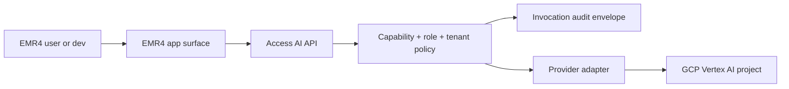

# Access AI API Architecture

> Programme 2F design record. This document defines EMR4's internal access
> boundary for AI model invocation across clinical copilot, Bernie, and later AI
> modalities. It is intentionally provider-aware but provider-owned by EMR4.

## Teleological Goal

EMR4 needs one controlled way to ask AI systems for help. The goal is not merely
to call LLM endpoints; it is to expose a safe **Access AI API** that can invoke
AI capabilities across modalities while enforcing identity, role, practice,
environment, cost, audit, and clinical safety boundaries.

An LLM is a substrate. EMR4 should model the higher-order capability:

- transcribe or summarize audio
- extract structured clinical facts
- draft clinical correspondence
- interpret receptionist booking instructions
- classify intent and missing context
- propose deterministic tool inputs
- inspect documents, images, or other future modalities

Provider APIs are implementation details behind EMR4 contracts.

Access AI must be multi-provider from the beginning. Gemini/Vertex is the first
runtime provider, but clinical knowledge products such as a future
Wiley/Cochrane knowledge base may live behind AWS services. EMR4 should route
that through the same capability, entitlement, audit, and citation policy rather
than creating a parallel "AWS-only" AI path.

WorkOS is a useful design benchmark for the enterprise-readiness layer:
organization-scoped identity, SSO/SCIM seams, RBAC plus fine-grained
authorization, typed audit logs, and self-service admin workflows. EMR4 should
borrow those product primitives without depending on WorkOS yet. The immediate
goal is to keep EMR4's own tenant, role, audit, and Access AI model compatible
with that style of enterprise integration.

## Core Decision

Frontend surfaces, Office add-ins, diary UI, and staff clients must not call
Google, OpenAI, LiteLLM, or any other model provider directly. They call EMR4.

EMR4's backend enforces product permissions first, then invokes a provider
adapter using a tightly scoped runtime identity.



## Subscription And Permission Layers

"Subscription" is overloaded. EMR4 separates it into three layers.

| Layer | Owner | Purpose | Example |
|---|---|---|---|
| Cloud subscription | Google Cloud billing/project | Project can consume Vertex AI and quota | `emr4-bernie-dev` has billing and Vertex AI enabled |
| Infrastructure entitlement | Google IAM | Runtime identity can call a provider/project | service account has Vertex AI permission |
| Product entitlement | EMR4 database/config | User/practice/role may invoke an AI capability | receptionist can interpret booking text but not run clinical scribe |

This prevents a GCP permission from becoming a clinical product permission.

## GCP Project And Identity Posture

Preferred organization root: `littlestardigital.com`.

Initial project layout:

| Project | Environment | Purpose |
|---|---|---|
| `emr4-copilot-dev` | dev | Medical scribe, clinical extraction, letters |
| `emr4-bernie-dev` | dev | Receptionist copilot and booking interpretation |
| `emr4-copilot-prod` | prod later | Production clinical copilot |
| `emr4-bernie-prod` | prod later | Production Bernie |

Authentication posture:

- no user-managed JSON service-account keys
- local dev uses Google login plus service account impersonation
- runtime on GCP uses attached service accounts
- external runtimes later use Workload Identity Federation
- each service account is capability/project scoped
- quota project is explicit for Application Default Credentials

Google Cloud IAM remains the infrastructure guard. EMR4 permissions remain the
product guard.

## Multi-Cloud And Knowledge-Base Posture

Access AI should support provider classes, not just model vendors:

| Provider Class | Example | EMR4 Use |
|---|---|---|
| `model_generation` | Gemini on Vertex AI | scribe, extraction, drafting, booking interpretation |
| `retrieval_generation` | Amazon Bedrock Knowledge Bases | Wiley/Cochrane-style clinical knowledge retrieval with citations |
| `embedding_retrieval` | Vertex AI Search, Bedrock KB, Kendra, OpenSearch | document and evidence lookup |
| `tool_intent` | Gemini/other LLM adapter | translate staff prompt into typed EMR4 proposal inputs |
| `local_or_test` | fake provider | deterministic tests and non-live review harnesses |

Amazon Bedrock Knowledge Bases is the likely AWS-shaped abstraction for a
Wiley/Cochrane evidence source because it supports Retrieval Augmented
Generation over connected data sources and can return citations. EMR4 should
not assume the retrieved knowledge and the generative model live in the same
cloud. A capability may use AWS retrieval plus GCP generation, AWS retrieval
plus AWS generation, or retrieval-only output that EMR4 passes into another
adapter.

Provider credentials and access stay provider-specific:

- GCP uses service account impersonation / workload identity.
- AWS should use IAM roles, STS-style temporary credentials, or workload
  identity federation where available.
- No long-lived AWS access keys should be used for routine runtime paths.
- Product permission is still checked by EMR4 before calling any provider.

Knowledge-base capabilities require extra policy:

- licensed content source and licence boundary
- citation requirement
- freshness/synchronization timestamp
- jurisdiction and clinical-safety disclaimer posture
- PHI allowed in query or not
- whether retrieved passages may be stored, cached, or only transiently used
- whether response can be shown to clinicians, patients, or staff only

For Wiley/Cochrane, default posture should be clinician-facing decision support,
not autonomous clinical decision-making. Responses should preserve citations and
distinguish evidence retrieval from patient-specific medical advice.

## Access AI Domain Model

### AiModality

Initial values:

- `text`
- `audio`
- `document`
- `image`
- `tool_intent`
- `multimodal`

### AiCapability

Capability names should be stable EMR4 identifiers, not provider model names.

| Capability | Modality | Primary Product |
|---|---|---|
| `clinical.scribe.transcribe` | audio | EMR4 Copilot |
| `clinical.note.extract` | text | EMR4 Copilot |
| `clinical.letter.draft` | text | EMR4 Copilot |
| `clinical.knowledge.query` | document/retrieval | EMR4 Copilot evidence support |
| `admin.booking.interpret` | text/tool_intent | Bernie |
| `admin.booking.suggest_slots` | tool_intent | Bernie |
| `admin.booking.prepare_proposal` | tool_intent | Bernie |
| `ai.provider.live_smoke` | text | Dev tooling |

### AiMethod

Methods are the callable operations exposed by Access AI. A capability can have
more than one method when the same product feature needs dry-run, live, and
evaluation paths.

Examples:

- `invoke`
- `dry_run`
- `evaluate_fixture`
- `live_smoke`
- `estimate_cost`

### AiRiskTier

| Tier | Meaning | Example |
|---|---|---|
| `low_read_only` | No persistence, no PHI expansion, no downstream write | non-PHI live smoke |
| `clinical_read` | Reads clinical context but does not write records | note extraction preview |
| `clinical_draft` | Produces clinician-reviewed draft | letter draft |
| `admin_proposal` | Produces deterministic proposal input only | Bernie slot constraints |
| `human_confirmed_write` | Requires explicit staff confirmation before mutation | appointment create confirmation |
| `blocked` | Not callable in this environment/context | autonomous booking request |

Risk tier controls audit, confirmation, PHI, provider, and role requirements.

## Roles

Initial EMR4 roles for AI access:

| Role | Intended Use |
|---|---|
| `ai.platform_admin` | Configure providers, projects, capabilities, and policy |
| `ai.dev_operator` | Run dev live smokes and diagnostics in dev projects |
| `ai.clinical_user` | Use clinical scribe/copilot capabilities |
| `ai.reception_user` | Use Bernie read-only/proposal capabilities |
| `ai.reception_supervisor` | Approve higher-risk Bernie proposals |
| `ai.audit_reviewer` | Review AI invocation metadata and safety decisions |
| `ai.disabled` | Explicit deny; overrides grants |

These roles can map to existing EMR4 user roles, but should remain explicit so
AI access is reviewable independently from general appointment access.

## Enterprise Identity And Authorization Posture

EMR4 should preserve a future seam for enterprise identity providers without
making SSO mandatory for early practices.

Borrowed WorkOS-style primitives:

- organization/practice membership as the root of access
- roles assigned within an organization, not just globally
- resource-scoped permissions over practice, location, diary, patient,
  appointment, proposal, AI capability, and knowledge base
- typed audit events for access, configuration, AI, and booking actions
- self-service administration for practice owners where safe
- future SSO/OIDC/SAML and SCIM/directory-sync support
- domain verification if practices later need to claim/manage their own domain

Near-term EMR4 stays internally managed:

- keep existing JWT/session/auth flow
- add Access AI roles and entitlements inside EMR4 first
- avoid introducing a third-party identity dependency before workflows stabilize
- model permissions in a way that can later map to WorkOS, Auth0 FGA, OpenFGA,
  Google/Azure groups, or another enterprise auth layer

Resource-scoped authorization should answer questions like:

- Can this receptionist prepare a Bernie booking proposal for this practice?
- Can this user confirm a pending proposal into a real appointment?
- Can this GP invoke clinical scribe for this patient encounter?
- Can this clinician query a licensed Cochrane knowledge base?
- Can this admin enable live provider access for a capability?

Do not let an AI agent inherit the full authority of the signed-in human. Access
AI should mint a narrower action context: user + product surface + capability +
method + resource scope + risk tier.

Initial external identity seam:

- `access-ai-clinical@littlestardigital.com` -> `ai.clinical_user`
- `access-ai-reception@littlestardigital.com` -> `ai.reception_user`
- `access-ai-reception-supervisors@littlestardigital.com` -> `ai.reception_supervisor`
- `access-ai-dev-operators@littlestardigital.com` -> `ai.dev_operator`
- `access-ai-platform-admins@littlestardigital.com` -> `ai.platform_admin`
- `access-ai-disabled@littlestardigital.com` -> `ai.disabled`

WorkOS-style org roles can feed the same role vocabulary with names such as
`access_ai:clinical` and `access_ai:reception`. Unknown external groups grant no
Access AI role. External identity must never call providers directly or bypass
EMR4's entitlement decision.

## Capability Policy Fields

The capability registry should eventually include:

- capability id
- modality
- allowed methods
- allowed environments
- default provider
- GCP project id
- location
- model name
- service account identity
- risk tier
- PHI allowed
- raw prompt logging allowed
- human confirmation required
- max request size
- max estimated cost
- rate limit key
- audit policy
- fallback provider, if any

Fail closed when any required policy field is absent.

## Invocation Context

Every invocation should receive a structured context:

- authenticated EMR4 user id
- practice id
- role set
- environment
- capability id
- method
- product surface
- patient id, if applicable
- appointment id, if applicable
- correlation id
- PHI classification
- dev/live flag

Future context sources include:

- selected diary appointment
- current diary cell/time/resource
- active phone call/caller ID
- recent phone call/caller ID
- patient search result or patient candidate set
- taskpane patient file context
- Command Centre clinical context
- licensed knowledge-base context

Provider adapters must not infer product permissions from prompt text.
Context sources must carry provenance and confidence. Caller ID, for example,
can improve patient identity interpretation but must not be treated as proof of
identity without staff verification.

## Audit Envelope

Every AI invocation should record metadata, not raw PHI by default:

- timestamp
- user/practice/environment
- capability/method/risk tier
- provider/project/location/model
- service account identity
- request classification
- prompt/input hash
- schema version
- decision: allowed, blocked, failed, fallback
- blocked reason or warning codes
- latency
- token/cost estimate where available
- correlation id

Raw prompts, transcripts, and model responses require an explicit policy and
should usually be excluded from routine logs.

For knowledge-base calls, audit should also record:

- knowledge base id/name
- source collection or licence namespace
- retrieval timestamp
- citation ids returned
- whether retrieved text was stored, cached, or transient only

## Typed Audit Event Catalog

Audit events should be strongly typed and queryable as product data, not just
free-text logs. Initial event families:

| Event | Purpose |
|---|---|
| `ai.invocation.allowed` | Access AI request passed entitlement and provider policy |
| `ai.invocation.blocked` | Access AI request failed policy, role, risk, PHI, or environment checks |
| `ai.invocation.failed` | Provider call or schema validation failed after authorization |
| `ai.capability.enabled` | Admin enabled a capability for a scope |
| `ai.capability.disabled` | Admin disabled a capability for a scope |
| `ai.entitlement.granted` | User/role/practice gained capability access |
| `ai.entitlement.revoked` | User/role/practice lost capability access |
| `bernie.proposal.created` | Pending Bernie proposal/hold was created |
| `bernie.proposal.confirmed` | Human confirmed a pending proposal into a final write |
| `bernie.proposal.cancelled` | Pending proposal was cancelled or expired |
| `identity.caller_candidate_matched` | Caller ID produced patient candidates |
| `identity.patient_verified_by_staff` | Staff verified patient identity for an action |
| `knowledge.query.allowed` | Licensed knowledge-base query was allowed |
| `knowledge.query.blocked` | Licensed knowledge-base query was blocked |

Minimum common fields:

- event id
- event type
- timestamp
- actor user id
- actor role/context
- practice id
- target resource type/id
- capability/method, when applicable
- decision and reason code
- correlation id
- source surface

These events should be exportable later for enterprise customers or compliance
review, but the first implementation can remain in EMR4's database.

## Bernie Caller Context And Pending Booking Proposal

Caller ID is a new high-value context source for Bernie. It can help connect a
staff instruction such as:

```text
Bernie, appointment today for Margaret Thompson with Dr Shera at 2.30.
```

to the right patient candidate when the patient is present or on the phone. It
must remain a context signal, not an identity proof.

Recommended flow:

1. Phone integration supplies caller context:
   - caller phone number
   - call state: active, recent, missed, unknown
   - matched patient candidates
   - confidence and match reason
2. Receptionist gives a natural-language booking instruction.
3. Bernie combines:
   - staff instruction
   - caller context
   - selected diary context
   - practitioner/resource availability
   - appointment proposal rules
4. Bernie creates a **pending booking proposal / temporary hold**, not a final
   appointment.
5. The diary renders the proposal in the requested slot:
   - slightly expanded appointment block
   - highlighted visual treatment
   - "Pending Bernie confirmation" state
   - patient verification details visible only while pending
   - Confirm, Edit, and Cancel actions
   - optional gentle chime for receptionist attention
6. Receptionist verifies details with the patient.
7. Confirm writes the final appointment, records audit evidence, and collapses
   the diary block back to normal rendering.

The pending card may show:

```text
Margaret Thompson
DOB 14/03/1956
Medicare ending 1234
```

Full Medicare details should not be permanently displayed in the diary grid. If
full identity details are needed, show them only in a focused verification
popover/panel and remove them once the proposal is confirmed or cancelled.

Safety rules:

- Bernie may prepare and visually place a pending proposal.
- Bernie must not create a final appointment before human confirmation.
- Caller ID can rank candidates but cannot verify identity by itself.
- Ambiguous patient matches require staff selection or clarification.
- Pending proposals should expire or be explicitly cancelled.
- Confirmation writes must reuse the existing deterministic appointment proposal
  and audit path.

This is a stronger product experience than the current diagnostic Bernie panel,
but keeps the core invariant intact: model-assisted work becomes a human
confirmed write.

## Dev Entitlement

Development must be able to exercise all needed functionality without weakening
production posture.

Dev rules:

- `yuri@littlestardigital.com` may impersonate dev service accounts only.
- dev live smokes use non-PHI fixtures by default.
- live provider use is explicit, never hidden inside ordinary tests.
- fake providers remain the default for unit and review harness tests.
- quota project is explicit.
- budget alerts are enabled before repeated live testing.
- production projects and service accounts are not used for local dev.

## Provider Adapter Rule

EMR4 contracts own request and response shapes. Provider adapters translate:

```text
EMR4 capability request -> provider prompt/API call -> EMR4 typed result
```

Provider-specific concepts must not leak into appointment mutation, clinical
note persistence, or Bernie proposal contracts.

## Sprint Roadmap

### Sprint 77 - Access AI Architecture Record

Create this design record and update the programme map so future AI/GCP work is
tracked as Programme 2F.

### Sprint 78 - Keyless GCP Dev Auth Runbook

Replace JSON key guidance with Cloud Identity, service-account impersonation,
ADC quota-project, and dev service-account setup documentation.

### Sprint 79 - AI Capability Registry

Extend `app/services/ai/contracts.py` and/or a new registry module with
capability metadata for modality, methods, risk tier, provider project, and
environment allowlists. Keep it config/static first unless a database model is
needed.

### Sprint 80 - AI Entitlement Model

Add product-level access checks for capability/method invocation. Prove default
fail-closed behavior and dev-only grants with tests.

### Sprint 81 - Typed AI Audit Event Catalog

Define the first typed audit event enum/schema and add tests for event shape,
redaction posture, and correlation ids. Keep it storage-light if needed, but
make the event contract explicit before live invocation expands.

### Sprint 82 - Access AI Invocation Service

Add `AccessAiService.invoke(context, request)` as the single backend entry point
for model calls. Keep tests fake-provider only.

### Sprint 83 - Invocation Audit And Cost Envelope

Record bounded invocation metadata, blocked reasons, latency, and cost/token
estimates without raw PHI logging by default.

### Sprint 84 - Enterprise Auth Seam Design

Document how EMR4's internal org/role/FGA-style model could later map to SSO,
SCIM/directory sync, domain verification, and external FGA providers without
replacing the current auth stack now.

### Sprint 85 - Bernie Interpreter Migration

Route Bernie live booking-instruction interpretation through Access AI. Preserve
existing default-disabled, fake-provider, no-write, and staff-confirmation
guards.

### Sprint 86 - Copilot/Scribe Migration

Route clinical extraction, audio scribe, and letter drafting through Access AI
without changing user-visible behavior.

### Sprint 87 - Caller Context Identity Source

Add the phone/caller ID context model and patient-candidate matching contract.
No appointment write changes.

### Sprint 88 - Pending Bernie Booking Proposal

Add a backend pending proposal/temporary-hold object with expiry, candidate
identity evidence, and no final appointment write before confirmation.

### Sprint 89 - Diary Pending Proposal Highlight UI

Render Bernie's pending proposal as an expanded highlighted diary slot with
bounded identity verification details, Confirm/Edit/Cancel controls, and an
optional accessible chime.

### Sprint 90 - Confirm-To-Appointment Bridge

Turn a pending Bernie proposal into a final appointment only after receptionist
confirmation, then collapse the slot back to normal diary rendering.

### Sprint 91 - Multi-Provider Knowledge Base Adapter

Add provider contract support for retrieval-generation capabilities, including
AWS Bedrock Knowledge Bases or equivalent knowledge-base adapters. Keep this
behind fake/provider-mocked tests at first.

Implemented groundwork:

- `clinical.knowledge.query` is registered as a retrieval-generation capability.
- Clinicians can invoke it through the existing `ai.clinical_user` entitlement.
- `app/services/ai/knowledge_base.py` defines provider-neutral query, answer,
  citation, adapter, and Access AI service contracts.
- PHI-bearing queries fail closed before any provider call.
- Citations are required by default and missing citations produce a provider
  failure audit envelope.
- Knowledge-base audit metadata records only safe fields such as knowledge-base
  id, provider, citation count, citation ids, and transient-storage posture.

### Sprint 92 - Wiley/Cochrane Knowledge Base Spike

Design the licensed clinical knowledge integration boundary: licence scope,
provider/API path, citation handling, PHI query rules, audit metadata, and
clinician-facing presentation. Do not expose patient-specific recommendations
until the retrieval, citation, and safety contract is reviewed.

## Non-Goals For This Programme

- No autonomous clinical or receptionist writes.
- No frontend direct provider credentials.
- No user-managed JSON service-account keys.
- No provider switch for its own sake.
- No raw PHI prompt logging as a routine diagnostic.
- No production live AI enablement before dev auth, audit, and entitlement are
  proven.
