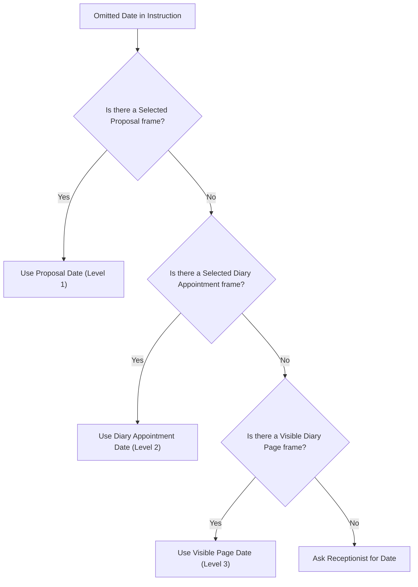

# Sprint 164 Context Date Precedence Review Packet

- **Author**: Antigravity/Gemini Worker Lane
- **Date**: 2026-07-07
- **Target File**: [antigravity-sprint164-context-date-precedence.md](file:///C:/Users/sarashera/emr4/orchestration/agent_inbox/antigravity/antigravity-sprint164-context-date-precedence.md)
- **Status / Verdict**: **APPROVED**

---

## 1. Executive Summary & Verdict

We have reviewed the uncommitted changes in [C:/Users/sarashera/emr4](file:///C:/Users/sarashera/emr4) comprising two new executable receptionist scenario fixtures and an updated [README.md](file:///C:/Users/sarashera/emr4/tests/fixtures/bernie_scenarios/README.md).

These fixtures represent high-value contract tests that verify the date context precedence rules used during multi-turn booking instruction interpretation:
1. `Selected Proposal Date` wins over both `Selected Diary Appointment` and `Visible Diary Page` dates.
2. `Selected Diary Appointment Date` wins over `Visible Diary Page` date.

All fixtures have been successfully verified locally via Pytest using the [test_bernie_scenario_integrity.py](file:///C:/Users/sarashera/emr4/tests/test_bernie_scenario_integrity.py) integrity suite and the [test_scenario_replay.py](file:///C:/Users/sarashera/emr4/tests/bernie_scenarios/test_scenario_replay.py) execution harness.

We issue a verdict of **APPROVED**. No blocking findings were identified, and no polish adjustments are required.

---

## 2. Reviewed Scope

The following files were reviewed:
1. **[README.md](file:///C:/Users/sarashera/emr4/tests/fixtures/bernie_scenarios/README.md)**: Updated to outline the new context-precedence prompts.
2. **[interpret_context_date_precedence_selected_diary.yaml](file:///C:/Users/sarashera/emr4/tests/fixtures/bernie_scenarios/interpret_context_date_precedence_selected_diary.yaml)**: Verifies that when a partial request has both `visible_diary_page` and `selected_diary_appointment` context, the selected diary appointment date wins.
3. **[interpret_context_date_precedence_selected_proposal.yaml](file:///C:/Users/sarashera/emr4/tests/fixtures/bernie_scenarios/interpret_context_date_precedence_selected_proposal.yaml)**: Verifies that when `visible_diary_page`, `selected_diary_appointment`, and `selected_proposal` dates disagree, the selected proposal date wins.

---

## 3. Product & Receptionist Usability Assessment

From a receptionist workflow and clinical safety perspective, the priority chain is well-designed and resolves ambiguous inputs logically:
- **Precedence Hierarchy**:
  - **Level 1 (Highest): Selected Proposal (`selected_proposal`)**: Represents a concrete booking/slot proposal currently being edited or reviewed by the receptionist. Its date is highly specific and takes ultimate precedence.
  - **Level 2: Selected Diary Appointment (`selected_diary_appointment`)**: Represents a specific appointment card on the diary that is currently selected (e.g. for rebooking/editing). This is more specific than the general page date.
  - **Level 3 (Lowest): Visible Diary Page (`visible_diary_page`)**: Represents the broad date view of the calendar grid. It serves as a fallback context when no specific appointment or proposal is active.



This precedence chain is implemented in [resolve_booking_date_transition](file:///C:/Users/sarashera/emr4/app/services/bernie_transition_table.py#L44) inside [bernie_transition_table.py](file:///C:/Users/sarashera/emr4/app/services/bernie_transition_table.py):

```python
    table: tuple[tuple[str, tuple[str, ...], str, str], ...] = (
        (
            "date.from_selected_proposal",
            ("date_from", "appointment_date", "selected_date"),
            "selected_proposal",
            "I used the date from the selected proposed booking.",
        ),
        (
            "date.from_selected_diary_appointment",
            ("appointment_date", "date_from", "selected_date"),
            "selected_diary_appointment",
            "I used the date from the selected diary appointment.",
        ),
        (
            "date.from_visible_diary_page",
            ("visible_date", "diary_date", "date", "appointment_date"),
            "visible_diary_page",
            "I used the date from the diary page that is open.",
        ),
    )
```

The outer loop checks these frame types in order, which guarantees that precedence is determined by the rule definition, independent of the order in which frames are serialized or appended in the request `context_frames` list.

---

## 4. Honest Edge-Contract Labels & Provider Boundaries

- **No Overclaiming**: The fixtures assert `"provider_metadata.provider": fake` and `"provider_metadata.live_provider": false`. This keeps the test focused on verifying route contract routing and local transition-table logic rather than pretending to verify live Gemini quality.
- **Provider Protection**: The execution harness intercepts any potential provider calls by raising an `AssertionError` if an AI provider is requested, forcing the execution to be entirely deterministic.
- **No Side Effects**: Both fixtures enforce `appointment_written: false` and `audit_written: false` and list `appointment_written` / `audit_written` under `forbidden_outcomes`. This verifies that the non-mutating `interpret` endpoint acts strictly as a read-only intent parser.

---

## 5. Gate Integrity & Boundary Assessment

The reviewed changes adhere strictly to EMR4 sandbox boundaries:
- **No Trove/H-series Profiles**: The fixtures use only baseline mock data (`practice`, `practitioner`, `gp_user`, `patient`, `schedule`). They do not import, reference, or drift into raw trove historical diary JSON or H-series profile directories.
- **No Semantic Gates (H15)**: The fixtures are purely synthetic and do not touch semantic gate structures or promote H15 semantic appointments.
- **No Database/Memory Coupling**: RAG/GraphRAG mechanisms, Access AI, and semantic memory layers are not imported or coupled.

---

## 6. Accepted Polish & Deferred Suggestions

### Polish
No outstanding polish points are identified. The naming of the test scenarios is consistent, and the expected assertions are correct and properly scoped.

### Deferred Suggestions
- **Multi-Frame Precedence for Other Dimensions**: Similar precedence tests could be added for practitioner resolution context (e.g. selected diary slot practitioner vs. visible practitioner filtering context) in future sprints if such heuristics are introduced.
