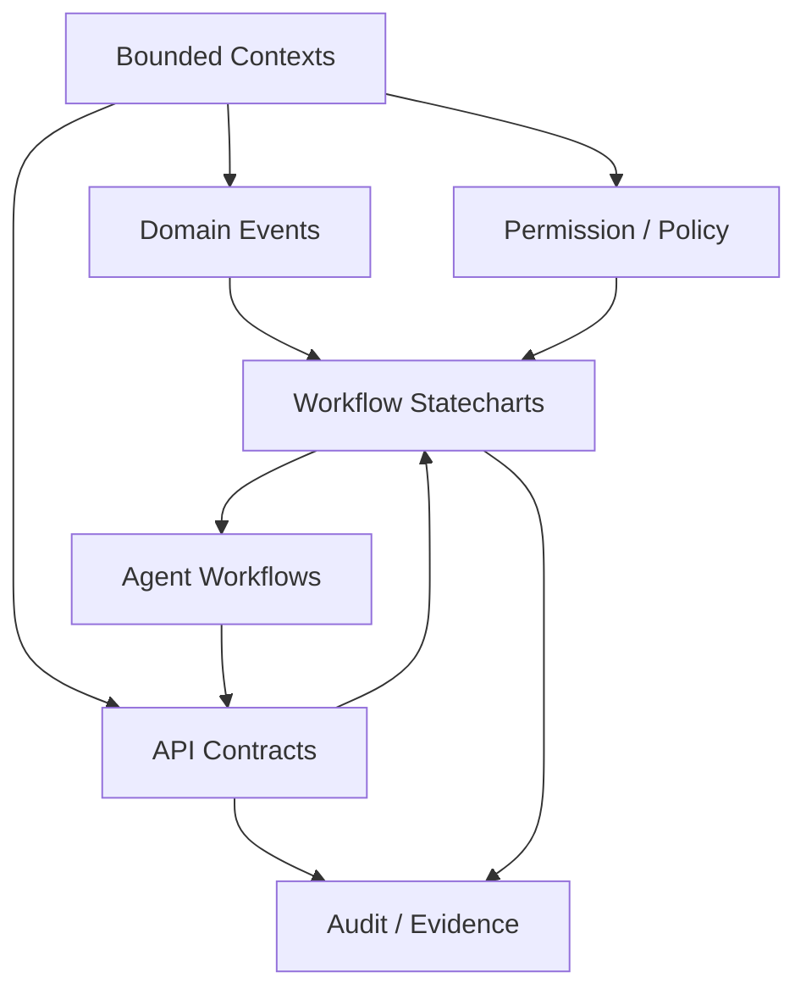

# EMR4 Event-Driven Architecture With Embedded Statecharts

Captured 2026-07-01 as the design guide for the post-Bernie root-to-branch
revision process.

## Purpose

EMR4 is becoming agent-facing as well as user-facing. Agents such as *bernie*,
*davida*, *scribe*, and future knowledge-base agents do not simply call screens
or endpoints. They observe context, interpret intent, propose transitions, ask
for clarification, and wait for human confirmation where required.

Flat UI flows and ad hoc endpoint calls are not enough for this. They allow
semantic state, visible UI state, and API state to leak into each other. The
current *bernie* live-diary failure is the practical example:

- the receptionist submits `tomorrow`;
- the UI navigates to the candidate day;
- the review flow reuses the mutated diary date as a new reference date;
- `tomorrow` can become tomorrow again.

The architectural response is not "state machines everywhere" as a single
model. The response is an event-driven domain architecture that uses
hierarchical statecharts inside bounded workflows.

## Modelling Stack

Use the following layers together.

1. Domain / bounded-context model
   - Defines the durable areas of EMR4: Diary, Appointments, Patient Identity,
     Consultations, Billing, Agents, Access AI, Audit, Practice Admin, and
     Knowledge Sources.
   - Answers: what part of the system owns this concept?

2. Event model
   - Defines what happens over time: `BookingInstructionSubmitted`,
     `IntentInterpreted`, `CandidateSlotOffered`, `SlotPreviewed`,
     `PatientIdentityChecked`, `BookingConfirmed`, `AppointmentCreated`.
   - Answers: what facts can other contexts react to?

3. Hierarchical statecharts
   - Define local workflow behaviour where state matters.
   - Examples: *bernie* booking session, appointment lifecycle, patient identity
     verification, scribe review/finalise, setup copilot progress.
   - Answers: which transitions are legal from here?

4. API contract model
   - Defines the executable boundary: GraphQL read/context graph, REST/command
     mutations, proposal endpoints, confirmation endpoints, and typed events.
   - Answers: how do clients and agents interact safely?

5. Permission and policy model
   - Defines which actor may initiate or confirm a transition.
   - Examples: *bernie* may propose a booking, a receptionist confirms it,
     *davida* may guide setup, a practice manager can use *davida* admin mode,
     *consultant* may synthesize advice but must not write clinical conclusions
     without GP review.

6. YAML operating layer
   - Defines declarative, machine-readable setup, capability, policy, and
     environment/profile documents.
   - YAML may describe statechart IDs, roles, required services, setup steps,
     evidence-source rules, and agent capabilities. It should not replace the
     typed API contracts or runtime state machines.

## Statecharts Are Local Behavioural Models

Statecharts should be used for workflows where the system must remember what
has already happened and must prevent illegal transitions.

Good candidates:

- *bernie* booking session
- Patient identity verification
- Appointment lifecycle
- Consultation draft -> review -> finalise
- Scribe audio/transcript/review workflow
- *davida* setup and practice-manager administration workflows
- Access AI provider invocation and audit lifecycle

Poor candidates:

- Static data shape
- Simple CRUD resources with no meaningful lifecycle
- Broad system architecture by itself

## Core Rule

State machines model behaviour. They do not replace the domain model, event
model, API contracts, or policy model.

The useful pattern is:

## Agent Design Consequences

Agents should not receive privileged write paths. They should operate through
the same API contracts as human-facing UI, with explicit actor attribution and
audit.

Agent runtime behaviour should usually look like:

1. Observe context.
2. Interpret natural language into typed intent.
3. Normalize into a typed command or query.
4. Enter a workflow statechart.
5. Ask clarification if confidence/policy requires it.
6. Produce a proposal or candidate list.
7. Wait for the authorized human transition.
8. Confirm through the normal API.
9. Emit audit/evidence events.

## Cross-Chart Links

Statecharts can link horizontally or across layers, but only through events and
typed contracts.

Examples:

- *bernie* `BookingConfirmed` emits into Appointment lifecycle as
  `AppointmentCreated`.
- Patient identity state can block or warn in *bernie* without being owned by
  the *bernie* chart.
- Access AI invocation state can wrap *consultant* and knowledge-base agent
  calls without those agents owning provider credentials directly.
- *davida* setup state can produce YAML/environment configuration that later
  shapes runtime API profiles.

## Invariants For Future Design

- Relative time is resolved against an immutable request reference, not the
  current visible page.
- UI navigation is a side effect, not semantic input, unless the user explicitly
  starts a new request using that context.
- Candidate lists are snapshots. Selecting or revisiting a candidate must not
  reinterpret the original natural-language prompt.
- Human confirmation is a transition with evidence, not a boolean flag hidden
  inside UI state.
- Agent confidence has separate axes. Do not collapse patient identity,
  temporal meaning, practitioner matching, intent, speech quality, and slot
  validity into a single scalar gate.
- Audit records should capture the event, actor, agent/session, confidence
  axes, proposal evidence, and final transition.

## Immediate Application: Bernie

The next implementation step should formalize the *bernie* booking session as a
state machine before more tactical UI fixes. This provides a concrete training
ground for the wider API-spine redesign.

The same modelling discipline should later guide the root-to-branch EMR4 API
review: bounded contexts first, events second, statecharts for workflows, API
contracts for executable boundaries, policy for authorization, and YAML for
declarative operating plans.
